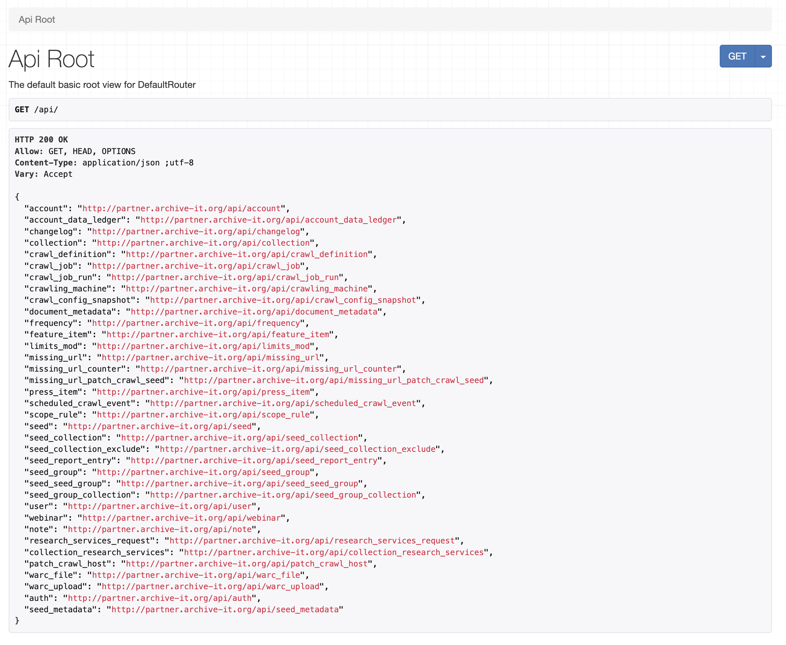

# Lab: pywb (record + replay)

## Overview

Archive-It provides a handful of APIs to work with collections programatically:


Today, we'll look at four of these APIs (covered in more detail below):

1. Partner API
2. Opensearch API
3. CDX API
4. Web Archiving Systems API (WASAPI)

Our goal will be to explore each one a little bit, get a feel for what kind of data it provides, and see how we can stitch them together.

At the end of this lab, you should have a teeny, tiny, super hacky discovery and access layer for any of your Archive-It collections!

### Partner API

From the [documentation](https://support.archive-it.org/hc/en-us/articles/360032747311-Access-your-account-with-the-Archive-It-Partner-API),

> The Archive-It Partner API provides access to information about Archive-It partners, collections, and crawls outside of your Archive-It account or pages on archive-it.org. Credentialed Archive-It users can query this data from Archive-It's database in a web browser or from the command line.
> 
> Partners can retrieve this information to develop custom access layers, manage administrative or descriptive metadata externally, or run periodic account usage reports.

### Opensearch API

From the [documentation](https://support.archive-it.org/hc/en-us/articles/208002246-Access-your-web-archives-with-OpenSearch),

> OpenSearch is a loosely structured standard that defines formats for the exchange of search results between search engines. The full draft specification is available at https://www.opensearch.org/Specifications/OpenSearch/1.1. For the rest of this guide, we'll focus on how to use OpenSearch as implemented by Archive-It.  See some real examples from our partners who are using OpenSearch: https://support.archive-it.org/hc/en-us/articles/360001231286-Archive-It-Access-Integrations
> 
> What you can do with OpenSearch:> 
> - ✅ Perform search queries with an RSS reader or your web browser
> - ✅ Perform search queries with a script, CGI, or other software
> - ✅ Programmatically manipulate results (for example, you can format results to match your own UI)
> 
> What you can't do with OpenSearch:
> - 🚫 Add or remove documents from the search engine
> - 🚫 Modify the content or meta data of a document  

### CDX API

From the [documentation](https://support.archive-it.org/hc/en-us/articles/115001790023-Access-Archive-It-s-Wayback-index-with-the-CDX-C-API),

> Archive-It’s Wayback CDX is the index of all archived content that the Wayback browsing interface uses to lookup and serve the specific captures requested by an end-user, such as from the Wayback calendar page. The index format is known as 'CDX' and contains various fields that describe each record, sorted by URL and date. The index's server responds to GET queries and returns the plain text CDX data. The CDX server is deployed as part of the wayback.archive-it.org Wayback browsing interface and was derived from the CDX server deployed for the general archive at web.archive.org, as part of the open-source Wayback Machine software: https://github.com/internetarchive/wayback.

### WARC Server API

From the [documentation](https://support.archive-it.org/hc/en-us/articles/360015225051-How-to-find-and-download-your-WARC-files-with-WASAPI),

> Partners can use Archive-It's implementation of the Web Archiving Systems API (WASAPI) from a web browser or a command line terminal to find and download their WARC files and associated technical metadata. The API supports several advanced options for partners to find and download these files by collection, date and timespans, and other attributes described below.

## Instructions

### Prepare Workspace

As per usual, ensure that you have the SI639 labs GitHub repository cloned and updated:

```shell
git clone https://github.com/ghukill/umsi-si639-labs
cd umsi-si639-labs
git pull origin main
```

Run command to update dependencies:
```shell
uv sync
```

We're all set!  We'll run any code from the **root** of the project.

### Partner API

#### Partner API via a Browser

First, login into the partner site at [https://partner.archive-it.org/](https://partner.archive-it.org/).

Once logged in, any API URL routes that we visit in our browser will show us the results for an authenticated user.

Let's navigate to the API root which shows us a list of API routes we can use: [https://partner.archive-it.org/api/](https://partner.archive-it.org/api/).

You should see something that looks like this:



This is an **HTML** representation of the API response, formatted nicely for our human eyes.  As we'll see later, _most_ of the time we make a request to the API and get back a JSON response.  So as we look at these responses in the browser, just keep in mind that from a programmatic context we'd be interacting with just JSON.

Conveniently, the links in this HTML API response are clickable.  Try clicking on the first link [https://partner.archive-it.org/api/account](https://partner.archive-it.org/api/account).  This brings back some information about our shared Archive-It account.  Neat!  One can imagine how this could be used to build a custom interface... but more on that later.

Next, and more aligned with goals of this lab, let's look at the `/collection` endpoint, [https://partner.archive-it.org/api/collection](https://partner.archive-it.org/api/collection).  At the time of this writing, the first page has 100 results, a second page 75 results, for a total of 175 collections.  It's pretty hacky, but try ctrl + f searching for a string you'd expect, like a collection you know exists.

For example, I looked for `gshukill` and found this collection on page 2:

```json
{
  "account": 421,
  "created_by": "gshukill",
  "created_date": "2026-01-17T00:23:39.656223Z",
  "custom_user_agent": null,
  "deleted": false,
  "id": 30935,
  "image": null,
  "last_crawl_date": "2026-01-22T05:34:51.071714Z",
  "last_updated_by": "gshukill",
  "last_updated_date": "2026-01-21T01:05:11.070555Z",
  "metadata": {
    "Identifier": [
      {
        "id": 17379727,
        "value": "gshukill-si639-collection-1"
      }
    ],
    "Date": [
      {
        "id": 17379728,
        "value": "2026-01-20"
      }
    ],
    "Creator": [
      {
        "id": 17379729,
        "value": "Graham Hukill"
      },
      {
        "id": 17379730,
        "value": "University of Michigan, School of Information, SI639"
      }
    ],
    "Title": [
      {
        "id": 17379731,
        "value": "Graham's SI639 Collection"
      }
    ],
    "minternet_domain": [
      {
        "id": 17379732,
        "value": "recipes"
      }
    ]
  },
  "name": "gshukill-si639-w26-week3-lab",
  "num_active_seeds": 1,
  "num_inactive_seeds": 0,
  "oai_exported": false,
  "private_access_token": "xxxxxxxxx",   <------- removed
  "publicly_visible": false,
  "state": "ACTIVE",
  "topics": null,
  "total_warc_bytes": 332017
}
```

In addition to metadata, one important thing from that response is the collection identifier `"id": 30935`.

Most of the AIT partner API routes can be filtered by keys that are in the response for that route.  Some filtering examples:

- a specific collection: [https://partner.archive-it.org/api/collection?id=30935](https://partner.archive-it.org/api/collection?id=30935)
- filter by creator: https://partner.archive-it.org/api/collection?created_by=gshukill

Let's use this collection and find seeds associated with it by using the `/seed` endpoint: [https://partner.archive-it.org/api/seed?collection=30935](https://partner.archive-it.org/api/seed?collection=30935)

```json
{
  "count": 1,
  "next": null,
  "previous": null,
  "results": [
    {
      "id": 4602918,
      "created_by": "gshukill",
      "created_date": "2026-01-22T00:53:55.484540Z",
      "last_updated_by": "gshukill",
      "publicly_visible": false,
      "http_response_code": null,
      "last_checked_http_response_code": null,
      "active": true,
      "collection": 30935,
      "valid": null,
      "seed_type": "oneHopOff",
      "deleted": false,
      "last_updated_date": "2026-02-01T20:08:56.921002Z",
      "url": "https://minternet.exe.xyz/",
      "canonical_url": "https://minternet.exe.xyz/",
      "login_username": null,
      "login_password": null,
      "metadata": {
        "Title": [
          {
            "id": 17404882,
            "value": "The Minternet"
          }
        ],
        "Creator": [
          {
            "id": 17404883,
            "value": "Graham Hukill"
          }
        ],
        "Description": [
          {
            "id": 17404884,
            "value": "Root of web archiving test suites"
          }
        ]
      },
      "seed_groups": []
    }
  ]
}
```

We can also see all crawls for a given collection, [https://partner.archive-it.org/api/crawl_job?collection=30935](https://partner.archive-it.org/api/crawl_job?collection=30935):

```json
{
  "count": 7,
  "next": null,
  "previous": null,
  "results": [
    {
      "id": 2654714,
      "type": "CRAWL_SELECTED_SEEDS",
      "brozzler": false,
      "original_start_date": "2026-01-17T14:15:23.469479Z",
      "end_date": "2026-01-17T14:16:08.436149Z",
      "test_crawl_save_date": null,
      "test_crawl_state": null,
      "elapsed_ms": 22607,
      "downloaded_count": 22,
      "total_data_in_kbs": 31,
      "novel_count": 15,
      "novel_bytes": 23414,
      "duplicate_count": 7,
      "duplicate_bytes": 8723,
      "warc_url_count": 20,
      "warc_content_bytes": 23416,
      "status": "FINISHED",
      "doc_rate": "0.97",
      "account": 421,
      "collection": 30935,
      "crawl_definition": 37325789982,
      "test_crawl_state_changed_by": null
    },
    {
      "id": 2656024,
      "type": "CRAWL_SELECTED_SEEDS",
      "brozzler": false,
      "original_start_date": "2026-01-21T00:51:19.561940Z",
      "end_date": "2026-01-21T00:55:13.935980Z",
      "test_crawl_save_date": null,
      "test_crawl_state": null,
      "elapsed_ms": 214733,
      "downloaded_count": 19,
      "total_data_in_kbs": 26,
      "novel_count": 7,
      "novel_bytes": 8006,
      "duplicate_count": 12,
      "duplicate_bytes": 18856,
      "warc_url_count": 17,
      "warc_content_bytes": 8008,
      "status": "FINISHED",
      "doc_rate": "0.09",
      "account": 421,
      "collection": 30935,
      "crawl_definition": 37325790587,
      "test_crawl_state_changed_by": null
    },
    {
      "id": 2656563,
      "type": "TEST_EXPIRED",
      "brozzler": false,
      "original_start_date": "2026-01-22T01:01:12.741230Z",
      "end_date": "2026-01-22T01:02:46.687552Z",
      "test_crawl_save_date": null,
      "test_crawl_state": "EXPIRED",
      "elapsed_ms": 77446,
      "downloaded_count": 48,
      "total_data_in_kbs": 475,
      "novel_count": 38,
      "novel_bytes": 482869,
      "duplicate_count": 10,
      "duplicate_bytes": 3738,
      "warc_url_count": 42,
      "warc_content_bytes": 482875,
      "status": "FINISHED",
      "doc_rate": "0.62",
      "account": 421,
      "collection": 30935,
      "crawl_definition": 37325790869,
      "test_crawl_state_changed_by": null
    },
    {
      "id": 2656566,
      "type": "TEST_EXPIRED",
      "brozzler": false,
      "original_start_date": "2026-01-22T01:17:18.852848Z",
      "end_date": "2026-01-22T01:19:45.554571Z",
      "test_crawl_save_date": null,
      "test_crawl_state": "EXPIRED",
      "elapsed_ms": 142400,
      "downloaded_count": 101,
      "total_data_in_kbs": 682,
      "novel_count": 88,
      "novel_bytes": 693648,
      "duplicate_count": 13,
      "duplicate_bytes": 4848,
      "warc_url_count": 95,
      "warc_content_bytes": 693654,
      "status": "FINISHED_DOCUMENT_LIMIT",
      "doc_rate": "0.71",
      "account": 421,
      "collection": 30935,
      "crawl_definition": 37325790870,
      "test_crawl_state_changed_by": null
    },
    {
      "id": 2656573,
      "type": "TEST_EXPIRED",
      "brozzler": false,
      "original_start_date": "2026-01-22T02:14:26.080621Z",
      "end_date": "2026-01-22T02:19:16.187737Z",
      "test_crawl_save_date": null,
      "test_crawl_state": "EXPIRED",
      "elapsed_ms": 267014,
      "downloaded_count": 308,
      "total_data_in_kbs": 1070,
      "novel_count": 295,
      "novel_bytes": 1090854,
      "duplicate_count": 13,
      "duplicate_bytes": 4848,
      "warc_url_count": 302,
      "warc_content_bytes": 1090860,
      "status": "FINISHED_ABORTED",
      "doc_rate": "1.15",
      "account": 421,
      "collection": 30935,
      "crawl_definition": 37325790871,
      "test_crawl_state_changed_by": null
    },
    {
      "id": 2656574,
      "type": "TEST_EXPIRED",
      "brozzler": false,
      "original_start_date": "2026-01-22T02:24:33.746895Z",
      "end_date": "2026-01-22T02:25:57.738364Z",
      "test_crawl_save_date": null,
      "test_crawl_state": "EXPIRED",
      "elapsed_ms": 66413,
      "downloaded_count": 83,
      "total_data_in_kbs": 579,
      "novel_count": 70,
      "novel_bytes": 588648,
      "duplicate_count": 13,
      "duplicate_bytes": 4848,
      "warc_url_count": 77,
      "warc_content_bytes": 588654,
      "status": "FINISHED",
      "doc_rate": "1.25",
      "account": 421,
      "collection": 30935,
      "crawl_definition": 37325790872,
      "test_crawl_state_changed_by": null
    },
    {
      "id": 2656578,
      "type": "CRAWL_SELECTED_SEEDS",
      "brozzler": false,
      "original_start_date": "2026-01-22T03:00:24.081819Z",
      "end_date": "2026-01-22T03:02:49.915230Z",
      "test_crawl_save_date": null,
      "test_crawl_state": null,
      "elapsed_ms": 127602,
      "downloaded_count": 83,
      "total_data_in_kbs": 579,
      "novel_count": 70,
      "novel_bytes": 588647,
      "duplicate_count": 13,
      "duplicate_bytes": 4848,
      "warc_url_count": 77,
      "warc_content_bytes": 588653,
      "status": "FINISHED",
      "doc_rate": "0.65",
      "account": 421,
      "collection": 30935,
      "crawl_definition": 37325790880,
      "test_crawl_state_changed_by": null
    }
  ]
}
```

Note that in each of these, the `id` field is the identifier of _that_ crawl.  We can use that to get more details about a specific crawl, [https://partner.archive-it.org/api/crawl_job_run?crawl_job=2654714](https://partner.archive-it.org/api/crawl_job_run?crawl_job=2654714):

```json
{
  "count": 1,
  "next": null,
  "previous": null,
  "results": [
    {
      "id": 1948962,
      "start_date": "2026-01-17T14:15:27.918171Z",
      "end_date": "2026-01-17T14:16:08.436149Z",
      "processing_end_date": "2026-01-17T14:23:41.490287Z",
      "host": "wbgrp-crawl029",
      "crawl_stop_requested": "2026-01-17T14:15:48.123416Z",
      "downloaded_count": 22,
      "total_data_in_kbs": 31,
      "novel_count": 15,
      "novel_bytes": 23414,
      "duplicate_count": 7,
      "duplicate_bytes": 8723,
      "warc_url_count": 20,
      "warc_content_bytes": 23416,
      "status": "FINISHED",
      "port": 6440,
      "postcrawl_step": 100,
      "resumption_count": 0,
      "doc_rate": "0.97",
      "crawl_job": 2654714,
      "account": 421,
      "collection": 30935,
      "scheduled_crawl_event": 2861415,
      "crawl_queue": 3
    }
  ]
}
```

There is obviously _much_ more to the Partner API, but this is the general pattern:

- use routes and extract identifiers
- use other routes and apply those collection, crawl, etc., identifiers to further refine

With this API alone, you could do quite a bit!  Here is one more example showing a hosts report for a given crawl [https://partner.archive-it.org/api/reports/host/2654714](https://partner.archive-it.org/api/reports/host/2654714),

```json
[
  {
    "id": 2,
    "host": "minternet-recipes.exe.xyz",
    "all_count": 13,
    "all_size": 22884,
    "new_count": 7,
    "new_size": 14652,
    "warc_all_count": 13,
    "warc_new_count": 7,
    "warc_all_content_bytes": 15780,
    "warc_new_content_bytes": 14652,
    "blocked": 0,
    "queued": 0,
    "out_of_scope": 0
  },
  {
    "id": 3,
    "host": "whois:",
    "all_count": 5,
    "all_size": 7869,
    "new_count": 5,
    "new_size": 7869,
    "warc_all_count": 3,
    "warc_new_count": 3,
    "warc_all_content_bytes": 7871,
    "warc_new_content_bytes": 7871,
    "blocked": 0,
    "queued": 0,
    "out_of_scope": 0
  },
  {
    "id": 4,
    "host": "www.w3.org",
    "all_count": 2,
    "all_size": 1247,
    "new_count": 1,
    "new_size": 756,
    "warc_all_count": 2,
    "warc_new_count": 1,
    "warc_all_content_bytes": 1080,
    "warc_new_content_bytes": 756,
    "blocked": 0,
    "queued": 0,
    "out_of_scope": 0
  },
  {
    "id": 1,
    "host": "dns:",
    "all_count": 2,
    "all_size": 137,
    "new_count": 2,
    "new_size": 137,
    "warc_all_count": 2,
    "warc_new_count": 2,
    "warc_all_content_bytes": 137,
    "warc_new_content_bytes": 137,
    "blocked": 0,
    "queued": 0,
    "out_of_scope": 0
  }
]
```

Neat!  It's the raw data that the front-end uses to generate host report graphs and tables.  

Now, let's move into using python + HTTP requests to use this API in the way it was designed to be used.

#### Partner API via python + HTTP requests

##### Starting Ipython shell with username + password environment variables

For the next few parts of the lab we'll be working from an Ipython shell and copy/pasting code to execute.

To make authenticated API requests we'll need to pass our username + password that we use to login into the partner site.  To do this from python, we'll set **environment variables** that we can then use from python.

Run the following to start an ipython shell, replacing `xxxx` and `yyyy` with your actual username + password:

```shell
AIT_USERNAME=xxxx AIT_PASSWORD=yyyy uv run ipython
```

**NOTE:** in a real production environment, you might create a `.env` file and store your credentials there, e.g.:

```shell
AIT_USERNAME=xxxx
AIT_PASSWORD=yyyy
```

And then start ipython and load that `.env` file:
```shell
uv run --env-file .env ipython
```

Both appraoches work!


Let's confirm our environment variables are set:

```python
import os

print(os.getenv("AIT_USERNAME"))
# gshukill
```

If that doesn't work, stop now!  All future work will assume these environment variables are set.

##### Make API requests with `requests` library

To demonstrate to ourselves how this works, let's do a simple API request with the `requests` library:

```python
import os
import requests

requests.get(
    "https://partner.archive-it.org/api/account",
    auth=(
        os.environ["AIT_USERNAME"],
        os.environ["AIT_PASSWORD"],
    )
).json()
```

Note that we are authenticating directly in the request.  A better approach would be to create a session, and then reuse that for all future requests:

```python
# create session
session = requests.Session()
session.auth = (
    os.environ["AIT_USERNAME"],
    os.environ["AIT_PASSWORD"],
)

# use session for requests
session.get("https://partner.archive-it.org/api/account").json()

# and another request using that same session
session.get("https://partner.archive-it.org/api/seed?collection=30935").json()
```

Noice!  So we've confirmed the Partner API works both in the browser and via python HTTP requests.  Let's move on to looking at the other APIs, and then we'll look at tying it all together.

### Opensearch API

The Opensearch API allows for full-text searching of our collections.

#### Opensearch API in the browser

Let's first perform a request in the browser to get a quick feel for the response: [https://archive-it.org/search-master/opensearch?i=30935&q=alice](https://archive-it.org/search-master/opensearch?i=30935&q=alice).

Gasp, XML!  

Let's break down the URL pattern a bit:
- API base URL: `https://archive-it.org/search-master/opensearch?i=30935&q=alice](https://archive-it.org/search-master/opensearch`
- collection id: `?i=30935`
- search term "alice": `q=alice`

If we format that XML nicely, it looks like this:

```xml
<?xml version="1.0" encoding="UTF-8"?>
<rss version="2.0">
    <channel>
        <title>alice</title>
        <description>alice</description>
        <link/>
        <startIndex xmlns="http://a9.com/-/spec/opensearchrss/1.0/">0</startIndex>
        <itemsPerPage xmlns="http://a9.com/-/spec/opensearchrss/1.0/">1</itemsPerPage>
        <query xmlns="http://web.archive.org/-/spec/opensearchrss/1.0/">alice</query>
        <index xmlns="http://web.archive.org/-/spec/opensearchrss/1.0/">30935</index>
        <urlParams xmlns="http://web.archive.org/-/spec/opensearchrss/1.0/">
            <param name="i" value="30935"/>
            <param name="q" value="alice"/>
            <param name="n" value="10"/>
            <param name="p" value="0"/>
        </urlParams>
        <item>
            <title>Alice Chen - minternet-blogs.exe.xyz</title>
            <link>https://minternet-blogs.exe.xyz/author/alice</link>
            <docId xmlns="http://web.archive.org/-/spec/opensearchrss/1.0/">
                30935sha1:QH3IOM6XWXINOTGRTXTPV2RQ57IVOS46https://minternet-blogs.exe.xyz/author/alice
            </docId>
            <score xmlns="http://web.archive.org/-/spec/opensearchrss/1.0/">74.577446
            </score>
            <site xmlns="http://web.archive.org/-/spec/opensearchrss/1.0/">
                minternet-blogs.exe.xyz
            </site>
            <length xmlns="http://web.archive.org/-/spec/opensearchrss/1.0/">2740</length>
            <type xmlns="http://web.archive.org/-/spec/opensearchrss/1.0/">text/html
            </type>
            <boost xmlns="http://web.archive.org/-/spec/opensearchrss/1.0/">1.0</boost>
            <collection xmlns="http://web.archive.org/-/spec/opensearchrss/1.0/">30935
            </collection>
            <index xmlns="http://web.archive.org/-/spec/opensearchrss/1.0/">30935</index>
            <date>20260122030104</date>
            <description>&lt;b&gt;Alice&lt;/b&gt; Chen - minternet-blogs.exe.xyz Archive
                Blog Exploring web preservation, one trap at a time Home Calendar Search
                &lt;b&gt;Alice&lt;/b&gt; Bob Charlie &lt;b&gt;Alice&lt;/b&gt; Chen Digital
                preservation specialist with 10 years of experience
            </description>
        </item>
        <totalResults xmlns="http://a9.com/-/spec/opensearchrss/1.0/">1</totalResults>
        <responseTime xmlns="http://web.archive.org/-/spec/opensearchrss/1.0/">0.369
        </responseTime>
    </channel>
</rss>
```

We can see that each "result" is represented by a `<item>` element.  In this case, we only had one match.  

It's not obvious from this example with "alice" being in both the title and the URL, but this API _is_ searching the full-text of the crawled content!  This is the major advantage.  Let's try another result from a public collection, [https://archive-it.org/search-master/opensearch?i=2950&q=seattle](https://archive-it.org/search-master/opensearch?i=2950&q=seattle).

This is searching the public collection ["Occupy Movement 2011/2012"](https://archive-it.org/collections/2950).  Note that this works because the Opensearch endpoint does NOT require authentication for public collections.

That response contains quite a few more results -- it's a large collection! -- with a result like this showing that the search term "Seattle" brought back a record where it's not part of the title, URL, or explicit metadata:

```xml
<item>
    <title>West Coast Ports Shutdown « occupy california</title>
    <link>
        http://occupyca.wordpress.com/2011/12/12/west-coast-ports-shutdown/?like=1
    </link>
    <docId xmlns="http://web.archive.org/-/spec/opensearchrss/1.0/">
        2950sha1:22TZJ5NVOLWTXMAJ7QSEWGGMQIESNON2http://occupyca.wordpress.com/2011/12/12/west-coast-ports-shutdown/?like=1
    </docId>
    <score xmlns="http://web.archive.org/-/spec/opensearchrss/1.0/">56.488823
    </score>
    <site xmlns="http://web.archive.org/-/spec/opensearchrss/1.0/">
        occupyca.wordpress.com
    </site>
    <length xmlns="http://web.archive.org/-/spec/opensearchrss/1.0/">45819
    </length>
    <type xmlns="http://web.archive.org/-/spec/opensearchrss/1.0/">
        application/xhtml+xml
    </type>
    <boost xmlns="http://web.archive.org/-/spec/opensearchrss/1.0/">1.3698448
    </boost>
    <collection xmlns="http://web.archive.org/-/spec/opensearchrss/1.0/">2950
    </collection>
    <index xmlns="http://web.archive.org/-/spec/opensearchrss/1.0/">2950</index>
    <date>20120117014149</date>
    <description>&lt;b&gt;SEATTLE&lt;/b&gt; , Washington — Hundreds gathered in
        Westlake Park around 1:30pm. As of 2:30pm, they’ve begun to march to the
        Port of &lt;b&gt;Seattle&lt;/b&gt; . By around 3:15pm, a growing crowd has
        reached the port.
    </description>
</item>
```

The keen eye may notice that "Seattle" is in the `<description>` element.  Where does that come from?  My guess -- and this is somewhat unsubstantiated -- is that that field is derived automatically via full-text from the captured URL.  You'll notice that some `<description>` elements are wonky or look incomplete, reflecting a potentially poorly crawled website.

There are three super key elements from each `<item>` that we can use for other purposes:

- `<link>`: the actual URL crawled
- `<collection xmlns="http://web.archive.org/-/spec/opensearchrss/1.0/">`: the AIT collection identifier
- `<date>`: date of capture

What can we do with these?  Buckle up.... we can generate a URL that will produce a Wayback Machine instance already configured for _this_ website, from _this_ collection, crawled on _that_ date.

The pattern: `https://wayback.archive-it.org/{collection_id}/{date}/{link}`

Example: [https://wayback.archive-it.org/2950/20120117014149/http://occupyca.wordpress.com/2011/12/12/west-coast-ports-shutdown/?like=1](https://wayback.archive-it.org/2950/20120117014149/http://occupyca.wordpress.com/2011/12/12/west-coast-ports-shutdown/?like=1)

So what are our takeaways from this API at this point?

- supports full-text searching collections
- results contain enough information to drill in via the Partner API
- results contain enough information to render a Wayback Machine instance for that capture

Neat!

#### Opensearch API in python

The browser interface is well and good, but if we want to use this data progrmatically, e.g. in python?   We would need to parse the XML and extract information.

Now is a good time to introduce some convenience python code that has been generated for this lab.  The idea is we can focus on the big picture mechanics of what we're doing without fighting syntax the whole time.

There is a file called [clients.py](clients.py) in this repository with some code we'll touch on now and use more later.

For the Opensearch API specifically, there is a class called `AITOpensearchClient`.  The following is a very quick example of using this class to perform a search and parse the results into a python friendly dictionary format:

```python
from labs.ait_apis.clients import AITOpensearchClient

opensearch_client = AITOpensearchClient()

opensearch_client.search(collection_id=2950, query="Seattle")
"""
{'total': 418,
 'offset': 0,
 'limit': 20,
 'items': [{'title': 'Occupy Seattle Live on USTREAM: Streaming the Occupy Seattle protest from my Samsung Galaxy S.',
   'link': 'http://www.ustream.tv/channel/occupy-seattle-live',
   'date': '20120124014651',
   'description': 'Occupy <b>Seattle</b> Live on USTREAM: Streaming the Occupy <b>Seattle</b> protest from my Samsung Galaxy S.',
   'score': '205.09383',
   'site': 'www.ustream.tv',
   'length': '44111',
   'type': 'application/xhtml+xml',
   'collection': '2950',
   'wayback_link': 'https://wayback.archive-it.org/2950/20120124014651/http://www.ustream.tv/channel/occupy-seattle-live'},
  {'title': 'Occupy Seattle May Day General Strike Callout | Facebook',
   'link': 'http://www.facebook.com/events/171777899607237/k0n/L',
   'date': '20120423050605',
   'description': 'Going (441) Maybe (121) Invited (6,314) Export · Report Occupy <b>Seattle</b> May Day General Strike Callout Public Event · By Occupy <b>Seattle</b> Tuesday, May 1, 2012 9:00am Occupy <b>Seattle</b> General Assembly has passed',
   'score': '91.76075',
   'site': 'www.facebook.com',
   'length': '47899',
   'type': 'text/html',
   'collection': '2950',
   'wayback_link': 'https://wayback.archive-it.org/2950/20120423050605/http://www.facebook.com/events/171777899607237/k0n/L'},
  {'title': 'occupy seattle | Tumblr',
   'link': 'http://www.tumblr.com/tagged/occupy-seattle',
   'date': '20120124024636',
   'description': 'occupy <b>seattle</b> | Tumblr Javascript is required to view this site.',
   'score': '89.68557',
   'site': 'www.tumblr.com',
   'length': '124775',
   'type': 'application/xhtml+xml',
   'collection': '2950',
   'wayback_link': 'https://wayback.archive-it.org/2950/20120124024636/http://www.tumblr.com/tagged/occupy-seattle'},
  {'title': 'Occupy Seattle | OccupyArrests',
   'link': 'http://occupyarrests.wordpress.com/category/occupy-seattle/?like=1',
   'date': '20120529034405',
   'description': 'Occupy <b>Seattle</b> | OccupyArrests OccupyArrests Skip to content Twitter Facebook Donate Numbers Category Archives: Occupy <b>Seattle</b> November 16, 2011 For Shame: Hundreds Of Arrests Across the Country Today',
   'score': '72.97875',
   'site': 'occupyarrests.wordpress.com',
   'length': '32583',
   'type': 'text/html',
   'collection': '2950',
   'wayback_link': 'https://wayback.archive-it.org/2950/20120529034405/http://occupyarrests.wordpress.com/category/occupy-seattle/?like=1'},
  {'title': 'WE ARE THE 99%',
   'link': 'http://occupy-fresno.tumblr.com/tagged/Seattle-Police',
   'date': '20120410040005',
   'description': '# OWS # <b>Seattle</b> Police # police #occupywallstreet: To the Mayor of <b>Seattle</b> and SPD: Stop Harassing the Occupiers!',
   'score': '64.73639',
   'site': 'occupy-fresno.tumblr.com',
   'length': '16988',
   'type': 'text/html',
   'collection': '2950',
   'wayback_link': 'https://wayback.archive-it.org/2950/20120410040005/http://occupy-fresno.tumblr.com/tagged/Seattle-Police'},
  {'title': '500 Students Walk Out of Seattle High School « occupyhighschooldotcom',
   'link': 'http://occupyhighschool.com/2012/01/22/500-students-walk-out-of-seattle-high-school/',
   'date': '20120724040535',
   'description': 'and with <b>Seattle</b> Public Schools students tired of the constant cuts to our education.',
   'score': '63.632656',
   'site': 'occupyhighschool.com',
   'length': '41495',
   'type': 'application/xhtml+xml',
   'collection': '2950',
   'wayback_link': 'https://wayback.archive-it.org/2950/20120724040535/http://occupyhighschool.com/2012/01/22/500-students-walk-out-of-seattle-high-school/'},
  {'title': 'Occupy Seattle Joins Wave of Building Occupations | OccupyWallSt.org',
   'link': 'http://occupywallst.org/forum/occupy-seattle-joins-wave-of-building-occupations/',
   'date': '20120322052814',
   'description': '2 comments 9 hours ago by poltergist22 Occupy <b>Seattle</b> Joins Wave of Building Occupations Posted 3 months ago on Dec. 3, 2011, 10:43 a.m.',
   'score': '62.0521',
   'site': 'occupywallst.org',
   'length': '125605',
   'type': 'text/html',
   'collection': '2950',
   'wayback_link': 'https://wayback.archive-it.org/2950/20120322052814/http://occupywallst.org/forum/occupy-seattle-joins-wave-of-building-occupations/'},
  {'title': 'West Coast Ports Shutdown « occupy california',
   'link': 'http://occupyca.wordpress.com/2011/12/12/west-coast-ports-shutdown/?like=1',
   'date': '20120117014149',
   'description': '<b>SEATTLE</b> , Washington — Hundreds gathered in Westlake Park around 1:30pm. As of 2:30pm, they’ve begun to march to the Port of <b>Seattle</b> . By around 3:15pm, a growing crowd has reached the port.',
   'score': '56.488823',
   'site': 'occupyca.wordpress.com',
   'length': '45819',
   'type': 'application/xhtml+xml',
   'collection': '2950',
   'wayback_link': 'https://wayback.archive-it.org/2950/20120117014149/http://occupyca.wordpress.com/2011/12/12/west-coast-ports-shutdown/?like=1'},
  {'title': 'Mark Taylor-Canfield',
   'link': 'http://www.huffingtonpost.com/mark-taylorcanfield',
   'date': '20120320032453',
   'description': 'Although <b>Seattle</b> ...',
   'score': '53.48966',
   'site': 'www.huffingtonpost.com',
   'length': '161661',
   'type': 'application/xhtml+xml',
   'collection': '2950',
   'wayback_link': 'https://wayback.archive-it.org/2950/20120320032453/http://www.huffingtonpost.com/mark-taylorcanfield'},
  {'title': '#OccupySeattle (@_OccupySeattle) on Twitter',
   'link': 'http://twitter.com/_OccupySeattle',
   'date': '20120612052819',
   'description': 'That is the official twitter account of #OccupySeattle 2:47 AM Oct 4th, 2011 via web Name #OccupySeattle Location <b>Seattle</b> , Washington Web http://www.occupy...',
   'score': '52.44716',
   'site': 'twitter.com',
   'length': '21034',
   'type': 'application/xhtml+xml',
   'collection': '2950',
   'wayback_link': 'https://wayback.archive-it.org/2950/20120612052819/http://twitter.com/_OccupySeattle'},
  {'title': 'Unity, Solidarity, and Debate | OccupySeattle',
   'link': 'http://www.occupyseattle.org/node/408',
   'date': '20120124024850',
   'description': 'The sooner that the participants of Occupy <b>Seattle</b> understand this and reject the influence exercised over Occupy <b>Seattle</b> by a handful of opportunist the better.',
   'score': '50.94638',
   'site': 'www.occupyseattle.org',
   'length': '48483',
   'type': 'application/xhtml+xml',
   'collection': '2950',
   'wayback_link': 'https://wayback.archive-it.org/2950/20120124024850/http://www.occupyseattle.org/node/408'},
  {'title': 'Moviefone The Huffington Post',
   'link': 'http://news.moviefone.com/',
   'date': '20120626041535',
   'description': 'long, illustrious career starting as an actor in the TV role of "Meathead" in "All in the Family" and moving on to directing classics such as "When Harry Met Sally," "A Few Good Men," and "Sleepless in <b>Seattle</b>',
   'score': '50.417694',
   'site': 'news.moviefone.com',
   'length': '207755',
   'type': 'application/xhtml+xml',
   'collection': '2950',
   'wayback_link': 'https://wayback.archive-it.org/2950/20120626041535/http://news.moviefone.com/'},
  {'title': 'FORUMS | OCCUPY Fort Wayne',
   'link': 'http://occupyfortwayne.org/forums/?mingleforumaction=viewtopic&t=97',
   'date': '20120508034230',
   'description': 'Real all about it: "In <b>Seattle</b> Occupy protesters got ousted and got organized " http://occupythe99percent.com/2011/11/in-<b>seattle</b> -occupy-protesters-got-ousted-and-got-organized/ I think there are many of',
   'score': '44.71262',
   'site': 'occupyfortwayne.org',
   'length': '26092',
   'type': 'application/xhtml+xml',
   'collection': '2950',
   'wayback_link': 'https://wayback.archive-it.org/2950/20120508034230/http://occupyfortwayne.org/forums/?mingleforumaction=viewtopic&t=97'},
  {'title': 'KING 5 TV | Seattle News, Local News, Breaking News, Weather | Register',
   'link': 'http://www.king5.com/register/?form=int&docReferrer=http://www.king5.com/news/quake/Ship-debris-possibly-from-tsunami-found-near-Ilwaco-159263555.html',
   'date': '20120710074055',
   'description': 'KING 5 TV | <b>Seattle</b> News, Local News, Breaking News, Weather | Register Skip Navigation. Jump to Side Bar.',
   'score': '40.675343',
   'site': 'www.king5.com',
   'length': '58845',
   'type': 'text/html',
   'collection': '2950',
   'wayback_link': 'https://wayback.archive-it.org/2950/20120710074055/http://www.king5.com/register/?form=int&docReferrer=http://www.king5.com/news/quake/Ship-debris-possibly-from-tsunami-found-near-Ilwaco-159263555.html'},
  {'title': 'Archive 2011 | Occupy Oakland',
   'link': 'http://occupyoakland.org/archive-2011/',
   'date': '20120403035303',
   'description': 'Posted by Julinvictus Based on verified police repression at Occupy <b>Seattle</b> , Occupy Houston, Occupy Long Beach and Occupy San Diego, the port blockade in Oakland will continue.',
   'score': '37.49238',
   'site': 'occupyoakland.org',
   'length': '59416',
   'type': 'text/html',
   'collection': '2950',
   'wayback_link': 'https://wayback.archive-it.org/2950/20120403035303/http://occupyoakland.org/archive-2011/'},
  {'title': 'oAuth client for PHP - Meetup API | Google Groups',
   'link': 'http://groups.google.com/group/meetup-api/browse_thread/thread/296877b2238e9272/cfg.init',
   'date': '20120605044425',
   'description': "Suite B, <b>Seattle</b> , WA http://www.meetup.com/SeattleWordPressMeetup/events/50003692/ Goes from 3pm - 9pm On 4/24/12 12:29 PM, Rahul wrote: - Hide quoted text - - Show quoted text - I've a working set of",
   'score': '36.71157',
   'site': 'groups.google.com',
   'length': '90039',
   'type': 'text/html',
   'collection': '2950',
   'wayback_link': 'https://wayback.archive-it.org/2950/20120605044425/http://groups.google.com/group/meetup-api/browse_thread/thread/296877b2238e9272/cfg.init'},
  {'title': 'Forum Post: christmas tree tax for the fascists. | OccupyWallSt.org',
   'link': 'http://www.occupywallst.org/forum/christmas-tree-tax-for-the-fascists/',
   'date': '20120103162050',
   'description': 'popular uproar but it does say a lot in and of itself... http://www.cbsnews.com/8301-503544_162-57321664-503544/christmas-tree-tax-sidelined-after-uproar/ ↥like ↧dislike reply permalink [-] D33 (51) from <b>Seattle</b>',
   'score': '36.131718',
   'site': 'www.occupywallst.org',
   'length': '27108',
   'type': 'text/html',
   'collection': '2950',
   'wayback_link': 'https://wayback.archive-it.org/2950/20120103162050/http://www.occupywallst.org/forum/christmas-tree-tax-for-the-fascists/'},
  {'title': 'Occupy Movement Kaua‘i: Occupy Movement Kauai Poster 11.5.11 11am Lihue',
   'link': 'http://www.occupykauai.org/2011/10/occupy-movement-kauai-poster-11511-11am.html?showComment0751320190865965',
   'date': '20120313041758',
   'description': "We're very involved locally in Occupy <b>Seattle</b> , and we'd like to contribute to Occupy Kauai any way we can while we're there. Who should we get in touch with as we get closer to January?",
   'score': '35.4967',
   'site': 'www.occupykauai.org',
   'length': '92184',
   'type': 'text/html',
   'collection': '2950',
   'wayback_link': 'https://wayback.archive-it.org/2950/20120313041758/http://www.occupykauai.org/2011/10/occupy-movement-kauai-poster-11511-11am.html?showComment0751320190865965'},
  {'title': 'Welcome Reddit!',
   'link': 'http://www.occupyflint.org/archives/310?replytocom=184',
   'date': '20120508040139',
   'description': 'By Dean – November 8, 2011 Posted in: Flint , Media , News , Occupy Everything , Occupy Flint Tweet 2 Comments Reply Michael J Burton Posted November 10, 2011 at 3:19 AM <b>Seattle</b> would have been a funner',
   'score': '35.29602',
   'site': 'www.occupyflint.org',
   'length': '34141',
   'type': 'application/xhtml+xml',
   'collection': '2950',
   'wayback_link': 'https://wayback.archive-it.org/2950/20120508040139/http://www.occupyflint.org/archives/310?replytocom=184'},
  {'title': 'The Occupations Report: 11/11 - Occupy Together | Journal',
   'link': 'http://www.occupytogether.org/blog/2011/11/11/the-occupations-report-1111/?replytocom=30477',
   'date': '20120529054400',
   'description': '<b>Seattle</b> Mayor Mike McGinn said managing Occupy <b>Seattle</b> has taken a “big chunk” of a police fund reserved for monitoring events.',
   'score': '35.168266',
   'site': 'www.occupytogether.org',
   'length': '57183',
   'type': 'application/xhtml+xml',
   'collection': '2950',
   'wayback_link': 'https://wayback.archive-it.org/2950/20120529054400/http://www.occupytogether.org/blog/2011/11/11/the-occupations-report-1111/?replytocom=30477'}]}
"""
```

Note that for each item, we construct a `wayback_link` key with the URL we had constructed by hand earlier.

Hopefully, at this point, the gears are started to turn as to what kind of things are possible!  With the Partner API + Opensearch API we could:

- search/browse collections
- identify a collection
- search full-text within that collection
- browse results
- produce a Wayback Machine capture of a result

### CDX API

The next API we'll _briefly_ look at is the CDX Index API.  

As we've touched on in class, CDX indexes are critical for efficiently working with and accessing indvidual URL captures in our WARC files.  They are, ostensibly, fully derivable from the WARC files themselves.

Let's look at a CDX API result in our browser first, for the collection + URL we just looked at, [https://wayback.archive-it.org/2950/timemap/cdx?url=http://occupyca.wordpress.com/2011/12/12/west-coast-ports-shutdown/?like=1](https://wayback.archive-it.org/2950/timemap/cdx?url=http://occupyca.wordpress.com/2011/12/12/west-coast-ports-shutdown/?like=1):

```text
com,wordpress,occupyca)/2011/12/12/west-coast-ports-shutdown?like=1 20120110014738 http://occupyca.wordpress.com/2011/12/12/west-coast-ports-shutdown/?like=1 text/html 200 BMGVRRSQGCQLYE3M6EW5BSU5DPBD3VPS - - 0 56071472 ARCHIVEIT-2950-WEEKLY-CWRYUP-20120110014658-00004-crawling208.us.archive.org-6680.warc.gz
com,wordpress,occupyca)/2011/12/12/west-coast-ports-shutdown?like=1 20120117014149 http://occupyca.wordpress.com/2011/12/12/west-coast-ports-shutdown/?like=1 text/html 200 22TZJ5NVOLWTXMAJ7QSEWGGMQIESNON2 - - 0 89093997 ARCHIVEIT-2950-WEEKLY-TBLTVX-20120117013814-00000-crawling202.us.archive.org-6680.warc.gz
com,wordpress,occupyca)/2011/12/12/west-coast-ports-shutdown?like=1 20120124014706 http://occupyca.wordpress.com/2011/12/12/west-coast-ports-shutdown/?like=1 text/html 200 ECL7RJNXF7TDXSFMBQYYYLZQXMDGBF2L - - 0 26456746 ARCHIVEIT-2950-WEEKLY-RHVJXC-20120124014612-00001-crawling204.us.archive.org-6680.warc.gz
com,wordpress,occupyca)/2011/12/12/west-coast-ports-shutdown?like=1 20120131014741 http://occupyca.wordpress.com/2011/12/12/west-coast-ports-shutdown/?like=1 text/html 200 N3SITT3V2XKHAYEA7AIDSKEHWDIE2A2C - - 0 68796268 ARCHIVEIT-2950-WEEKLY-NNMCHH-20120131014518-00001-crawling113.us.archive.org-6682.warc.gz
com,wordpress,occupyca)/2011/12/12/west-coast-ports-shutdown?like=1 20120207014727 http://occupyca.wordpress.com/2011/12/12/west-coast-ports-shutdown/?like=1 text/html 200 4ZJP4QYK74SBCCXN4QVYUHCUDFLY66XL - - 0 96680451 ARCHIVEIT-2950-WEEKLY-JCTTHL-20120207014450-00001-crawling201.us.archive.org-6680.warc.gz
com,wordpress,occupyca)/2011/12/12/west-coast-ports-shutdown?like=1 20120207020425 https://occupyca.wordpress.com/2011/12/12/west-coast-ports-shutdown/?like=1 text/html 200 6Y6O7QGO75QYHGU2ZQCHLBNFOURVY5BU - - 0 98144254 ARCHIVEIT-2950-WEEKLY-JCTTHL-20120207020121-00007-crawling201.us.archive.org-6680.warc.gz
com,wordpress,occupyca)/2011/12/12/west-coast-ports-shutdown?like=1 20120214074940 http://occupyca.wordpress.com/2011/12/12/west-coast-ports-shutdown/?like=1 text/html 200 5NK3WJE47UA5OHQZYWLIXWQ6TDHWECFL - - 0 90086278 ARCHIVEIT-2950-WEEKLY-FSOCCC-20120214074635-00001-crawling109.us.archive.org-6680.warc.gz
com,wordpress,occupyca)/2011/12/12/west-coast-ports-shutdown?like=1 20120221033006 http://occupyca.wordpress.com/2011/12/12/west-coast-ports-shutdown/?like=1 text/html 200 3ATJFV5ZSX5ZN27VHFKLHYLVPU2W35GF - - 0 68484430 ARCHIVEIT-2950-WEEKLY-AJERSM-20120221032736-00001-crawling211.us.archive.org-6683.warc.gz
com,wordpress,occupyca)/2011/12/12/west-coast-ports-shutdown?like=1 20120228050145 http://occupyca.wordpress.com/2011/12/12/west-coast-ports-shutdown/?like=1 text/html 200 TW5RPWNT7R5Z5WTRRIFYM5T6WM4N3CYW - - 0 94388371 ARCHIVEIT-2950-WEEKLY-VZHAMO-20120228045744-00001-crawling114.us.archive.org-6683.warc.gz
com,wordpress,occupyca)/2011/12/12/west-coast-ports-shutdown?like=1 20120327033838 http://occupyca.wordpress.com/2011/12/12/west-coast-ports-shutdown/?like=1 text/html 200 2L7RVG2CBUUGXLU37KRTV5BZZMW2JLO4 - - 0 17916077 ARCHIVEIT-2950-WEEKLY-LDOXDB-20120327033802-00004-crawling207.us.archive.org-6681.warc.gz
com,wordpress,occupyca)/2011/12/12/west-coast-ports-shutdown?like=1 20120327043922 https://occupyca.wordpress.com/2011/12/12/west-coast-ports-shutdown/?like=1 text/html 200 LNJ5OOMG3IXYSF5M6YJFCKGRFWUOERU6 - - 0 11789759 ARCHIVEIT-2950-WEEKLY-LDOXDB-20120327043857-00021-crawling207.us.archive.org-6681.warc.gz
com,wordpress,occupyca)/2011/12/12/west-coast-ports-shutdown?like=1 20120403035448 http://occupyca.wordpress.com/2011/12/12/west-coast-ports-shutdown/?like=1 text/html 200 HYYAY2A5G7BPUPKRSPOH33FDB4VVPGJC - - 0 73199570 ARCHIVEIT-2950-WEEKLY-TXYADX-20120403035207-00003-crawling204.us.archive.org-6682.warc.gz
com,wordpress,occupyca)/2011/12/12/west-coast-ports-shutdown?like=1 20120403045135 https://occupyca.wordpress.com/2011/12/12/west-coast-ports-shutdown/?like=1 text/html 200 A2VH5KJNZFQTP3DXO6VRJB2ILIJLBU6G - - 0 38807955 ARCHIVEIT-2950-WEEKLY-TXYADX-20120403044959-00018-crawling204.us.archive.org-6682.warc.gz
com,wordpress,occupyca)/2011/12/12/west-coast-ports-shutdown?like=1 20120410035945 http://occupyca.wordpress.com/2011/12/12/west-coast-ports-shutdown/?like=1 text/html 200 6LKU6FE3YF7J556MTNIQNBLEZACNGNCJ - - 0 49579158 ARCHIVEIT-2950-WEEKLY-ZVZYBE-20120410035804-00008-crawling210.us.archive.org-6680.warc.gz
com,wordpress,occupyca)/2011/12/12/west-coast-ports-shutdown?like=1 20120410044322 https://occupyca.wordpress.com/2011/12/12/west-coast-ports-shutdown/?like=1 text/html 200 ETKNEPRIRGJMESESSOPODKXDVTMEN6RM - - 0 54401412 ARCHIVEIT-2950-WEEKLY-ZVZYBE-20120410044136-00020-crawling210.us.archive.org-6680.warc.gz
com,wordpress,occupyca)/2011/12/12/west-coast-ports-shutdown?like=1 20120417040401 http://occupyca.wordpress.com/2011/12/12/west-coast-ports-shutdown/?like=1 text/html 200 SOA3CMU2QAEV7F4ISXP7FI36IECF3JRF - - 0 55021342 ARCHIVEIT-2950-WEEKLY-EWUVNG-20120417040140-00009-crawling203.us.archive.org-6680.warc.gz
```

Pure text, not lovely to look at, but super informative!

This data tells us information like:
- capture dates
- HTTP codes
- length of URL content captured
- etc.

So while the Opensearch API and/or the Partner API may be able to identify seeds and URLs, it doesn't do much for understanding _how many times_ that URL was captured.  This CDX API fills that need quite well.

Similar to Opensearch, a python class/client has been created that parses this CDX format and produces a python friendly dictionary.  Let's try that out:

```python
from labs.ait_apis.clients import AITCDXClient

cdx_client = AITCDXClient()

cdx_client.get(collection_id=2950, url="http://occupyca.wordpress.com/2011/12/12/west-coast-ports-shutdown/?like=1")
"""
[{'surt_url': 'com,wordpress,occupyca)/2011/12/12/west-coast-ports-shutdown?like=1',
  'timestamp': '20120110014738',
  'original_url': 'http://occupyca.wordpress.com/2011/12/12/west-coast-ports-shutdown/?like=1',
  'mime_type': 'text/html',
  'status_code': '200',
  'digest': 'BMGVRRSQGCQLYE3M6EW5BSU5DPBD3VPS',
  'redirect_url': '-',
  'meta': '-',
  'compressed_length': '0',
  'offset': '56071472',
  'warc_filename': 'ARCHIVEIT-2950-WEEKLY-CWRYUP-20120110014658-00004-crawling208.us.archive.org-6680.warc.gz'},
 {'surt_url': 'com,wordpress,occupyca)/2011/12/12/west-coast-ports-shutdown?like=1',
  'timestamp': '20120117014149',
  'original_url': 'http://occupyca.wordpress.com/2011/12/12/west-coast-ports-shutdown/?like=1',
  'mime_type': 'text/html',
  'status_code': '200',
  'digest': '22TZJ5NVOLWTXMAJ7QSEWGGMQIESNON2',
  'redirect_url': '-',
  'meta': '-',
  'compressed_length': '0',
  'offset': '89093997',
  'warc_filename': 'ARCHIVEIT-2950-WEEKLY-TBLTVX-20120117013814-00000-crawling202.us.archive.org-6680.warc.gz'},
 {'surt_url': 'com,wordpress,occupyca)/2011/12/12/west-coast-ports-shutdown?like=1',
  'timestamp': '20120124014706',
  'original_url': 'http://occupyca.wordpress.com/2011/12/12/west-coast-ports-shutdown/?like=1',
  'mime_type': 'text/html',
  'status_code': '200',
  'digest': 'ECL7RJNXF7TDXSFMBQYYYLZQXMDGBF2L',
  'redirect_url': '-',
  'meta': '-',
  'compressed_length': '0',
  'offset': '26456746',
  'warc_filename': 'ARCHIVEIT-2950-WEEKLY-RHVJXC-20120124014612-00001-crawling204.us.archive.org-6680.warc.gz'},
 {'surt_url': 'com,wordpress,occupyca)/2011/12/12/west-coast-ports-shutdown?like=1',
  'timestamp': '20120131014741',
  'original_url': 'http://occupyca.wordpress.com/2011/12/12/west-coast-ports-shutdown/?like=1',
  'mime_type': 'text/html',
  'status_code': '200',
  'digest': 'N3SITT3V2XKHAYEA7AIDSKEHWDIE2A2C',
  'redirect_url': '-',
  'meta': '-',
  'compressed_length': '0',
  'offset': '68796268',
  'warc_filename': 'ARCHIVEIT-2950-WEEKLY-NNMCHH-20120131014518-00001-crawling113.us.archive.org-6682.warc.gz'},
 {'surt_url': 'com,wordpress,occupyca)/2011/12/12/west-coast-ports-shutdown?like=1',
  'timestamp': '20120207014727',
  'original_url': 'http://occupyca.wordpress.com/2011/12/12/west-coast-ports-shutdown/?like=1',
  'mime_type': 'text/html',
  'status_code': '200',
  'digest': '4ZJP4QYK74SBCCXN4QVYUHCUDFLY66XL',
  'redirect_url': '-',
  'meta': '-',
  'compressed_length': '0',
  'offset': '96680451',
  'warc_filename': 'ARCHIVEIT-2950-WEEKLY-JCTTHL-20120207014450-00001-crawling201.us.archive.org-6680.warc.gz'},
 {'surt_url': 'com,wordpress,occupyca)/2011/12/12/west-coast-ports-shutdown?like=1',
  'timestamp': '20120207020425',
  'original_url': 'https://occupyca.wordpress.com/2011/12/12/west-coast-ports-shutdown/?like=1',
  'mime_type': 'text/html',
  'status_code': '200',
  'digest': '6Y6O7QGO75QYHGU2ZQCHLBNFOURVY5BU',
  'redirect_url': '-',
  'meta': '-',
  'compressed_length': '0',
  'offset': '98144254',
  'warc_filename': 'ARCHIVEIT-2950-WEEKLY-JCTTHL-20120207020121-00007-crawling201.us.archive.org-6680.warc.gz'},
 {'surt_url': 'com,wordpress,occupyca)/2011/12/12/west-coast-ports-shutdown?like=1',
  'timestamp': '20120214074940',
  'original_url': 'http://occupyca.wordpress.com/2011/12/12/west-coast-ports-shutdown/?like=1',
  'mime_type': 'text/html',
  'status_code': '200',
  'digest': '5NK3WJE47UA5OHQZYWLIXWQ6TDHWECFL',
  'redirect_url': '-',
  'meta': '-',
  'compressed_length': '0',
  'offset': '90086278',
  'warc_filename': 'ARCHIVEIT-2950-WEEKLY-FSOCCC-20120214074635-00001-crawling109.us.archive.org-6680.warc.gz'},
 {'surt_url': 'com,wordpress,occupyca)/2011/12/12/west-coast-ports-shutdown?like=1',
  'timestamp': '20120221033006',
  'original_url': 'http://occupyca.wordpress.com/2011/12/12/west-coast-ports-shutdown/?like=1',
  'mime_type': 'text/html',
  'status_code': '200',
  'digest': '3ATJFV5ZSX5ZN27VHFKLHYLVPU2W35GF',
  'redirect_url': '-',
  'meta': '-',
  'compressed_length': '0',
  'offset': '68484430',
  'warc_filename': 'ARCHIVEIT-2950-WEEKLY-AJERSM-20120221032736-00001-crawling211.us.archive.org-6683.warc.gz'},
 {'surt_url': 'com,wordpress,occupyca)/2011/12/12/west-coast-ports-shutdown?like=1',
  'timestamp': '20120228050145',
  'original_url': 'http://occupyca.wordpress.com/2011/12/12/west-coast-ports-shutdown/?like=1',
  'mime_type': 'text/html',
  'status_code': '200',
  'digest': 'TW5RPWNT7R5Z5WTRRIFYM5T6WM4N3CYW',
  'redirect_url': '-',
  'meta': '-',
  'compressed_length': '0',
  'offset': '94388371',
  'warc_filename': 'ARCHIVEIT-2950-WEEKLY-VZHAMO-20120228045744-00001-crawling114.us.archive.org-6683.warc.gz'},
 {'surt_url': 'com,wordpress,occupyca)/2011/12/12/west-coast-ports-shutdown?like=1',
  'timestamp': '20120327033838',
  'original_url': 'http://occupyca.wordpress.com/2011/12/12/west-coast-ports-shutdown/?like=1',
  'mime_type': 'text/html',
  'status_code': '200',
  'digest': '2L7RVG2CBUUGXLU37KRTV5BZZMW2JLO4',
  'redirect_url': '-',
  'meta': '-',
  'compressed_length': '0',
  'offset': '17916077',
  'warc_filename': 'ARCHIVEIT-2950-WEEKLY-LDOXDB-20120327033802-00004-crawling207.us.archive.org-6681.warc.gz'},
 {'surt_url': 'com,wordpress,occupyca)/2011/12/12/west-coast-ports-shutdown?like=1',
  'timestamp': '20120327043922',
  'original_url': 'https://occupyca.wordpress.com/2011/12/12/west-coast-ports-shutdown/?like=1',
  'mime_type': 'text/html',
  'status_code': '200',
  'digest': 'LNJ5OOMG3IXYSF5M6YJFCKGRFWUOERU6',
  'redirect_url': '-',
  'meta': '-',
  'compressed_length': '0',
  'offset': '11789759',
  'warc_filename': 'ARCHIVEIT-2950-WEEKLY-LDOXDB-20120327043857-00021-crawling207.us.archive.org-6681.warc.gz'},
 {'surt_url': 'com,wordpress,occupyca)/2011/12/12/west-coast-ports-shutdown?like=1',
  'timestamp': '20120403035448',
  'original_url': 'http://occupyca.wordpress.com/2011/12/12/west-coast-ports-shutdown/?like=1',
  'mime_type': 'text/html',
  'status_code': '200',
  'digest': 'HYYAY2A5G7BPUPKRSPOH33FDB4VVPGJC',
  'redirect_url': '-',
  'meta': '-',
  'compressed_length': '0',
  'offset': '73199570',
  'warc_filename': 'ARCHIVEIT-2950-WEEKLY-TXYADX-20120403035207-00003-crawling204.us.archive.org-6682.warc.gz'},
 {'surt_url': 'com,wordpress,occupyca)/2011/12/12/west-coast-ports-shutdown?like=1',
  'timestamp': '20120403045135',
  'original_url': 'https://occupyca.wordpress.com/2011/12/12/west-coast-ports-shutdown/?like=1',
  'mime_type': 'text/html',
  'status_code': '200',
  'digest': 'A2VH5KJNZFQTP3DXO6VRJB2ILIJLBU6G',
  'redirect_url': '-',
  'meta': '-',
  'compressed_length': '0',
  'offset': '38807955',
  'warc_filename': 'ARCHIVEIT-2950-WEEKLY-TXYADX-20120403044959-00018-crawling204.us.archive.org-6682.warc.gz'},
 {'surt_url': 'com,wordpress,occupyca)/2011/12/12/west-coast-ports-shutdown?like=1',
  'timestamp': '20120410035945',
  'original_url': 'http://occupyca.wordpress.com/2011/12/12/west-coast-ports-shutdown/?like=1',
  'mime_type': 'text/html',
  'status_code': '200',
  'digest': '6LKU6FE3YF7J556MTNIQNBLEZACNGNCJ',
  'redirect_url': '-',
  'meta': '-',
  'compressed_length': '0',
  'offset': '49579158',
  'warc_filename': 'ARCHIVEIT-2950-WEEKLY-ZVZYBE-20120410035804-00008-crawling210.us.archive.org-6680.warc.gz'},
 {'surt_url': 'com,wordpress,occupyca)/2011/12/12/west-coast-ports-shutdown?like=1',
  'timestamp': '20120410044322',
  'original_url': 'https://occupyca.wordpress.com/2011/12/12/west-coast-ports-shutdown/?like=1',
  'mime_type': 'text/html',
  'status_code': '200',
  'digest': 'ETKNEPRIRGJMESESSOPODKXDVTMEN6RM',
  'redirect_url': '-',
  'meta': '-',
  'compressed_length': '0',
  'offset': '54401412',
  'warc_filename': 'ARCHIVEIT-2950-WEEKLY-ZVZYBE-20120410044136-00020-crawling210.us.archive.org-6680.warc.gz'},
 {'surt_url': 'com,wordpress,occupyca)/2011/12/12/west-coast-ports-shutdown?like=1',
  'timestamp': '20120417040401',
  'original_url': 'http://occupyca.wordpress.com/2011/12/12/west-coast-ports-shutdown/?like=1',
  'mime_type': 'text/html',
  'status_code': '200',
  'digest': 'SOA3CMU2QAEV7F4ISXP7FI36IECF3JRF',
  'redirect_url': '-',
  'meta': '-',
  'compressed_length': '0',
  'offset': '55021342',
  'warc_filename': 'ARCHIVEIT-2950-WEEKLY-EWUVNG-20120417040140-00009-crawling203.us.archive.org-6680.warc.gz'}]
"""
```

A couple things to note:

- this CDX API endpoint does NOT require authentication
- we DO have to provide a collection ID to limit the results to a single collection
- we DO have to provide a known URL that has been captured

This endpoint -- in theory -- contains trillions (!) of possible responses, so this limiting is essential.

### WASAPI API

The last API we'll look at, briefly, is the Web Archiving Systems API (WASAPI) endpoint.

One of the primary features, and the only one we'll look at today, is the ability to provide URLs to download WARC files.

Unlike the Opensearch and CDX APIs, this one does require authentication.  

First, let's look at the results in our browser via their handy-dandy API HTML results. For this example, we'll go back to our original collection of `30935` which is a collection owned by our AIT account, [https://warcs.archive-it.org/wasapi/v1/webdata?collection=30935](https://warcs.archive-it.org/wasapi/v1/webdata?collection=30935).

```json
{
  "filename": "ARCHIVEIT-30935-CRAWL_SELECTED_SEEDS-JOB2656578-SEED4602918-20260122030027217-00000-h3.warc.gz",
  "filetype": "warc",
  "checksums": {
    "sha1": "6d952d7a02580ae33c74d8e06cf84eaf18988af6",
    "md5": "d2039e8b86748d1c1701d70669dd873c"
  },
  "account": 421,
  "size": 268185,
  "collection": 30935,
  "crawl": 2656578,
  "crawl-time": "2026-01-22T03:00:27.217000Z",
  "crawl-start": "2026-01-22T03:00:24.081819Z",
  "store-time": "2026-01-22T03:05:09.170121Z",
  "locations": [
    "https://warcs.archive-it.org/webdatafile/ARCHIVEIT-30935-CRAWL_SELECTED_SEEDS-JOB2656578-SEED4602918-20260122030027217-00000-h3.warc.gz",
    "https://archive.org/download/ARCHIVEIT-30935-2026012203-00000/ARCHIVEIT-30935-CRAWL_SELECTED_SEEDS-JOB2656578-SEED4602918-20260122030027217-00000-h3.warc.gz"
  ]
}
```

Note that the results contain a `locations` property with URLs.  These are download links to the WARC files themselves!

We can also filter the response to only WARC files from a specific crawl.

### Bringing it all together!


## Reflection Prompts
