# Lab: Archive-It (AIT)

## Overview

This lab will serve as introduction to the Archive-It (AIT) web archiving service.

## Instructions

### 1- Login and create a collection

First, login to AIT:
- URL: https://partner.archive-it.org/login
- username: your umich unique name, e.g. `gshukill`
- password: available in spreadsheet shared in Canvas 
  - NOTE: you'll be required to change it the first time you login 

Find the option to create a new collection, and name it with the format `<umich_unique_name>-si639-w26-week3-lab`.

It should open your new collection and look similar to the following:

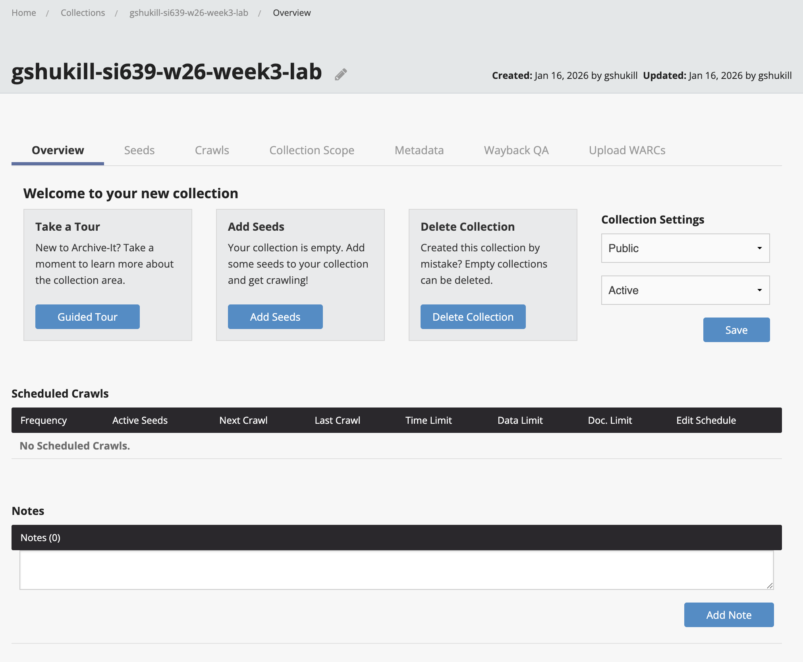

One of the very first things we'll want to do is make the collection **private**.  You can do this by toggling this part of the "Collection Settings" and then clocking "Save": 

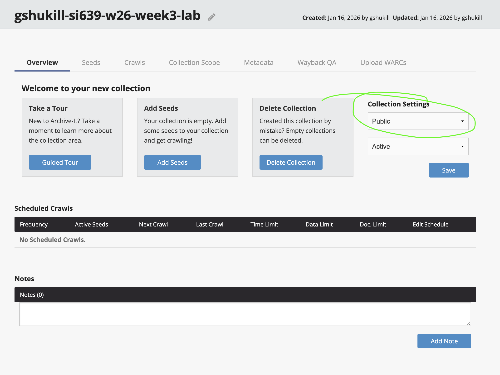

### 2- Add single seed and run first crawl

Next we'll add a single seed and run a test crawl to get a feel for the mechanics of that.

To add a seed,
1. Click the "Seeds" tab
2. Click "Add Seeds" button

Paste the following single seed into the box:

```text
https://minternet-recipes.exe.xyz/
```

And set the following:
- Access: `Private`
- Frequency: `One-Time`
- Seed Type: `Standard Plus External Links (Standard+)`
  - [AIT documentation about "Seed Type"](https://support.archive-it.org/hc/en-us/articles/208332843-Assign-and-edit-a-seed-type)
  - we want this type to attempt and crawl the entire `minternet-recipes` domain

Should look like the following:

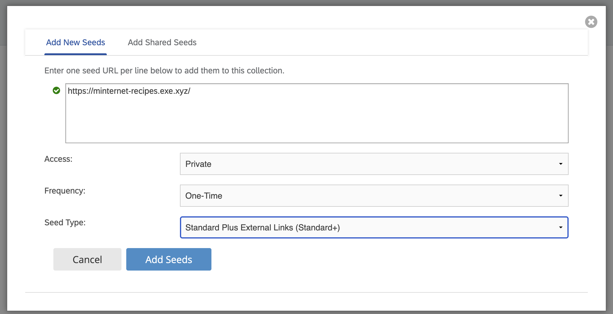

Now let's kickoff our first crawl!

In the seed list, click the checkbox next to your seed then click "Run Crawl"

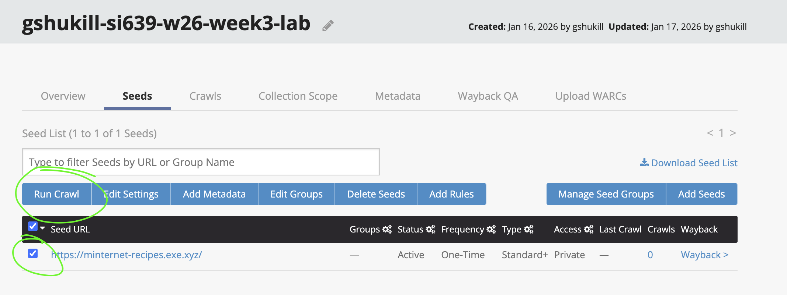

Set the following options:
- Crawl Type: `One-Time Crawl`
- Doc. Limit = `1000` (just to be safe)

Then click "Crawl".  Congratulations, you have started your first web crawl with the AIT service!

### 3- Add collection and see metadata

While our first crawl is underway, let's add some collection and seed metadata.

Click "Collections" in the top navigation bar, then click your collection in the table.

Within the collection, look for the "Metadata" tab.  You should see a screen that looks like this:

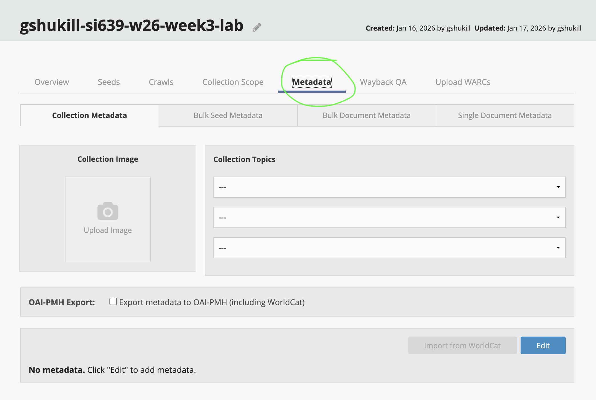

The tab "Collection Metadata" is highlighted by default.  We can add some collection level metadata here.

Feel free to add a collection image and/or collection topics.

Next, let's add some metadata in the bottom box by clicking the "Edit" button.  The available fields are from [Dublin Core (DC) metadata schema](https://www.dublincore.org/specifications/dublin-core/dcmi-terms/#section-3).  Dublin Core has evolved over the years, starting with these roughly 15 elements, now referred to as the `/elements/1.1/` namespace.

Feel free to create a handful of these available metadata fields.  Note that the fields are repeatable!  Each time you click "Save" next to one, you can enter a new field value.

Example:

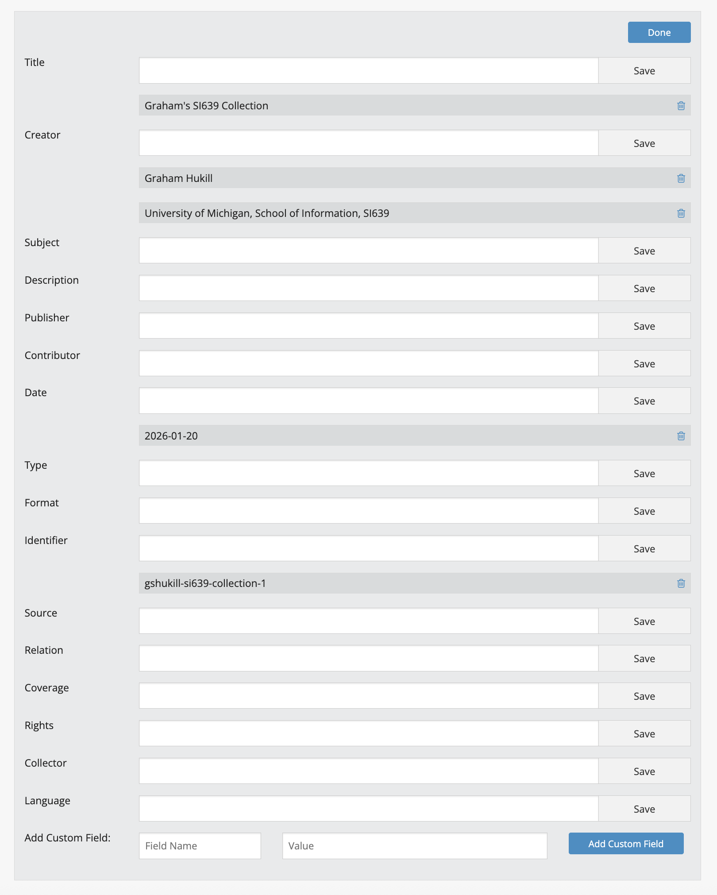

Note that you can also add custom metadata fields:

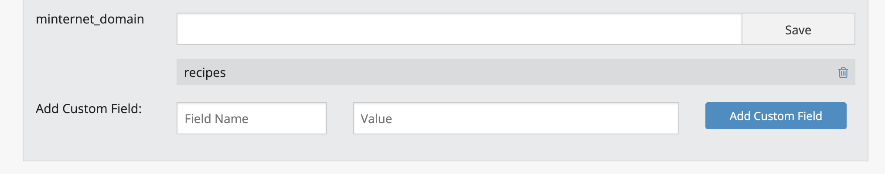

When you're done, click "Done" near the top of the metadata section.

Note that in this metadata screen there is an "OAI-PMH Export" option.  [OAI-PMH](https://www.openarchives.org/pmh/) is a protocol for metadata harvesting.  By publishing the collection metadata via OAI, [Worldcat](https://search.worldcat.org/) can harvest the records and expose them in the Worldcat catalog for discovery.  This is a rich and interesting topic unto itself, a little out of scope here, but worth noting!

By this time, your crawl has likely completed!  If you navigate back to the collection page, there should be a link to view the collection in the user-facing side of things in AIT:

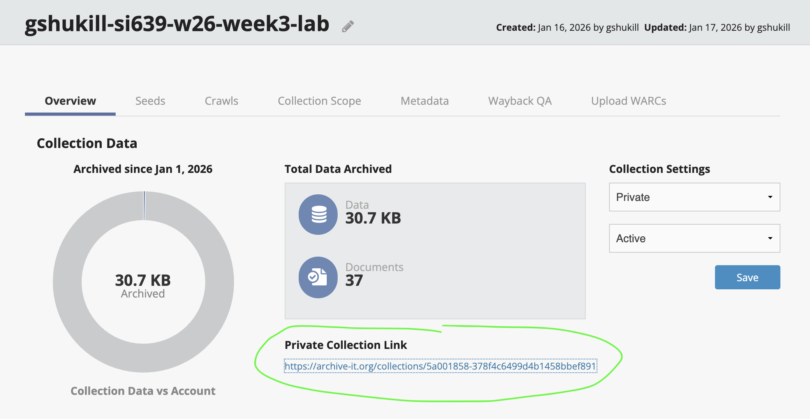

### 4- Public collection page and wayback replay

The collection is still **private** at this time, so things will look a little different, but it's a sense of what a public collection looks like.  What you see here is very similar to what the public would see if the collection was discoverable and public:

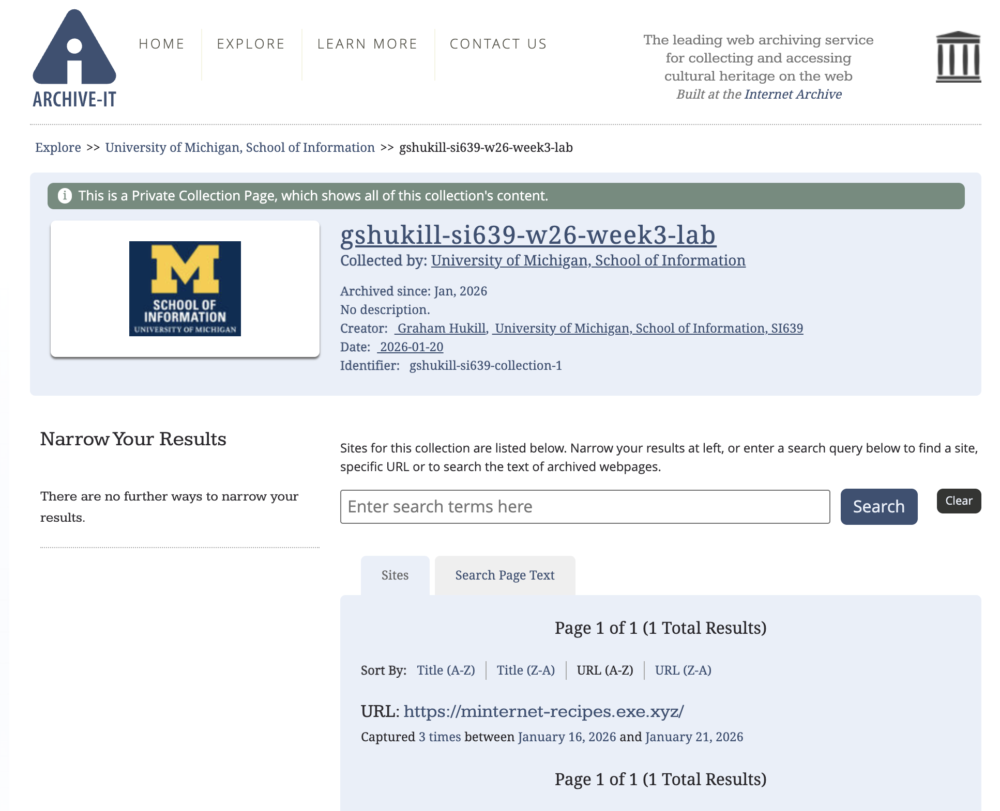

Note the block "URL: https://minternet-recipes.exe.xyz/" on the collection page.  We have only entered one seed so far, which correlates to this URL and link here; this section is driven by the collection seeds.  In this way, they are an implicit **entrypoint** into the collection via this browsing interface.

Clicking on that URL link will open the likely familiar Wayback interface.  Find the date of the most recent capture (likely the _only_ capture in the context of this lab) and click the circle:

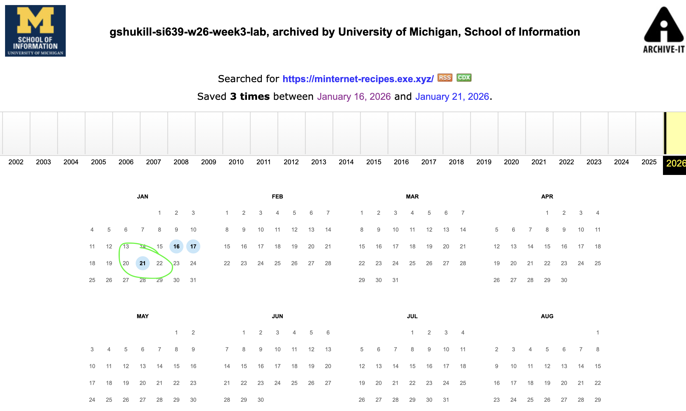

Once clicked, we've come full circle and you should be seeing a successful replay of our crawl!

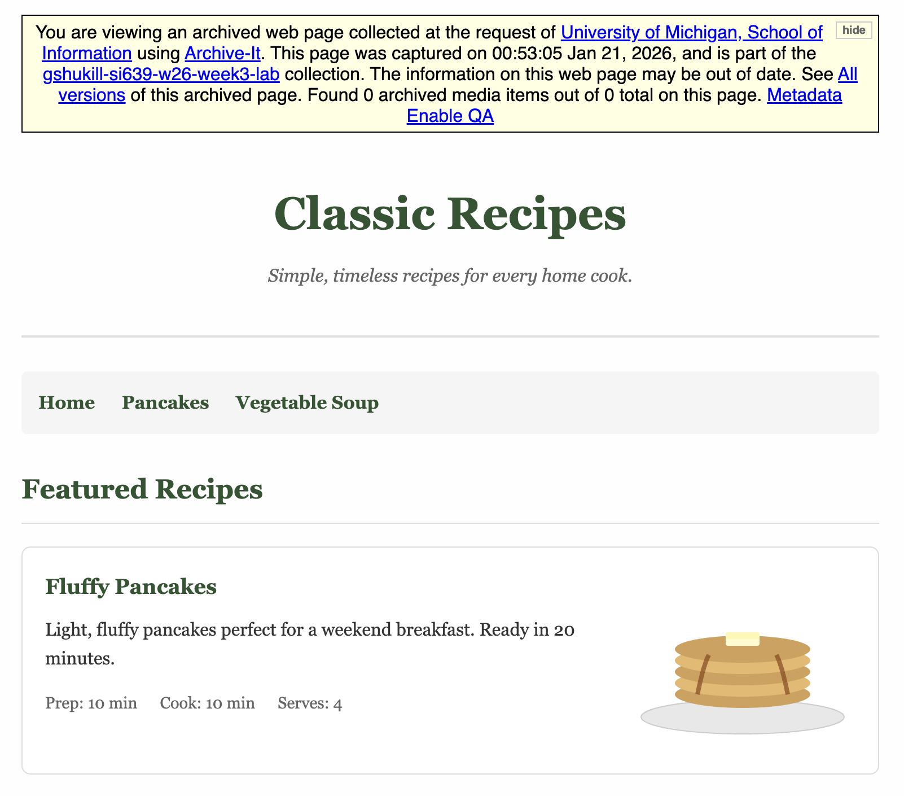

For some web archiving programs, this may close the loop and be sufficient for their purposes:

1. Creation of a collection
2. Seeds added
3. Crawls run
4. Data captured
5. Minimal metadata entered
6. Discovery and access available via the AIT public interface

For other web archiving programs, we are only scratching the surface of what they may utilize.  AIT is a very full featured web archiving service, much of which we have not yet touched on yet.

### 5- Crawl Traps, QA, and Scoping; oh my!

Next we will add a seed that will encounter some known crawler traps and walk through the steps of:

1. Running test crawls to expose them
2. QA to understand them
3. Crawl scoping to avoid them

Our seed will be the following URL:

```text
https://minternet.exe.xyz/
```

With the settings:
- Access: `Private`
- Frequency: `One-Time`
- Seed Type: `Standard Plus External Links (Standard+)`

Now, let's run a test crawl to get a sense of what this seed would do if we don't include any seed level **include** or **exclude** rules.

1. Check the box next to only the newly added seed
2. Click "Run Crawl"
3. Select the "Test Crawl" radio button
4. Set the Doc Limit to 100 (this smallish number exceeds the valid URLs on this domain)
5. Default options are okay for the rest

Once the crawl is started, you can view it in "Current Crawls".  The crawl shouldn't take more than a few minutes to complete.  For the sake of analysis, we can analyze a previously run crawl with the same settings: https://partner.archive-it.org/421/collections/30935/crawl/2656563.

Opening this crawl, it should look like the following

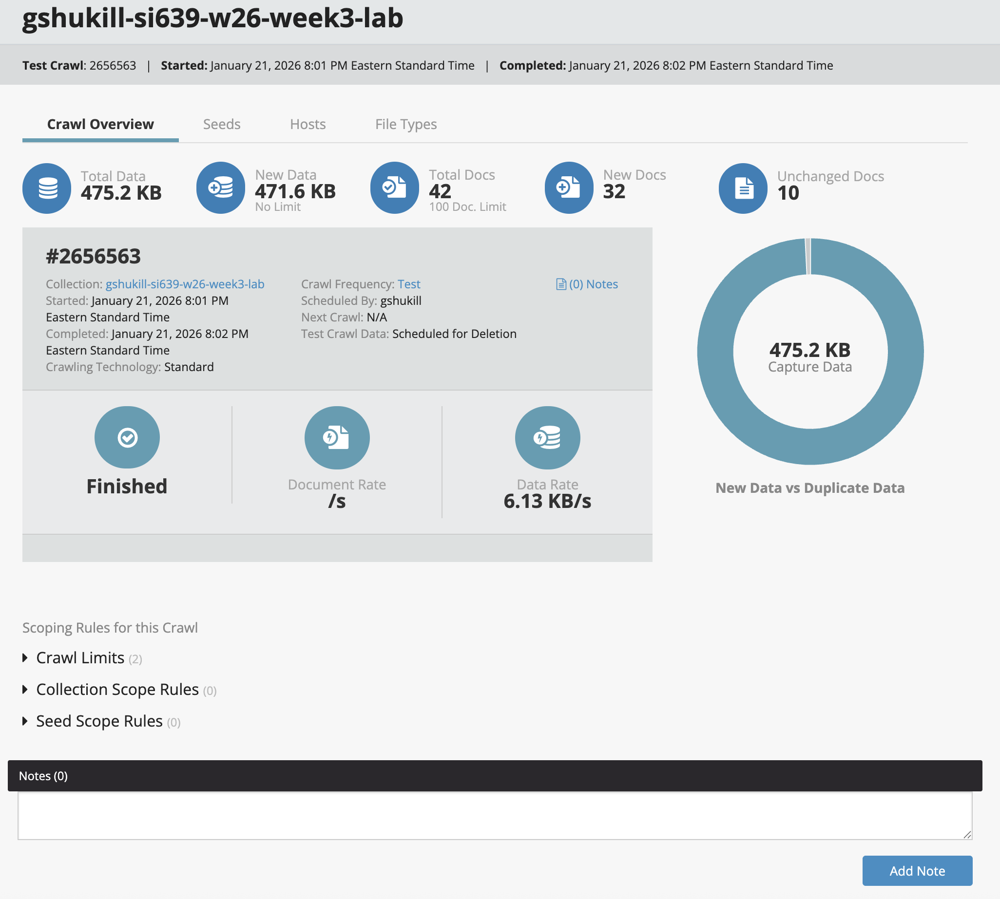

The metrics near the top indicate we captured 42 docs, but what URLs are included in this?  To see a list of the URLs captured we'll want to do the following:

1. Click the "Seeds" tab from this crawl
2. Find the seed `https://minternet.exe.xyz/` in the seed list at the bottom
3. Click the [42 Docs link](https://partner.archive-it.org/api/reports/crawled-detail/2656563?pluck=url&warc_filename__isnull=false&seed=https%3A%2F%2Fminternet.exe.xyz%2F)
4. This will open a new tab with a plain text list of URLs captured

```text
dns:minternet.exe.xyz
https://minternet.exe.xyz/robots.txt
whois://whois.arin.net/z+%2B+16.145.25.29
whois://whois.iana.org/xyz
whois://whois.nic.xyz/exe.xyz
https://minternet.exe.xyz/
dns:minternet-blogs.exe.xyz
dns:minternet-science.exe.xyz
dns:minternet-wowser.exe.xyz
https://minternet-blogs.exe.xyz/robots.txt
https://minternet.exe.xyz/favicon.ico
https://minternet-science.exe.xyz/robots.txt
https://minternet-wowser.exe.xyz/robots.txt
https://minternet-blogs.exe.xyz/
https://minternet.exe.xyz/
https://minternet-science.exe.xyz/
https://minternet-wowser.exe.xyz/
dns:minternet-recipes.exe.xyz
whois://whois.arin.net/z+%2B+16.145.159.32
whois://whois.arin.net/z+%2B+16.145.126.153
whois://whois.arin.net/z+%2B+16.145.179.236
dns:cdn.tailwindcss.com
https://minternet.exe.xyz/favicon.ico
https://minternet-blogs.exe.xyz/favicon.ico
https://minternet-science.exe.xyz/favicon.ico
https://minternet-wowser.exe.xyz/favicon.ico
https://minternet-recipes.exe.xyz/robots.txt
https://minternet-blogs.exe.xyz/static/style.css
https://cdn.tailwindcss.com/robots.txt
https://minternet-science.exe.xyz/static/images/volcano.svg
https://minternet-wowser.exe.xyz/static/style.css
https://minternet-recipes.exe.xyz/
whois://whois.arin.net/z+%2B+16.145.102.7
https://cdn.tailwindcss.com/
https://minternet-science.exe.xyz/static/images/crystal.svg
https://minternet-recipes.exe.xyz/favicon.ico
https://cdn.tailwindcss.com/3.4.17
https://minternet-science.exe.xyz/static/images/pendulum.svg
https://minternet-recipes.exe.xyz/style.css
https://minternet-science.exe.xyz/static/app.js
https://minternet-recipes.exe.xyz/images/pancakes.svg
https://minternet-recipes.exe.xyz/images/soup.svg
```

What do we notice about this list?  We know the seed URL itself was nothing more than 4 links to sub-domains like `minternet-blogs`, `minternet-recipes`, etc.  We see a few of those sub-domains on here, but nothing much "deeper" than that.  We are also seeing some CSS, Javascript, and favicons as well.  But it's clear at a glance that we're not going much deeper into those sites.

We have a couple of options at this point:
1. Add more seeds for these sub-domains
2. Add some **include** rules to our pre-existing seed that will allow capture of pages discovered

For this lab, we'll go with option #2.

Navigate back to the collection, then to the "Seeds" section, then click into our seed `https://minternet.exe.xyz/`.  Next, click the "Seed Scope" tab for this seed which should look like the following:

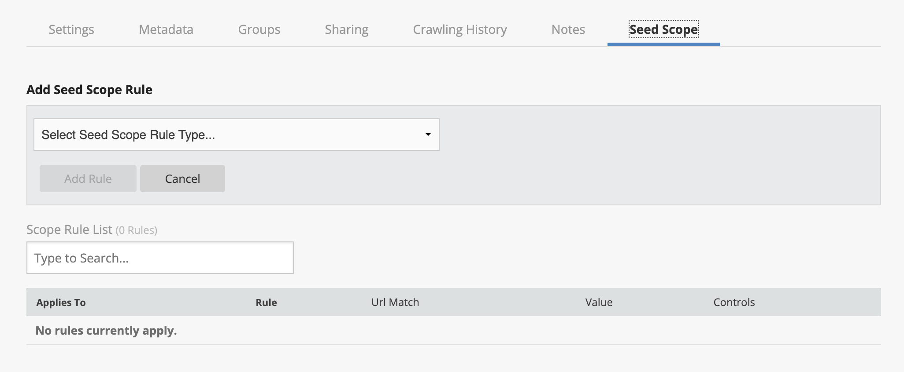

To add **include** rules, select the option "Accept Document If", then set the following:

- first dropdown: "it Matches the Regular Expression"
- value: `.*minternet.*`

It should look like the following:

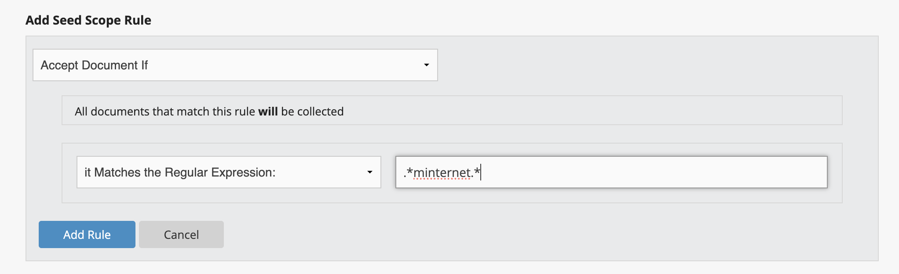

Then click "Add Rule".

This [regular expression](https://en.wikipedia.org/wiki/Regular_expression#Basic_concepts) type rule will be applied to all URLs that the crawler encounters.  The regular expression -- or "regex" for short -- of `.*minternet.*` can be thought of like this:

- `.*` = match anything at the start of the URL, e.g. `https://`
- `minternet` = make sure the string "minternet" is _somewhere_ in the URL
- `.*` = anything can follow after `minternet`, e.g. `minternet-blogs.exe.xyz`, `minternet-science.exe.xyz`, etc.

This is a fairly unrealistic rule, as it's too "greedy" and may capture URLs we don't want, but it paints a picture of how they can be used.

With this new rule in place, let's re-run a test crawl with all the same settings as before... once this test crawl is complete you should see something similar:

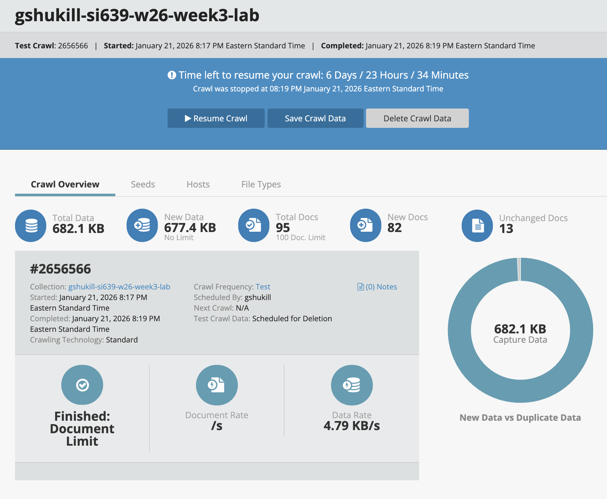

For analysis purposes, this crawl will work equally well to the one you ran: [https://partner.archive-it.org/421/collections/30935/crawl/2656566](https://partner.archive-it.org/421/collections/30935/crawl/2656566).

Note that now 95 docs; it would appear that our seed scope include rule had an effect!  What kind of URLs are we seeing from this crawl?  We can use the same QA approach as before and look at the plain text URLs that originated from this seed:

1. Click "Seeds" tab from within this crawl
2. Click the link [95 docs](https://partner.archive-it.org/api/reports/crawled-detail/2656566?pluck=url&warc_filename__isnull=false&seed=https%3A%2F%2Fminternet.exe.xyz%2F)
3. Review the plain text

```text
dns:minternet.exe.xyz
https://minternet.exe.xyz/robots.txt
whois://whois.arin.net/z+%2B+16.145.25.29
whois://whois.iana.org/xyz
whois://whois.nic.xyz/exe.xyz
https://minternet.exe.xyz/
dns:minternet-blogs.exe.xyz
dns:minternet-science.exe.xyz
dns:minternet-recipes.exe.xyz
https://minternet.exe.xyz/
dns:minternet-wowser.exe.xyz
https://minternet-blogs.exe.xyz/robots.txt
https://minternet-recipes.exe.xyz/robots.txt
https://minternet-science.exe.xyz/robots.txt
https://minternet.exe.xyz/favicon.ico
https://minternet-blogs.exe.xyz/
https://minternet-wowser.exe.xyz/robots.txt
https://minternet-recipes.exe.xyz/
https://minternet-science.exe.xyz/
whois://whois.arin.net/z+%2B+16.145.159.32
whois://whois.arin.net/z+%2B+16.145.102.7
https://minternet.exe.xyz/favicon.ico
https://minternet-blogs.exe.xyz/static/style.css
whois://whois.arin.net/z+%2B+16.145.126.153
https://minternet-recipes.exe.xyz/style.css
https://minternet-science.exe.xyz/static/images/volcano.svg
https://minternet-wowser.exe.xyz/
dns:cdn.tailwindcss.com
whois://whois.arin.net/z+%2B+16.145.179.236
https://minternet-recipes.exe.xyz/images/pancakes.svg
https://minternet-blogs.exe.xyz/favicon.ico
https://minternet-wowser.exe.xyz/static/style.css
https://minternet-science.exe.xyz/static/images/crystal.svg
https://cdn.tailwindcss.com/robots.txt
https://minternet-recipes.exe.xyz/images/soup.svg
https://minternet-blogs.exe.xyz/calendar
https://cdn.tailwindcss.com/
https://minternet-wowser.exe.xyz/favicon.ico
https://minternet-science.exe.xyz/static/images/pendulum.svg
https://minternet-blogs.exe.xyz/search
https://minternet-recipes.exe.xyz/favicon.ico
https://cdn.tailwindcss.com/3.4.17
https://minternet-wowser.exe.xyz/app/home
https://minternet-science.exe.xyz/static/app.js
https://minternet-blogs.exe.xyz/author/alice
https://minternet-recipes.exe.xyz/recipes/pancakes.html
https://minternet-wowser.exe.xyz/app/about
https://minternet-science.exe.xyz/favicon.ico
https://minternet-blogs.exe.xyz/author/bob
https://minternet-recipes.exe.xyz/recipes/soup.html
https://minternet-wowser.exe.xyz/app/gallery
https://minternet-science.exe.xyz/static/data/experiments.csv
https://minternet-blogs.exe.xyz/author/charlie
https://minternet-wowser.exe.xyz/app/contact
https://minternet-science.exe.xyz/static/data/observations.csv
https://minternet-blogs.exe.xyz/post/cross-domain-archiving-challenges
https://minternet-wowser.exe.xyz/app/
https://minternet-science.exe.xyz/static/documents/safety-guide.pdf
https://minternet-blogs.exe.xyz/post/science-resources-for-archivists
https://minternet-wowser.exe.xyz/base-demo
https://minternet-science.exe.xyz/api/experiments
https://minternet-blogs.exe.xyz/post/getting-started-with-web-archiving
https://minternet-wowser.exe.xyz/random
https://minternet-blogs.exe.xyz/calendar?year=2026&month=0
https://minternet-wowser.exe.xyz/inline-assets
https://minternet-blogs.exe.xyz/calendar?year=2026&month=2
https://minternet-wowser.exe.xyz/large-script
https://minternet-blogs.exe.xyz/calendar?year=2016&month=1
https://minternet-wowser.exe.xyz/csp-demo
https://minternet-blogs.exe.xyz/calendar?year=2025&month=1
https://minternet-wowser.exe.xyz/refresh-loop
https://minternet-blogs.exe.xyz/calendar?year=2027&month=1
https://minternet-wowser.exe.xyz/refresh-loop?count=1
https://minternet-wowser.exe.xyz/refresh-loop?count=2
https://minternet-blogs.exe.xyz/calendar?year=2036&month=1
https://minternet-wowser.exe.xyz/refresh-loop?count=3
https://minternet-blogs.exe.xyz/calendar?year=1990&month=1
https://minternet-wowser.exe.xyz/refresh-loop?count=4
https://minternet-blogs.exe.xyz/calendar?year=2000&month=1
https://minternet-wowser.exe.xyz/refresh-loop?count=5
https://minternet-blogs.exe.xyz/calendar?year=2050&month=1
https://minternet-wowser.exe.xyz/websocket-demo
https://minternet-blogs.exe.xyz/calendar?year=3000&month=1
https://minternet-blogs.exe.xyz/archive/2026/1
https://minternet-blogs.exe.xyz/search?q=archive
https://minternet-wowser.exe.xyz/shadow-dom
https://minternet-blogs.exe.xyz/search?q=warc
https://minternet-wowser.exe.xyz/static/
https://minternet-blogs.exe.xyz/search?q=crawler
https://minternet-wowser.exe.xyz/static/test.html
https://minternet-blogs.exe.xyz/search?q=javascript
https://minternet-wowser.exe.xyz/random/jehdtsin
https://minternet-blogs.exe.xyz/search?q=preservation
https://minternet-wowser.exe.xyz/random/nafjxobz
https://minternet-blogs.exe.xyz/search?q=web
```

We are seeing quite a bit more content this time.  It would appear that with the new **include** of `.*minternet.*` we are capturing more pages originating from our single seed.  This suggests that because our seed starts at [https://minternet.exe.xyz/](https://minternet.exe.xyz/), which has links to these sub-domains, and as links are followed they will all contain `minternet` _somewhere_ in the URL, the crawl is instructed to capture and include those URLs.

What else are we seeing here?  QA-ing crawls can be very methodical and scientific.... or it can be more of an art, looking for patterns or irregularities.  A quick scroll through these URLs will reveal a couple of things that repeat a lot:

- URLs with `/calendar` in it, e.g. `https://minternet-blogs.exe.xyz/calendar?year=1990&month=1`
- URLs with `/archive` in it, e.g. `https://minternet-blogs.exe.xyz/archive/2026/1`
- URLs with `/search` in it, e.g. `https://minternet-blogs.exe.xyz/search?q=warc`
- URLs with `/random` in it, e.g. `https://minternet-wowser.exe.xyz/random/nafjxobz`

We will explore crawler trap patterns in more detail later, but suffice to say for now these _are_ crawler traps.  Note the following websites which explain why they are traps:

- [https://minternet-blogs.exe.xyz/calendar](https://minternet-blogs.exe.xyz/calendar)
- [https://minternet-blogs.exe.xyz/search](https://minternet-blogs.exe.xyz/search)
- [https://minternet-blogs.exe.xyz/archive/2026/1](https://minternet-blogs.exe.xyz/archive/2026/1)
- [https://minternet-wowser.exe.xyz/random](https://minternet-wowser.exe.xyz/random)

Our next step will be to write some **exclude** rules that will avoid these traps!

Just like we added our **include** rule, follow these steps:

1. Navigate to the collection
2. Then to "Seeds"
3. Click on our seed `https://minternet.exe.xyz/`
4. Click on "Seed Scope"

Now we'll create three exclusion rules:

1. Select "Exclude Document If"
2. Select "it Matches the Regular Expression"
3. Enter the value `.*minternet-blogs.exe.xyz/search.*`

Repeat this process for the following three values:
- `.*minternet-blogs.exe.xyz/calendar.*`
- `.*minternet-blogs.exe.xyz/archive.*`
- `.*minternet-wowser.exe.xyz/random.*`

When you're done, it should look like the following:

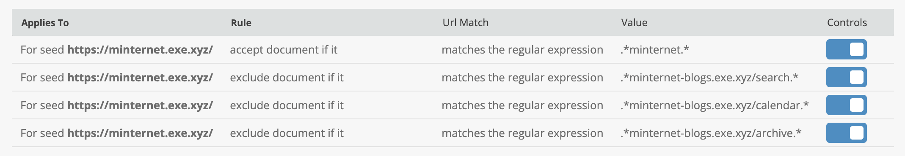

Finally, let's run another test crawl and see the effect of this.  Follow the steps we've done before, but this time let's bump our document limit to 2000 and give us some breathing room for URLs and the various assets we may encounter.

For analysis purposes, you may use this crawl which follows this pattern is now complete: [https://partner.archive-it.org/421/collections/30935/crawl/2656574](https://partner.archive-it.org/421/collections/30935/crawl/2656574).

Once the crawl is complete, it should finish with 77 documents:

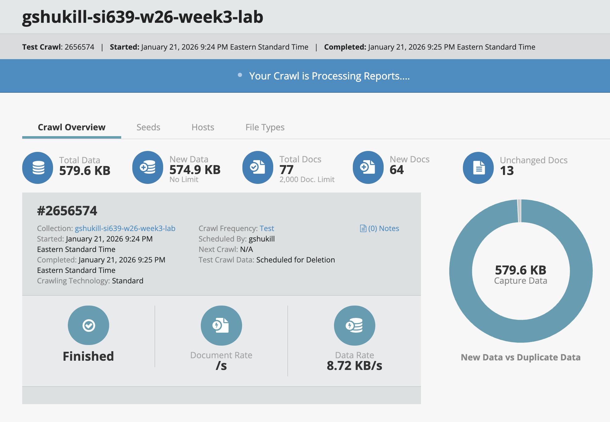

🚨**NOTE!** 🚨

While putting together this section, I originally missed the exclusion pattern `.*minternet-wowser.exe.xyz/random.*` which resulted in encountering another crawler trap.  This was discovered after running a test crawl and noticing repeating URLs with `/random` in the URL.  This was not obvious from our first test crawl.  Though a couple of URLs had `/random` in them, e.g. `https://minternet-wowser.exe.xyz/random/jehdtsin`, it was not enough for an ad-hoc spot check to catch.  This is both a nice example of a) how scale can effect crawling and QA, and b) how iterative the process is! 

### 6- A real crawl and replay of content

Now that we've honed our seed, let's perform a full, real crawl.  Once that crawl is complete, we'll be able to view the results in the public facing interface of our collection.

1. Navigate to the collection
2. Navigate to "Seeds"
3. Select the seed we've been working on, `https://minternet.exe.xyz/`
4. Click "Run Crawl" and set the following:

- Crawl Type: `One-Time Crawl`
- Doc. Limit: `1000`  (just to be safe)

It should look like the following:

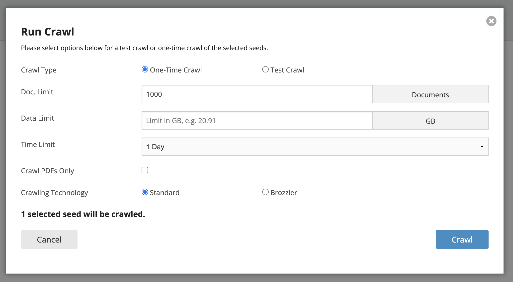

Either wait for this crawl to complete, or view the results of the crawl here: [https://partner.archive-it.org/421/collections/30935/crawl/2656578](https://partner.archive-it.org/421/collections/30935/crawl/2656578).

With the crawl complete, we can look at the public access interface.  Please note that we've configured this collection as "Private", so this interface is only visible to logged in users for this AIT account.

1. Navigate to collection
2. Click the [public/private interface link](https://archive-it.org/collections/5a001858-378f4c6499d4b1458bbef891):

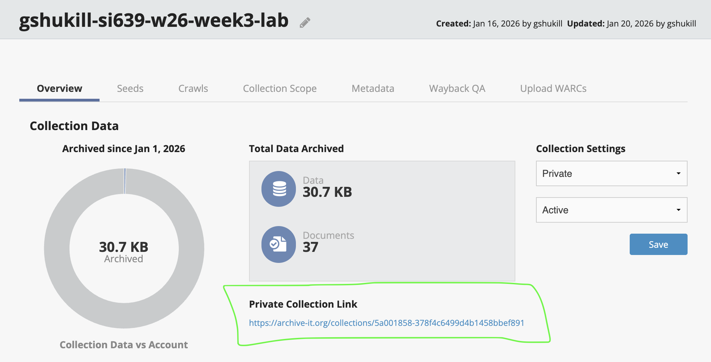


## Reflection Prompts

1- If you are new to AIT, what are you finding intuitive (if anything)?  what is confusing or non-obvious (if anything)?

2- How does this "service" differ from the "tool" `wget` we looked at last week?

3- 