# Lab: Browser Dev Tools (Chrome)

## Overview

[Chrome "DevTools"](https://developer.chrome.com/docs/devtools) is a suite of tools built right into the Chrome browser that allow for analyzing and manipulating websites.  It's difficult to succinctly summarize what it/they can do, given how expansive it is and how it continues to evolve.  In their own words,

> "Chrome DevTools is a set of web developer tools built directly into the Google Chrome browser. DevTools lets you edit pages on-the-fly and diagnose problems quickly, which helps you build better websites, faster."

As is evident, one of the primary initial use cases was helping developers _build_ websites.  Turns out, analysis that helps troubleshoot websites while building them, also helps us when crawling and archiving them!

In this lab, we'll primarily look at DevTools as a tool to help us QA crawls.  As we build a foundation of what DevTools can do, we'll take a peek at other affordances they provide, e.g. [Chrome DevTools Protocol (CDP)](https://chromedevtools.github.io/devtools-protocol/) for crawlers to use directly.

_NOTE: while this lab focuses on developer tools for Chrome, most browsers like Firefox, Safari, Edge, etc., have something similar.  I'm most familiar with Chrome's DevTools, and for better or worse they might be the most widely cited and used in web archiving at the moment, but it by no means needs to _stay_ that way!  I'm likely not alone in welcoming a future where our Internet browser ecosystem diversifies, and with that, new developer tools like this.

Lastly, we will use "DevTools", "dev tools", "developer tools", and countless other combinations; we are referring to the same thing.  The only more precise term we might use is CDP (Chrome DevTools Protocol) which is a protocol linked to above.

## Instructions

### 1- Opening DevTools and configuring our workspace

Personally, I find the easiest way to open DevTools is to right-click any website and select "Inspect".  You can also use the triple dot "hamburger" icon in Chrome and select `More Tools > Developer Tools`.  There are also countless keyboard shortcuts, worth a Googling if you prefer that!

Once opened, if you have never configured your dev tools workspace, it will look roughly like this:

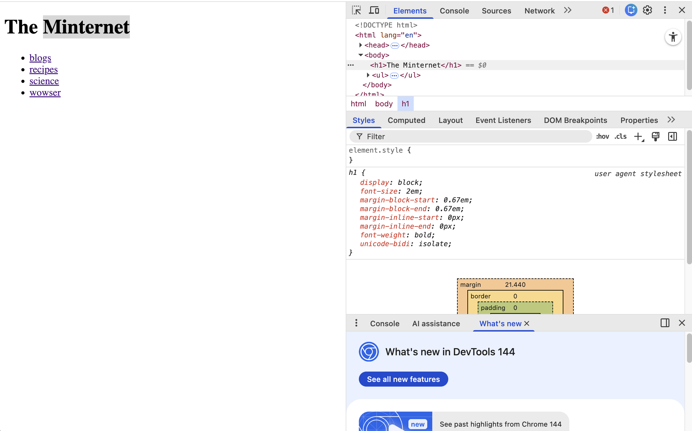

For the sake of this lab, please follow these steps to configure the workspace which will ensure what you see matches examples mentioned here.

First, click the triple dots in the upper right, then set "Dock Side" to "Dock to Bottom".  This moves the dev tools window to the bottom; this will help when we're looking at the network tab.

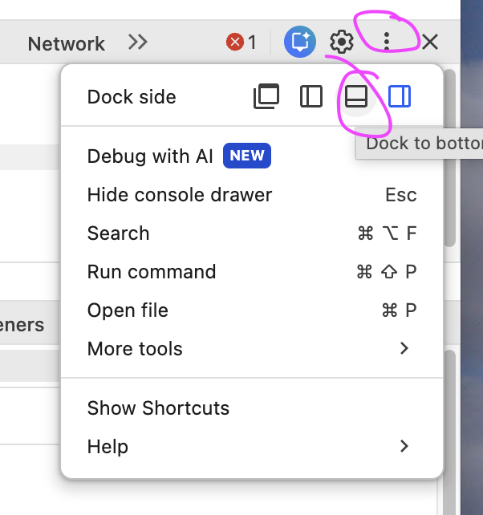

Next, close any boxes like "What's new in DevTools 144"; usually just an "X" in the upper-right of that box.  Eventually we want things to look like this:

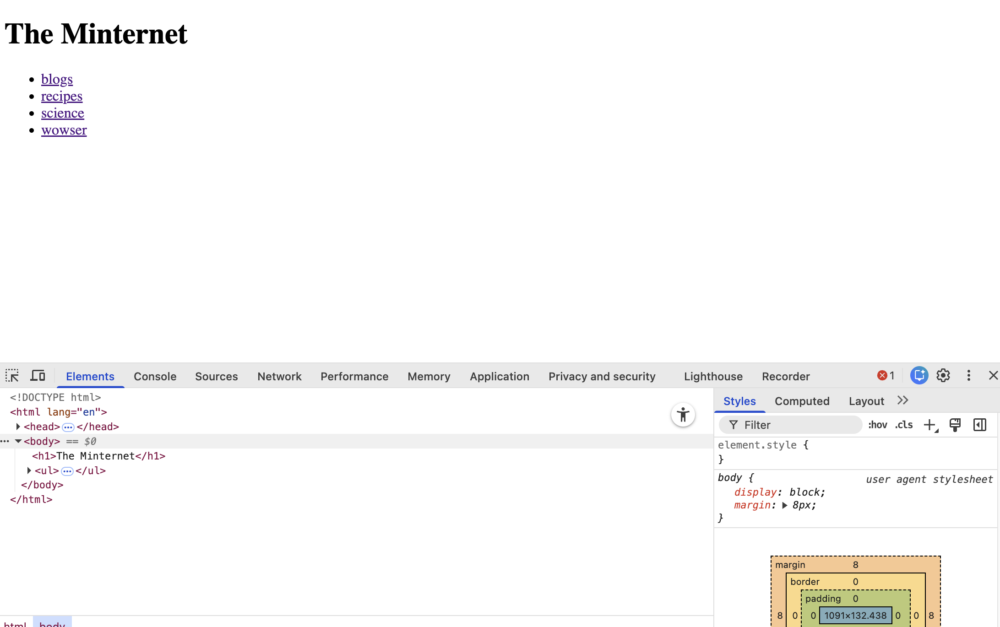

Next, click into the "Network" tab.  From here, check the two boxes "Preserve Log" and "Disable cache":

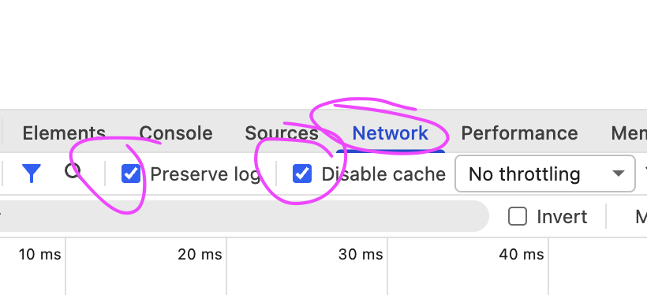

_NOTE: After this lab, you'll likely want to **uncheck** the "Disable cache" checkbox._  This ensures that anything we see in the network tab during analysis is a real, current network request and not the browser caching requests; while normally a wonderful thing, it can complicate analysis.

And voila, we're ready to analyze!

### 2- Observe network tab for a live website

Click the "Network" tab if not already there, then click the "Clear network log" button which is a circle with a cross through it in the upper-left:

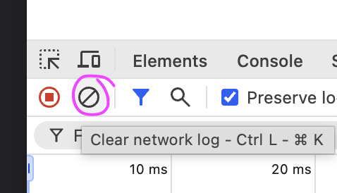

This will clear anything in the network tab.  We'll use this a lot, given our checkbox of "Preserve log".

Next, navigate to `https://minternet-science.exe.xyz/` in the browser with dev tools open.

At this time, you should see some activity in the network tab (recommended to increase the dev tools size if helpful).  Congratulations, you are monitoring network traffic!

We might call this the "home" or "root" page of the Science Minternet site.  Granted it's a non-trivial site, look at all those network requests!  Yours should look roughly like this:

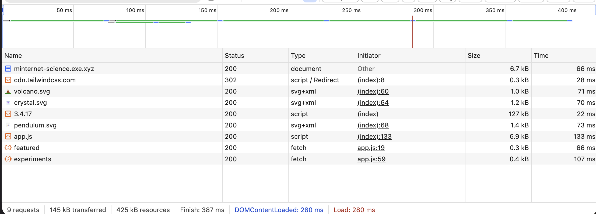

Each of these rows is a network request that was performed during the load and rendering of this page, including any network requests that CSS, Javascripts, or other browser engine activities requested.  We are _already_ getting into the heart of what makes browser engine crawls higher fidelity: each of these network requests is arguably an "asset" we need to render this website correctly.  

Let's click the first one, which should have `name=minternet-science.exe.xyz` and `type=document`.  When we do that, we immediately get some details about the request:

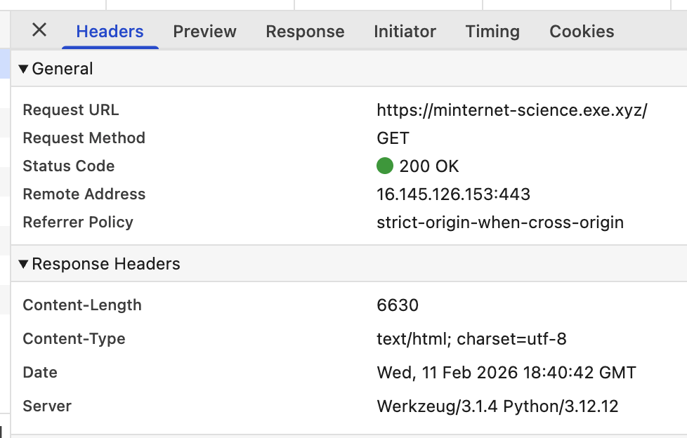

The top section "Response Headers" is metadata about the response:

- we get the full URL, `https://minternet-science.exe.xyz/`
- we see it performed a `GET` HTTP request
- we received a `200` status code from the server
- we even see the host of remote server it came from, `16.145.126.153:443` (the port `:443` suggests `https`)

If we scroll down and look at the "Request Headers" we see metadata about the request the browser engine made:
- method of `GET`
- `Accept` is what kind of responses it would accept
- etc.

Won't touch on them all, but would like to point out one for now `User-Agent` with a value of `Mozilla/5.0 (Macintosh; Intel Mac OS X 10_15_7) AppleWebKit/537.36 (KHTML, like Gecko) Chrome/144.0.0.0 Safari/537.36`.  This is the user agent of my browser making this request.  Pointing this out, because during crawls, this is the request headers that crawlers can optionally set to inform websites the request is coming from a crawler.  There are all _kinds_ of implications for user agents, well out of scope today, but suffice to say it's good to be familiar with this header.

Moving on, let's click the "Preview" tab from this specific request:

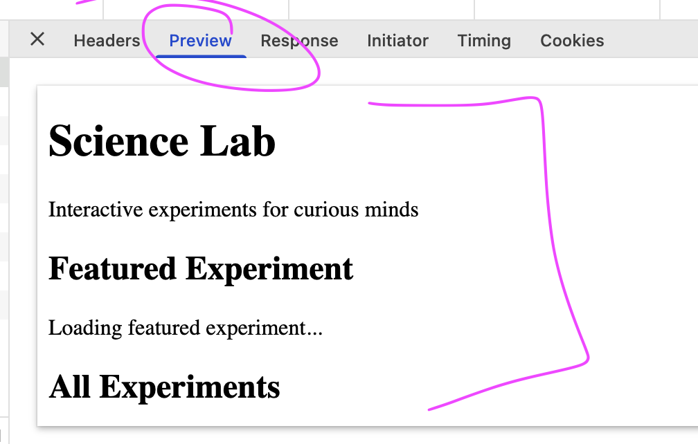

What we see here is DevTools attempting to preview the raw response from this request.  We're seeing the pure HTML the server sent for this URL, minus all the CSS and javascript and images in the final form.  

Clicking the "Response" tab will show that raw HTML:

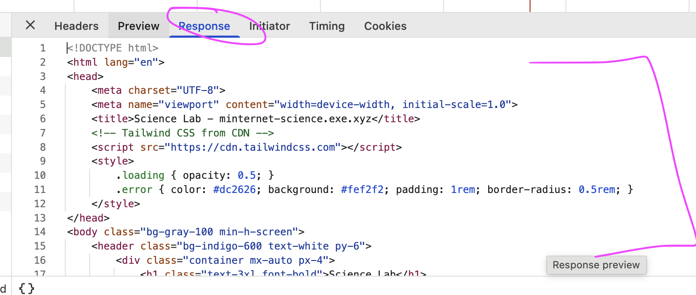

The preview and response tabs are quite helpful as you get deeper into QA:
- was that image what we thought it was?
- what is the precise HTML that was returned for the root page, before the browser engine touched it?
- what is the API response for an asynchronous request made on the page?  more on this one in a moment!

We'll skip tabs "Initiator", "Timing" and "Cookies" for now.

With a sense of what these tabs are all about, try clicking into other requests made during the loading of this page and see what the requests + responses were like.  

When ready, let's drill into the network request called "featured":

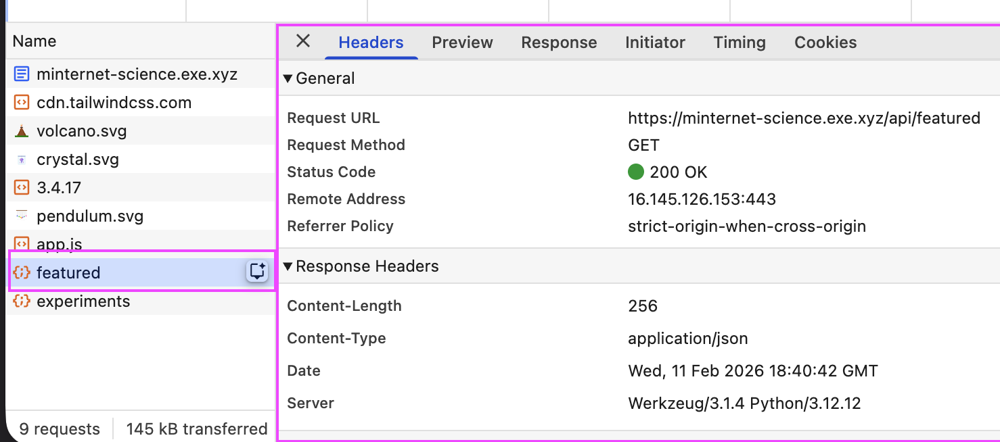

We can also introduce the network tab filtering at this point.  With the row clicked, look above for a row of filters and click the "Fetch/XHR" button:

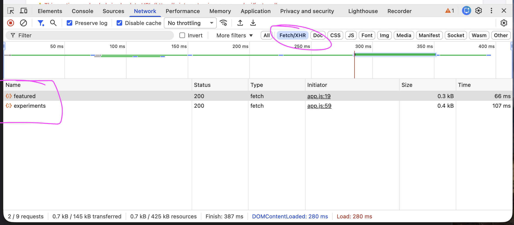

What happened?  what is XHR?  To understand these, and this "featured" network row, we need to backup a little bit.

As noted, browser engines will often make network requests for assets beyond just the original HTML document.  These are often referred to as "fetch" or "asynchronous" or "async" requests.  Most of the time, these are initiated by Javascript, but CSS and other mechanisms can trigger them too.  

Back in the day, most of these requests were to URLs that would return XML and thus "XHR" -- "XMLHttpRequest" -- kind of stuck as a dev tools moniker.  At one point, they were also called "AJAX" requests (Asynchronous JavaScript and XML) to try and capture it wasn't just XML anymore.  For the sake of this lab, and probably in most situations, it's fair to conceptualize these as "async" requests.  The "asynchronous" dimension of them is that they happened _after_ the original request for HTML had completed, and now we're in the browser engine land of figuring what _else_ to do.  This is glossing over some technicalities, but that's the gist.

When we filtered to only these, our "featured" request to URL `https://minternet-science.exe.xyz/api/featured` remained!  This is a _great_ clue that this page is "doing some Javascript work" beyond just retrieving and showing simple HTML.  As you get into web archiving, and are doing scoping and exploratory work, filtering to XHR requests on a page is a great way to get a sense for how "busy" the website is in terms of async requests.

Try going to some of your favorite websites and doing this experiment with them:
1. Navigate to page
2. Click the network logs clear button 🚫
3. Reload the page
4. Filter to XHR / async requests

Some websites have a LOT of these.

Okay... let's jump back to the "featured" async request.  If needed, you may need to navigate back to `https://minternet-science.exe.xyz/` (and don't forget to clear the network logs before reload!).

If we look at the "Response" tab, we see the raw JSON the server provided for this request, and the "Preview" tab shows a more interactive way to view that data.  This data is what populated the "Featured Experiment" section in the website.  As we'll see later in this lab, if this network request failed or was never performed at all, the website would not have rendered correctly.  Here, we are kind of looking at the "happy path" where everything is working well.   

---

#### Philosophical Interlude: Connection to WARCs

Much of what we've looked at above,
- request headers
- response headers
- HTTP methods and status codes
- responses
- etc.

are _precisely_ what make up the content in WARC files!  It bears repeating that **Web Archiving is basically capturing network requests in a way you can replay them later.**  

In this way, DevTools are a really natural companion to the capture and replay work we do.  They are exposing interactively and in realtime, all the bits and bobs that a crawler captures.  This allows us to kind of see what a crawler would see, to better understand a) how it _will_ work, or b) what went wrong.

#### /end Philosophical Interlude

---

For our next trick, let's drill into interactivity a bit more with DevTools.

First, let's clear the network tab with 🚫.  Then reload the science home page.

Now, with the network tab open, start clicking "View Details" for various experiments.  Note that each time you do this, another async request rolls through and is recorded.  The keen observer may also notice the graph near the top showing a timeline of when network requests are made.  This isn't terribly helpful now, but can be _really_ helpful for debugging tricky crawling bugs.  For example, maybe a particular crawler assumes that a page is fully rendered after no more javascript is firing, or 10 seconds.  This graph may reveal that at 15 seconds, the important data finally comes back and populates the page!

### 3- Elements aka the "DOM"

Let's switch gears a little and look at the "Elements" tab which shows us the _final_ rendered DOM and HTML the browser engine created.  With everything we learned from the "Network" tab in mind, looking at the DOM is a good reminder that experiencing a website is to experience a potentially ever changing entity.

Let's navigate to our blogs site, `https://minternet-blogs.exe.xyz/`, and click the "Elements" tab:

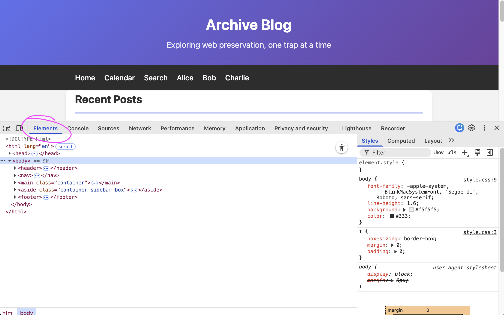

I'm tempted to refer to this as "looking at the HTML", and that's not totally inaccurate, but referring to this as the "DOM" might be more accurate.  The elements tab is showing us HTML, but it's HTML _as prepared and ever-changing_ by the browser engine.  For some sites, and we'll see this in a moment, this may change underfoot even as we're looking at it.

First, try expanding the `<head>` element which reveals what the creators of this page thought prudent to include in this section:

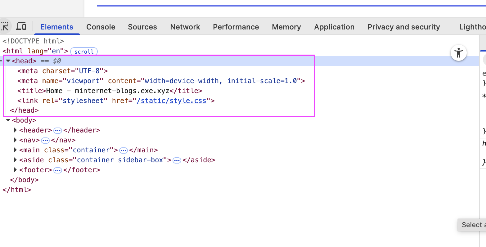

For web archiving, this `<head>` section is a common place to look for metadata that can be programmatically extracted.  Elements like `<title>` are extremely common, as are metadata information in formats like:

- Dublin Core
- [schema.org microdata](https://schema.org/docs/gs.html)
- etc.

This is also where you'll often see things like Javascript or CSS files referenced, which is a common thing that goes wrong during a crawl.  How does this help with QA?  Take this page for example.  We can see that there is a request for a CSS stylesheet at `/static/style.css`.  This is called an "absolute" or a "root relative" path, but it is _not_ a fully qualified URL.  This implies that this asset will be found on our current host / domain of  `minternet-blogs.exe.xyz`.  This is _highly_ relevant for scoping crawls.

It is very common to see full URLs here, to potentially different domains, for javascript and CSS files.  When you see that, you'll know that in your crawl settings you'll need to allow these "cross-domain" requests to happen.  

Now, let's imagine we're QA-ing a crawl and can't figure out why it thinks the page is unique each time we crawl it.  We look at the blogs home page and realize there is this session ID near the bottom.  

There are kind of two ways we can drill into this part of the website:

1. right click the section "Your session" and select "Inspect"
2. Use the element select tool from the already open dev tools:

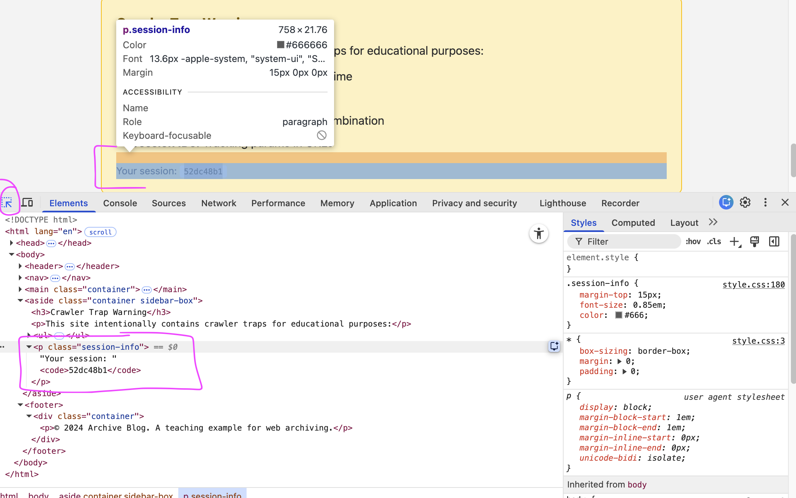

Either way, the precise part of the HTML / DOM is opened in the Elements tab and we can look at it.  For a bit of levity, try double clicking the value in your dev tools, modifying it, and pressing enter:

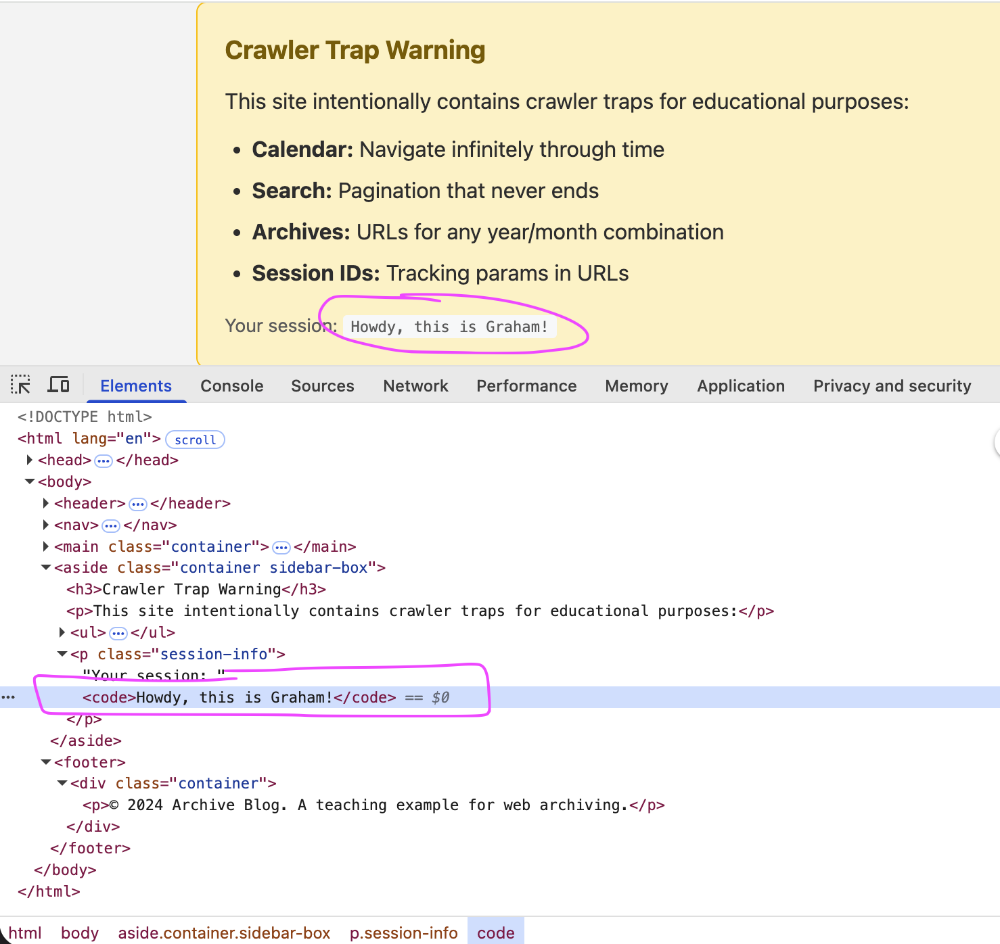

That's worth really sitting with for a moment.  By manipulating the DOM via DevTools, we have changed what the fully rendered website looks like.  This may seem like a party trick -- and trust me, it's a good one; try doing this to the headline in a news website and screenshotting it to freak people out -- but it's actually showing the bi-directional nature of the website we see and interact with and the DevTools interface with is an interface to the website _as structured as data in browser engine memory_.  As we'll see in a later more advanced part of this lab, some crawlers can utilize this principle to use DevTools as a way to capture _and_ interact with a website.

To wrap up this "Elements" section, let's look at what's called a "Single-Page App" (SPA) and how this manipulates the DOM in realtime.

Navigate to this URL `https://minternet-wowser.exe.xyz/app/home`.  Then, right click where it says "Welcome Home" in the page and select "Inspect" (or you can use the element select tool we did earlier).  You should see something like this:

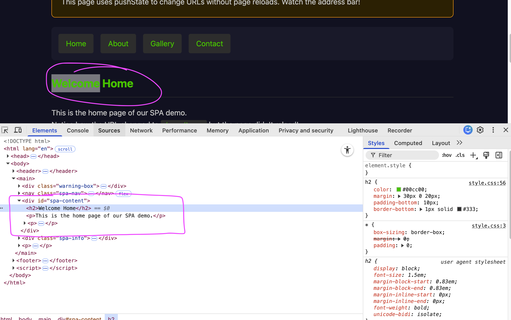

Now, with DevTools still open to this part of the DOM, try clicking the button "Gallery" in the website.  You should see the DOM change quickly, right before your eyes.  It has this nice feature of changed elements sort of slowly changing color and fading.  You can click any of those four buttons and see the DOM flicker and change.

Note that the URL is _also_ changing each time in the URL bar.  This might feel like we're just bouncing between pages, but is that true?  To the network tab for analysis!

Opening the network tab for whatever URL you're currently on,

1. Clear the network log
2. Select the "All" button

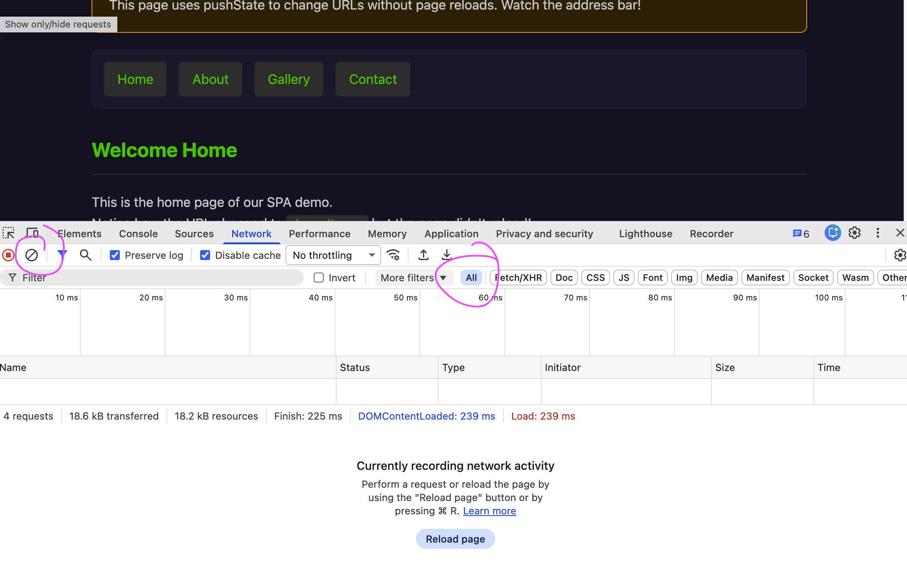

Now, start clicking those buttons in the website just like before.  What do you notice in the network tab?  Nothing!  This is consistent with a lot of modern websites.  On first load, they load a bunch of content and javascript, then as you navigate around in the page it _looks_ like you are going to websites, but it's just manipulating the URL bar.  In reality, there are no requests to new pages or any network requests at all.  This can be very problematic for a crawler.

We won't fully solve this right now, but what would this look like in a WARC file?  Would a crawler have followed these links?  Let's right-click the "Gallery" button and select inspect, which will zoom us back to the "Elements" tab:

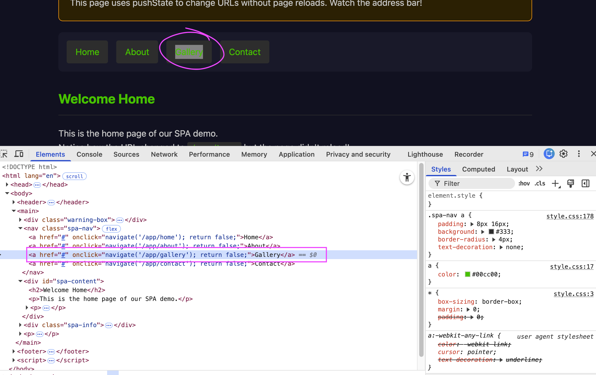

This tells us that while these buttons are `<a>` "anchor" tags, which crawlers generally follow, their `href` property is `#` for each.  Said another way, they aren't "real" links to anywhere.  So how does the page change content?  If you look at these `<a>` tags:

```html
<nav class="spa-nav">
    <a href="#" onclick="navigate('/app/home'); return false;">Home</a>
    <a href="#" onclick="navigate('/app/about'); return false;">About</a>
    <a href="#" onclick="navigate('/app/gallery'); return false;">Gallery</a>
    <a href="#" onclick="navigate('/app/contact'); return false;">Contact</a>
</nav>
```

We can see that each has an `onclick=` section which fires some javascript.  At this point, we can be sure that any crawlers _without_ some kind of clicking behavior -- think back to the Browsertrix lab -- they will NOT capture these sub-pages in this SPA website.  

Casting our mental and conceptual net _way_ into the distance.... how might a crawler "click" this button?  Let's introduce the console at this point to round out this lab.

### 4- The Console

(Re)navigate to our SPA website: `https://minternet-wowser.exe.xyz/app/home`.  Now, click the "Console" tab:

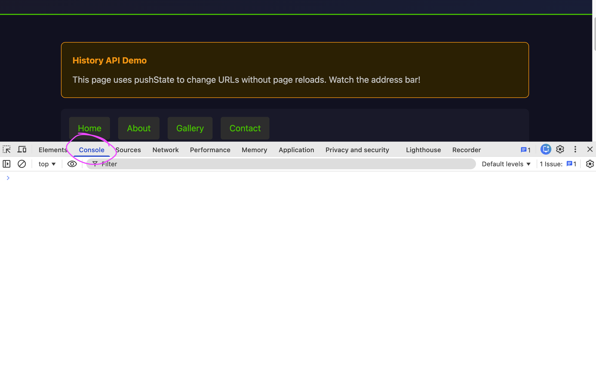

If it's your first time using the console in DevTools, you may have some warnings or notifications to close.  

The console is a place to interactively run Javascript code!  It's an incredibly helpful tool when building websites, and it's equally helpful sometimes for QA-ing a crawl to see what javascript code _would_ do.  

To demonstrate that it runs javascript code, we can try a classic.  Paste the following into the command prompt and hit enter:

```javascript
alert("Hello world! I was triggered from the console.  Web archiving is the bee's knees.");
```

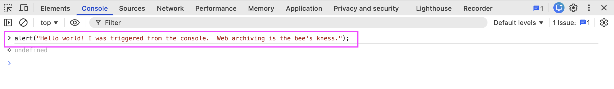

If it's your first time pasting code, it may ask you to allow this by typing "allow paste" and hitting enter.  Then it should work.

We just ran some javascript, and an alert box should have popped up. How cool _and_ annoying at the same time!

Now, we can use this console to understand how the SPA website works.  We'll jump around a bit between tabs, something quite common in DevTools work.

First, right-click the "Gallery" button, bringing up the DOM element related to the button (yep, we've done this before):


If you double click the text next to `onclick=` you should be able to select it.  What we want to do is copy the javascript that clicking that button fires which is the following:

```javascript
navigate('/app/gallery');
```

With that copied, let's navigate _back_ to the Console tab, paste that in, and run it:

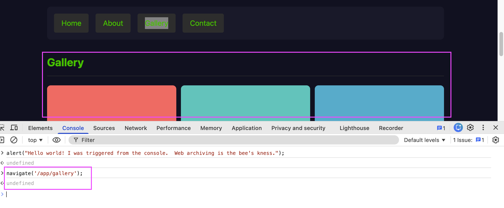

Lo and behold, it has navigated the website to the Gallery content!  This is a lot of fanfare to confirm something we may have been able to guess, but it's javascript that is changing the content in this page.  In all likelihood, a crawler without special instructions would miss these "sub-pages" of the SPA website.  If it was critical to capture this content, we might have a clue for how to tell crawlers to get it (e.g. _clicking_ on all `<a>` tags, not just extracting their `href` property target URLs).

### 5- So, what does an archived website look like in DevTools?

With all this DevTool-ing available to us now, how could we QA an actual archived website?  what does it look like when applied to replayed, captured content?

The answer is that it will vary depending on the crawler + replay approach, but often helpful information one way or another!  Let's try looking at a crawl of the Minternet via Archive-It.

With your dev tools open, open the "Network" tab, clear the contents, and navigate to `https://wayback.archive-it.org/30907/20260110184810/https://minternet-science.exe.xyz/`.  What do you notice?

One of the first things that jumps out is a red line in the network tab for our familiar "featured" asset:

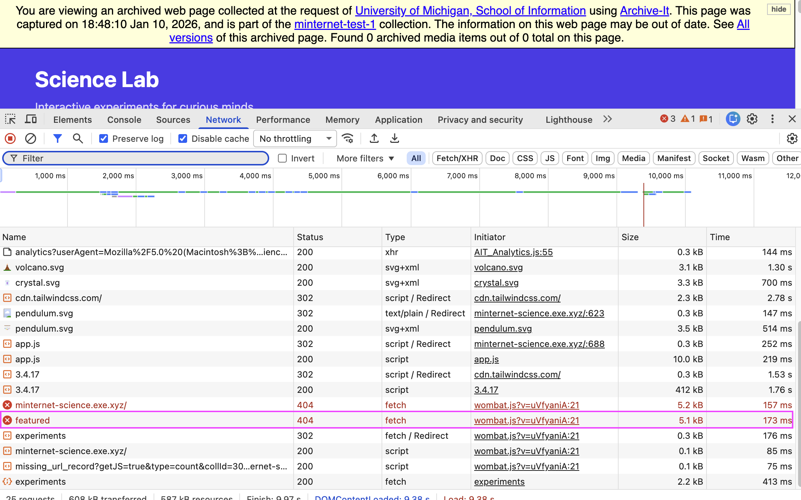

If we click on this row, we see the actual URL that was attempted: 

```text
https://wayback.archive-it.org/30907/20260110184810/https://minternet-science.exe.xyz/api/featured
```

Interesting!  If you recall from earlier, we know the original URL was `https://minternet-science.exe.xyz/api/featured`, and we can see that embedded in this URL.  This is fundamental to how Wayback playback works:

1. The HTML of websites is captured, with the original outbound links embedded in the HTML and/or Javascript
2. When we replay it, a library like [`wombat.js`](https://github.com/webrecorder/wombat) is used to **rewrite** URLs on the fly inside the replayed page.

So instead of an async request to `https://minternet-science.exe.xyz/api/featured`, `wombat.js` has rewritten this to `https://wayback.archive-it.org/30907/20260110184810/https://minternet-science.exe.xyz/api/featured`, which is basically `<collection>/<original_url>`.  There are edge cases to this simplistic explanation, and complexity on how `wombat.js` works, but this is the main idea.

As we use DevTools on archived sites, observing URLs that are getting requested, we see this rewriting everywhere.  

In this scenario, it looks as though the crawl did NOT capture this site, and we see the effect in the website:

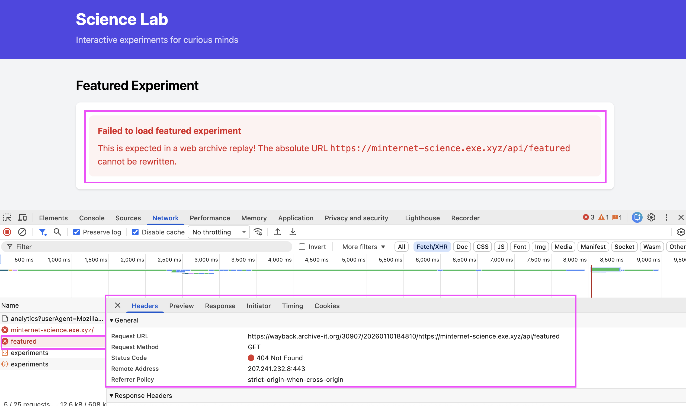

Let's see if we can use DevTools and do some real deep digging.

### 6- Understanding how replays pull from different crawls

In a browser with or without dev tools open, navigate to `https://wayback.archive-it.org/30907/*/https://minternet-wowser.exe.xyz/app/gallery`.  This screen shows two captures for this specific URL within the collection:

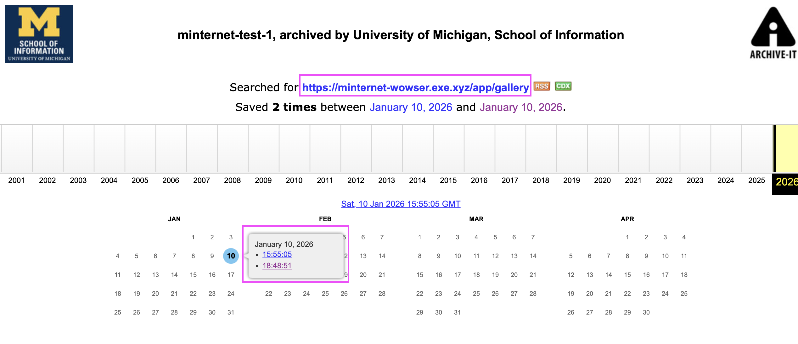

It's hard to capture in a screenshot, but if you hover over the links you'll see these two URLs:

```text
15:55:05 --> https://wayback.archive-it.org/30907/20260110155505/https://minternet-wowser.exe.xyz/app/gallery
18:48:51 --> https://wayback.archive-it.org/30907/20260110184851/https://minternet-wowser.exe.xyz/app/gallery
```

It's not obvious or even conventional across all web archives, but there are two bits of information we can extract from this:

- `30907` --> collection identifier
- `20260110155505` and `20260110184851` --> two distinct captures, at two different times

Why do we care about this?  Back to dev tools!  

With dev tools open, clear the network tab, then open this page `https://wayback.archive-it.org/30907/20260110184835/https://minternet-wowser.exe.xyz/app/gallery`.  Note the `20260110184835` crawl identifier in the URL.  This is not one of the ones we saw earlier.

Now look at the URL, you should be seeing `https://wayback.archive-it.org/30907/20260110184851/https://minternet-wowser.exe.xyz/app/gallery` which is the `20260110184851` crawl identifier we _did_ see earlier.

Next, click the "Doc" filter and look for the _two_ network requests for "gallery" in the network tab:

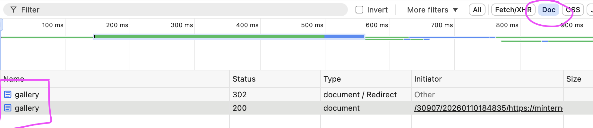

If we click on the first, we see the URL `https://wayback.archive-it.org/30907/20260110184835/https://minternet-wowser.exe.xyz/app/gallery` with a `302` redirect status.  In the Response Headers, you'll see the header `Location = https://wayback.archive-it.org/30907/20260110184851/https://minternet-wowser.exe.xyz/app/gallery` set in the response.  This tells the browser to redirect to this URL, which is the _closest crawl time_ that it can find a capture for this URL.

This is really not the greatest example, but it starts to _hint_ at how the Wayback machine will often very quietly redirect to crawls that are the nearest timestamp to the capture time we started with.  Think back to the concept of "temporal coherence" from lecture.  As we navigate captured content, using DevTools, we can analyze the URLs for websites and loaded assets to see what crawls they originated from.  More often than you might expect, we are bouncing between different capture dates, sometimes even within a single website.

We can see this a bit more cleanly and simply in the recipes page for an image.  If you navigate to the page `https://wayback.archive-it.org/30907/20260110184804/https://minternet-recipes.exe.xyz/`, with a little filtering and clicking around you can confirm that we are pulling in the image from a different crawl than what generated the HTML of the page!

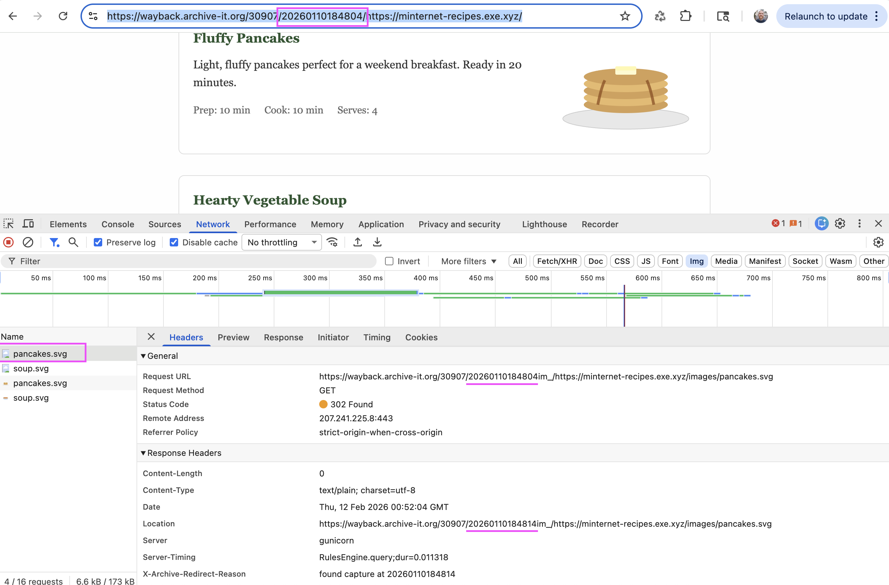

We can see the main URL of the page is coming from crawl `20260110184804`.  But the first attempt for the `pancake.svg` file gets a `302` redirect, pointing to the crawl `20260110184814`.  To _really_ confirm our understanding, we can look in the Wayback for captures of this specific `pancake.svg` URL:

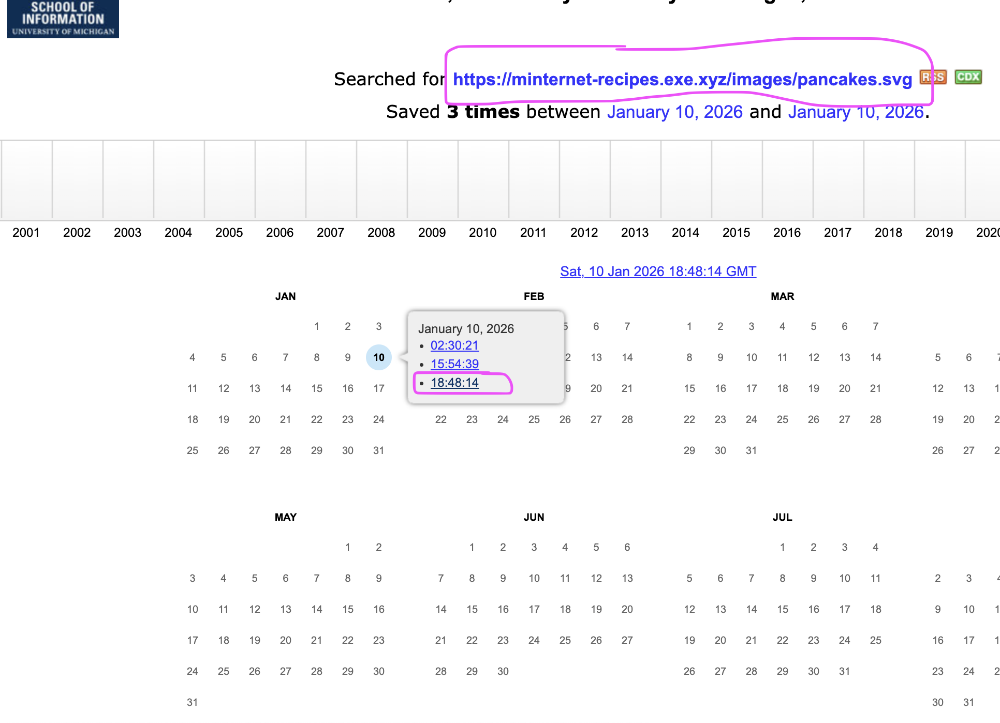

The end of the URL `184814` is referring to the `18:48:14` timestamp.

This is a very deep dive ™️, likely not something you'd do in day-to-day web archiving or QA.  But it helps to demonstrate how instrumental dev tools can be in tracking down hard to explain bugs or irregularities in a crawl.  We have shown that for a capture of the recipes via crawl `20260110184804`, we are actually seeing images from crawl `20260110184814`!  

## Reflection Prompts

1- Have you used developer tools in Chrome or other browsers before?  if so, was this different than your previous experience?

2- What are some other uses of dev tools for QA-ing web archives captures that were not covered in this walkthrough?

3- Try turning on developer tools for some websites you normally visit.  Do you see anything unusual or noteworthy?  

4- Do you think you'll use dev tools for your own final project web archiving work?  if so, what for?  if not, why not?
