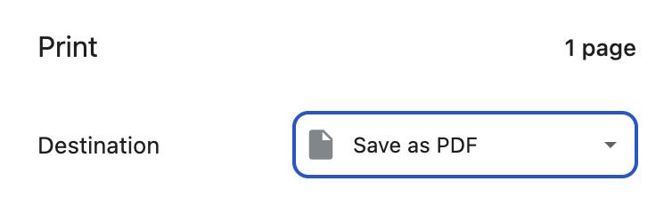
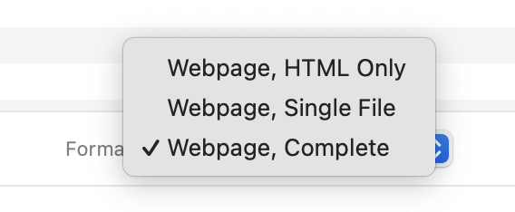

# Lab: "Save as" and "Save as PDF"

## Overview

In this lab, we will walk through and analyze a couple of the simplest forms of capturing web content:

1. File > "Save As"
2. File > Print > "Save as PDF"

## Instructions

**1-** In your browser of choice, navigate to a website of your choosing.

Option from the "Minternet": [https://minternet-science.exe.xyz/](https://minternet-science.exe.xyz/)

### Part One: File > "Save As"

**1-** Select the "File" menu, then "Save As"

**2-** Look for options near the bottom and select, "Webpage, Complete"

**3-** Select a location and click "Save"

### Part Two: File > Print > "Save as PDF"

**1-** Select the "File" menu, then "Print"

**2-** In the print dialog menu, look for the "Save as PDF" option:

**3-** Click "Save"

### Reflection Prompts

**1-** Do either of these approaches provide any metadata about the operation?  when it was performed?  from what computer or context?  if not, what are the implications? 

**2-** Are there situations where this approach to capturing web content may be acceptable or even desirable?

**3-** For Chrome specifically, what are the differences between these "Save As" options?

**4-** Before this lab, would you have considered this "web archiving"?  do you now?
