# Lab: Browsertrix

## Overview

Browsertrix-Crawler ([Github](https://github.com/webrecorder/browsertrix-crawler), [documentation](https://crawler.docs.browsertrix.com/)) is a, 

> standalone browser-based high-fidelity crawling system, designed to run a complex, customizable browser-based crawl in a single Docker container. Browsertrix Crawler uses [Puppeteer](https://github.com/puppeteer/puppeteer) to control one or more [Brave Browser](https://brave.com/) browser windows in parallel. Data is captured through the [Chrome Devtools Protocol (CDP)](https://chromedevtools.github.io/devtools-protocol/) in the browser.

Browsertrix is a core component of the [Webrecorder web archiving platform](https://webrecorder.net/), but can be run as a standalone CLI application to perform web crawls and save the results as WARC files and/or a WACZ archive.  For this lab, we'll look at Browsetrix in this context.

Browsertrix is run as a Docker container allowing for strong cross-platform compatability.

## Instructions

### Install Docker and pull Browsertrix-Crawler image

First, ensure that Docker is installed on your machine:

- [Windows installation](https://docs.docker.com/desktop/setup/install/windows-install/)
- [Mac installation](https://docs.docker.com/desktop/setup/install/mac-install/)
- [Linux installation](https://docs.docker.com/engine/install/)

Our goal is the ability to invoke a `docker ...` command from a terminal shell, which is how we'll invoke Browsertrix.  Once you think you have Docker installed, run the following command to confirm it's working:

```shell
docker --version

# example output:
# Docker version 29.1.3, build f52814d
```

With Docker installed, we can now pull the Docker image we'll use for future invocations:

```shell
docker pull webrecorder/browsertrix-crawler
```

This may take a few minutes depending on internet connection.  Once complete, run the following to confirm that we can invoke the Browsertrix Docker image:

```shell
docker run -it webrecorder/browsertrix-crawler:latest crawl --version

# example output:
# 1.11.1
```

Great!  Now we're ready to perform some web crawls.  The following link could be helpful to open in a new tab, containing all CLI arguments available for running crawls: [https://crawler.docs.browsertrix.com/user-guide/cli-options/](https://crawler.docs.browsertrix.com/user-guide/cli-options/).

### Run a small sample crawl without saving output

Our first task will be a small, test crawl to ensure the crawler is functioning as expected.  For this first crawl, we won't worry about saving any of the output.

Let's perform a crawl for a single URL with all default configurations:

```shell
docker run -it \
webrecorder/browsertrix-crawler:latest \
crawl \
--verbose \
--url https://minternet.exe.xyz/
```

If all went well, you should see some output like the following:

```text
{"timestamp":"2026-01-26T00:21:25.255Z","logLevel":"info","context":"general","message":"Browsertrix-Crawler 1.11.1 (with warcio.js 2.4.7)","details":{}}
{"timestamp":"2026-01-26T00:21:25.255Z","logLevel":"info","context":"general","message":"Seeds","details":[{"url":"https://minternet.exe.xyz/","scopeType":"prefix","include":["/^https?:\\/\\/minternet\\.exe\\.xyz\\//"],"exclude":[],"allowHash":false,"depth":-1,"sitemap":null,"auth":null,"_authEncoded":null,"maxExtraHops":0,"maxDepth":1000000}]}
{"timestamp":"2026-01-26T00:21:25.256Z","logLevel":"info","context":"general","message":"Link Selectors","details":[{"selector":"a[href]","extract":"href","isAttribute":false}]}
{"timestamp":"2026-01-26T00:21:25.256Z","logLevel":"info","context":"general","message":"Behavior Options","details":{"message":"{\"autoplay\":true,\"autofetch\":true,\"autoscroll\":true,\"siteSpecific\":true,\"log\":\"__bx_log\",\"startEarly\":true,\"clickSelector\":\"a\"}"}}
{"timestamp":"2026-01-26T00:21:25.573Z","logLevel":"info","context":"worker","message":"Creating 1 workers","details":{}}
{"timestamp":"2026-01-26T00:21:25.573Z","logLevel":"info","context":"worker","message":"Worker starting","details":{"workerid":0}}
{"timestamp":"2026-01-26T00:21:25.643Z","logLevel":"info","context":"worker","message":"Starting page","details":{"workerid":0,"page":"https://minternet.exe.xyz/"}}
{"timestamp":"2026-01-26T00:21:25.644Z","logLevel":"info","context":"crawlStatus","message":"Crawl statistics","details":{"crawled":0,"total":1,"pending":1,"failed":0,"limit":{"max":0,"hit":false},"pendingPages":["{\"seedId\":0,\"started\":\"2026-01-26T00:21:25.574Z\",\"extraHops\":0,\"url\":\"https:\\/\\/minternet.exe.xyz\\/\",\"added\":\"2026-01-26T00:21:25.276Z\",\"depth\":0}"]}}
{"timestamp":"2026-01-26T00:21:25.908Z","logLevel":"info","context":"general","message":"Awaiting page load","details":{"page":"https://minternet.exe.xyz/","workerid":0}}
{"timestamp":"2026-01-26T00:21:29.229Z","logLevel":"info","context":"pageStatus","message":"Page Finished","details":{"loadState":4,"page":"https://minternet.exe.xyz/","workerid":0}}
{"timestamp":"2026-01-26T00:21:29.235Z","logLevel":"info","context":"worker","message":"Worker done, all tasks complete","details":{"workerid":0}}
{"timestamp":"2026-01-26T00:21:29.300Z","logLevel":"info","context":"crawlStatus","message":"Crawl statistics","details":{"crawled":1,"total":1,"pending":0,"failed":0,"limit":{"max":0,"hit":false},"pendingPages":[]}}
{"timestamp":"2026-01-26T00:21:29.301Z","logLevel":"info","context":"general","message":"Crawling done","details":{}}
{"timestamp":"2026-01-26T00:21:29.302Z","logLevel":"info","context":"general","message":"Exiting, Crawl status: done","details":{}}
```

Let's look at a few log lines in particular to see what's happening.  Each log line is conveniently formatted as valid JSON.

```text
{"timestamp":"2026-01-26T00:21:25.255Z","logLevel":"info","context":"general","message":"Seeds","details":[{"url":"https://minternet.exe.xyz/","scopeType":"prefix","include":["/^https?:\\/\\/minternet\\.
```

This suggests that by passing the `--url` argument, we effectively started a crawl with a single seed:
```json
{
  "url":"https://minternet.exe.xyz/",
  "scopeType":"prefix",
  "include":["/^https?:\\/\\/minternet\\.exe\\.xyz\\//"],
  "exclude":[],
  "allowHash":false,
  "depth":-1,
  "sitemap":null,
  "auth":null,
  "_authEncoded":null,
  "maxExtraHops":0,
  "maxDepth":1000000
}
```

Hopefully some of these default configurations are looking a bit familiar by now!  We can see that both `include` and `exclude` scoping rules are applied.  We can see that the "scope type" for this seed is `prefix`, with other [scope types documented here](https://crawler.docs.browsertrix.com/user-guide/crawl-scope/#configuring-pages-included-or-excluded-from-a-crawl).  There are some other defaults like `depth:-1` and `maxDepth:1000000` that set some _very_ expansive limits on the extent of the crawl.  If not careful, we could pull in a lot of content!  Thankfully our URL prefix of `https://minternet.exe.xyz/` only has a single URL online to crawl.

There is lots of helpful content in the Browsertrix logs, but lets just jump down to one of the last ones.  This `content: crawlStatus` type logging line is _very_ helpful for keeping an eye on during crawls:

```json
{
  "timestamp":"2026-01-26T00:21:29.300Z",
  "logLevel":"info",
  "context":"crawlStatus",
  "message":"Crawl statistics",
  "details":{
    "crawled":1,
    "total":1,
    "pending":0,
    "failed":0,
    "limit":{
      "max":0,
      "hit":false
    },
    "pendingPages":[]
  }
}
```

This tells us that 1 URL was crawled, that we have a total of 1 URLs so far in this crawl (queued + crawled), and that zero are pending.  The logs reveal that the crawl ends immediateley after this status update, confirming this information is accurate.  

It's a bit of an art, with lots of different techniques, but monitoring the logging output for crawlers like this a very good idea.  If a crawl encounters a crawler trap, or is otherwise not scoped well, the `total` and `pending` numbers will start to increase quickly.

Because we did not [mount](https://docs.docker.com/engine/storage/bind-mounts/) a folder from our computer (the "host" machine in Docker terms) into the container, despite the crwal completeing successfully we do not have any persisting outputs once the crawl is complete and the container closes.  Our next task will be to _save_ some of the output after the container exits.

### Run single URL crawl and save output

First, ensure that you are working in a directory that you are familiar with and can find again.  At the end of this task, we'll have some files to inspect once the container has closed.

One option is to clone the SI639 labs Github repository and move into the `scratch` directory:

```shell
git clone https://github.com/ghukill/umsi-si639-labs

cd umsi-si639-labs

cd scratch

pwd
# example output
# /Users/gshukill/dev/teaching/umsi-si639-labs/scratch
```

To have the crawler write outputs to our "host" machine, thus persisting after the container closes, we'll need to run the countain with a mount.  Additionally, we'll set some flags for crawler to indicate what kind of output we want.

Run the following to perform the same crawl, but this time saving the output locally.  We will mount to a known folder in the container `/crawls` and request a WACZ file is written.

```shell
docker run -it \
-v $(PWD):/crawls \
webrecorder/browsertrix-crawler:latest \
crawl \
--verbose \
--collection minternet-crawl-1 \
--url https://minternet.exe.xyz/ \
--generateWACZ
```

Once the crawl completes, you should see a new folder called `collections`.  For context: inside the Browsertrix container the folder `/crawls/collections` was created.  We mounted the `/crawls` folder locally to our machine in the current directory, and thus we see this `collections` folder even _after_ the crawl has completed.  The structure of this folder should look roughly like the following:

```text
collections
└── minternet-crawl-1
    ├── archive
    │   └── rec-bbd22d6d0bca-minternet-crawl-1-20260126004356641-0.warc.gz
    ├── minternet-crawl-1.wacz
    ├── downloads
    ├── indexes
    │   └── index.cdxj
    ├── logs
    │   └── 20260126003755193.log
    ├── pages
    │   ├── extraPages.jsonl
    │   └── pages.jsonl
    ├── profile
    │   └── ... <---------- truncated output from profile/ directory
    └── warc-cdx
        └── rec-bbd22d6d0bca-minternet-crawl-1-20260126004356641-0.warc.gz.cdx

92 directories, 259 files
```

Browsertrix's data model uses a "collection" to encapsulate crawls.  Technically, we could run multiple crawls under the same collection, but we'll likely create a new collection for each crawl to keep things simple.

We used the flag `--collection minternet-crawl-1`, which results in a folder `collections/minternet-crawl-1` that contains _all_ output from the crawl in one place.  We'll look at some of the artifacts from the crawl in more detail.

#### `archive/`

This folder contains all the WARC files generated during the crawl.  Generally speaking, you have as many WARC files as you have workers, and they will "roll over" into a new file each time one of the hits 1gb.  For our crawl, a single worker with tiny data, we get one file.  But it would not be uncommon to have dozens, even hundreds of WARC files here.

#### `minternet-crawl-1.wacz`

This is the WACZ file we requested!  It's a bit circular, but this archive file is basically a zip of _all_ the files we're looking at now, but ecnapsulated in a single file.  We'll use this later to replay our crawl.

#### `indexes/`

This folder contains CDXJ index files generated from the crawl.  [CDXJ](https://specs.webrecorder.net/cdxj/0.1.0/) is a file format created by Webrecorder that dovetails with other tooling in the Webrecorder ecosystem.  We might think of it as an _extension_ of the [CDX](https://www.loc.gov/preservation/digital/formats/fdd/fdd000590.shtml) file format created by the Internet Archive for similar purposes.

One of the big differences is that each line contains valid JSON that can be parsed.  More on indexes later.

#### `logs/`

Logs from the crawl.  These can be incredibly valuable for understanding details about a crawl for QA and/or scoping.

#### `pages/`

This is convention somewhat unique to the Browsertrix / Webrecorder ecosystem, but a very handy one.  The file `pages.jsonl` is roughly equivalent to the seeds used.  Looking at our file, we see only a couple lines, with our `--url` Seed as the second line:

```json
{"format":"json-pages-1.0","id":"pages","title":"Seed Pages","hasText":"false"}
{"id":"eddd95e0-9485-4400-b776-9d7f27a6c61c","url":"https://minternet.exe.xyz/","title":"The Minternet","loadState":4,"ts":"2026-01-26T00:43:56.391Z","mime":"text/html","status":200,"seed":true,"depth":0}
```

In `extraPages.jsonl` we see only the first metadata line and nothing else:

```json
{"format":"json-pages-1.0","id":"pages","title":"Non-Seed Pages","hasText":"false"}
```

We'll see plenty more in this file in later crawls.

#### `profile/`

Let's skip this for now.  This is fairly advanced usage of Browsertrix that allows for creating a Browser -- think Google profile as an example -- that you can run the crawl as.

#### `warc-cdx/`

This directory contains CDX files generated from the crawl, where we'll see one file per WARC file generated.  More on indexes later.

Zooming out a bit, these outputs provide most if not all of what's needed to archive the content captured during the crawl!

To close the loop on this first, small, single URL crawl, let's see if we can replay it in the [ReplayWeb.page](https://replayweb.page/).  This is identical to what we did in the Week 2 lab for `wget`.

First, let's try loading the only WARC file we generated.  The full path of the WARC file can be found at `collections/minternet-crawl-1/archive/rec-bbd22d6d0bca-minternet-crawl-1-20260126004356641-0.warc.gz` relative to where the crawl was performed from.  If you open replayweb.page, you can click "Choose file" and load this WARC file.  Once loaded, you should see something similar:

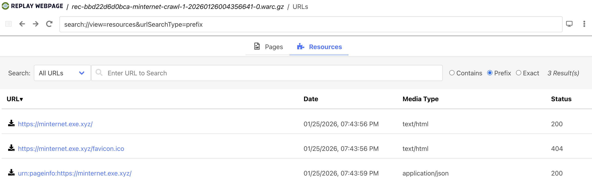

And clicking on the first link of `https://minternet.exe.xyz/` we see our page rendered from the crawl we performed!

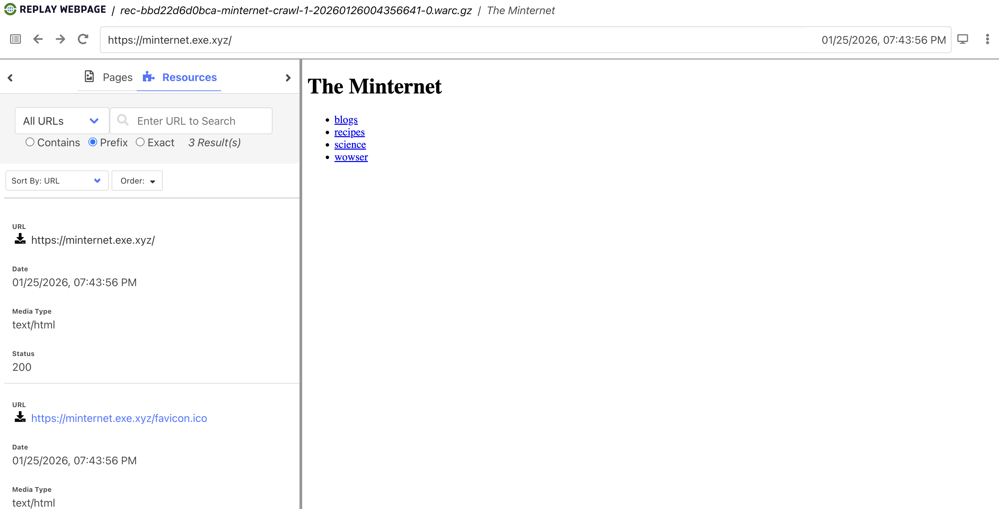

This was a single, pure HTML page, with zero complexity, but still confirms things are working as we hoped.

### Crawl with multiple seeds and domains

For our next crawl, let's try building a [configuration YAML file](https://crawler.docs.browsertrix.com/user-guide/yaml-config/) that we can pass to the crawler to use.  Browsertrix-Crawler is very convenient how it handles configurations, allowing the same arguments to be set in the configuration YAML or as command line arguments.  From the documentation,

> The YAML file can contain the same parameters as the command-line arguments. If a parameter is set on the command-line and in the YAML file, the value from the command-line will be used.

Create a file called `minternet-full.yaml` in your current directory and paste the following contents:

```yaml
verbose: true
collection: minternet-full-1
workers: 4
generateWACZ: true
limit: 500

seeds:
  - url: https://minternet.exe.xyz/
    scopeType: "domain"
  - url: https://minternet-blogs.exe.xyz/
    scopeType: "domain"
    exclude:
      - ".*minternet-blogs.exe.xyz/search.*"
      - ".*minternet-blogs.exe.xyz/calendar.*"
      - ".*minternet-blogs.exe.xyz/archive.*"
  - url: https://minternet-recipes.exe.xyz/
    scopeType: "domain"
  - url: https://minternet-science.exe.xyz/
    scopeType: "domain"
  - url: https://minternet-wowser.exe.xyz/
    scopeType: "domain"
    exclude:
      - ".*minternet-wowser.exe.xyz/random.*"
```

NOTE: if you have never worked with YAML files, they can be a little unforgiving!  Space and indents matter, kind of like python.  Thankfully -- errors are our friends! -- the crawl will not proceed if the YAML file is not formatted correctly.

Some of these fields may look familiar from our first single crawl, e.g. `collection`, `verbose`, `generateWACZ`, etc.  But as you can see in the `seeds` section, the YAML allow for more detail and complexity.  Here we are passing 5 seeds, each with their own configurations.  Recall from the [Archive-It Lab](../archive_it/README.md) where we set `include` and `exclude` scoping rules for a seed.  We can do essentially the same here!  Read more about seed scoping here, this YAML file only has some basic `include` / `exclude` rules applied.

It's worth noting that we could apply these scoping rules at the collection level (the full crawl) or per seed as we have done here.  This can feel a little daunting at first, but allows for very fine grained control over the crawl.

We have focused mostly on seeds, but `include` rules can be powerful too!  You may know that a particular seed will attempt to retrieve files from other domains, but you're not comfortable setting `scopeType: any` which would allow for capturing material _anywhere_.  With `include` rules, you could explicitly allow the crawl to capture URLs from specific domains or matching specific patterns.

With that file in place, we'll run a crawl and utilize the YAML file for most of our configurations.  The following is the command you'll run, but before running it let's breakdown how it works.

```shell
docker run -it \
-v $(PWD):/crawls \
webrecorder/browsertrix-crawler:latest \
crawl \
--config /crawls/minternet-full.yaml
```

Once the crawl completes, you should see some logging lines near the end that look similar:

```text
{"timestamp":"2026-01-27T00:45:01.160Z","logLevel":"info","context":"crawlStatus","message":"Crawl statistics","details":{"crawled":29,"total":29,"pending":0,"failed":0,"limit":{"max":500,"hit":false},"pendingPages":[]}}
{"timestamp":"2026-01-27T00:45:01.161Z","logLevel":"info","context":"general","message":"Crawling done","details":{}}
{"timestamp":"2026-01-27T00:45:01.161Z","logLevel":"info","context":"general","message":"Merging CDX","details":{}}
{"timestamp":"2026-01-27T00:45:01.166Z","logLevel":"info","context":"general","message":"Generating WACZ","details":{}}
{"timestamp":"2026-01-27T00:45:01.166Z","logLevel":"info","context":"general","message":"Num WARC Files: 4","details":{}}
{"timestamp":"2026-01-27T00:45:01.177Z","logLevel":"info","context":"general","message":"Exiting, Crawl status: done","details":{}}
```

This tells us that we have crawled around 29 URLs, and we have generated a WACZ file.  The WACZ file -- which if you recall is an archive file that contains all parts of the crawl in one file -- can be found at `collections/minternet-full-1/minternet-full-1.wacz` relative to your working directory.

Now, let's load this into [ReplayWeb.page](https://replayweb.page/) and see how things look!  This time, we'll load the WACZ file instead of any of the individual WARC files.  If you look in the directory `collections/minternet-full-1/archive` you'll see there are 4 WARC files.  This relates to how many `workers` we set in our config YAML file.  Each worker was crawling content and writing to its own WARC file.  This is perfectly normal and even desirable, but also reveals how handy the WACZ file is; an entire web crawl in a single file.

Once loaded into ReplayWeb.page, it should look similar to the following:

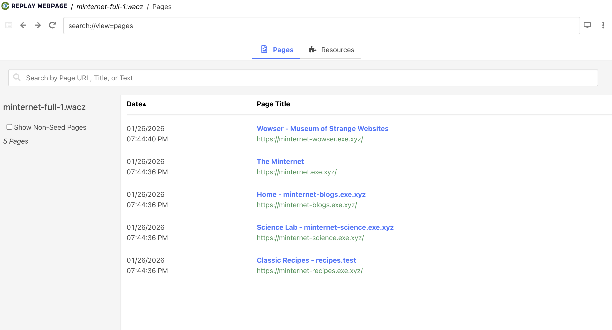

Note that we ran our crawl with 5 seeds, and there are 5 entrypoints into our crawl.  This is not a hard and fast rule, and can vary crawler-to-crawler, or depending on loading WARC or WACZ files, but it's a decent mental model to think of seeds also as entrypoints for access and discovery in a web archive.

Clicking on "The Minternet" link with the URL `https://minternet.exe.xyz/` will bring up our familiar Minternet root page.  Where it gets fun, but now we can follow links from _within_ the archived version.

Try navigating the `Science Lab - minternet-science.exe.xyz` eithe from the main ReplayWeb.page root screen with the 5 links or from the Minternet root page itself:

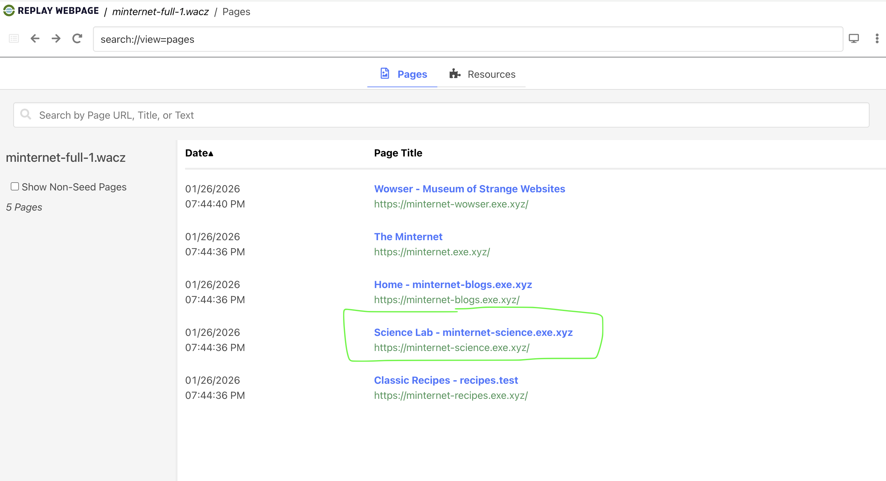

or...

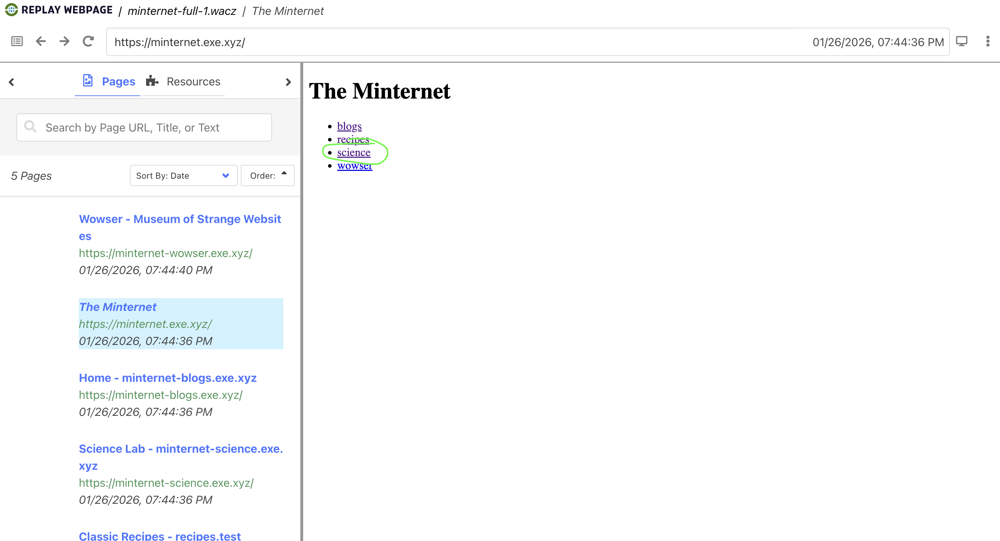

It looks pretty good at a glance... but what if you try clicking "View Details -->" from the "Baking Soda Volcano" card.  You'll should see an error like the following:

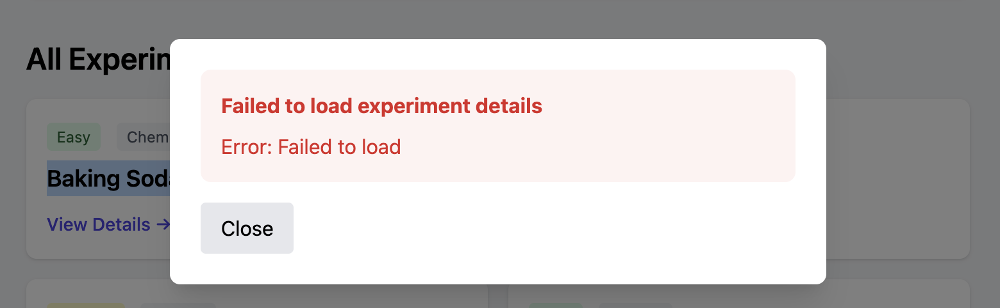

What's going on here?  If you were to open the Chrome developer tools, click the "Network" tab, and then click the "View Details -->" link, you'll see the following:

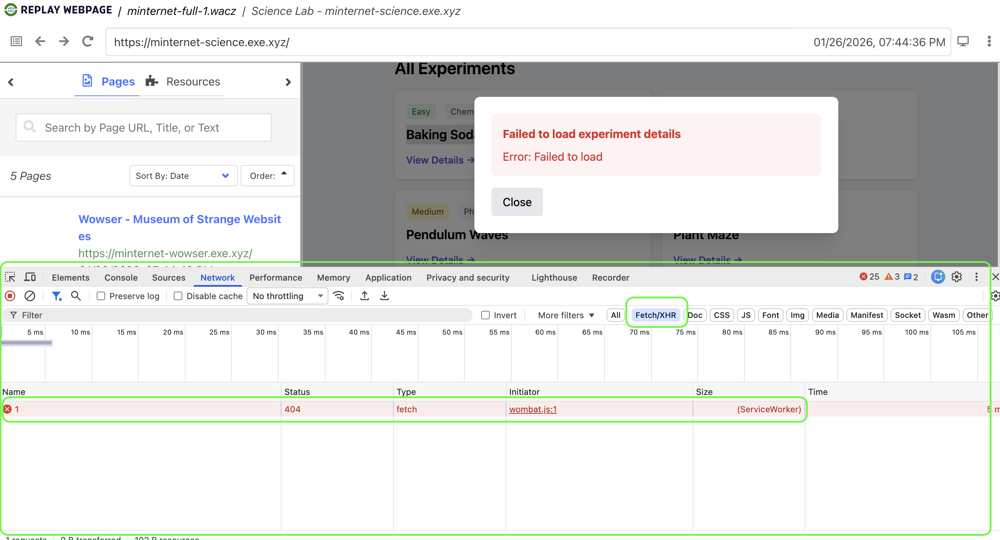

This is telling us that on the website itself, when that button is clicked, it attempts an additional network request -- sometimes called an AJAX request or async request; goes by many names -- to retrieve the details for that experiment to then render.  The specific URL it attempted to capture was `https://minternet-science.exe.xyz/api/experiment/1` which can determined from the dev tools as well.  If this feels overwhelming, don't worry, we'll devote an entire lab to learning how developer tools can help us QA crawls!

We're getting into a very real, and very finicky part of web archiving.  We might think of this as "behavior" or "actions" on the page that the crawler didn't know to do, and thus did not capture.  If we had somehow captured that URL, during our replay of the site this likely would have worked.  This is worth pausing on for a moment, maybe have a sip of tea or coffee, and really let it sink in.  

When we crawl and capture content, we often aren't capturing the "final product" per se, but instead we want to make sure that we retrieve each and very network request from the rendered page that our actions may have triggered.  That way, when we're _replaying_ the site, our archive contains all those network requests and we can experience the site as it was originally intended with the browser still doing some work for us.  This is subtle, but important!  This insight will come in handy quite often when thinking about crawling content and QA-ing replay-ability.  This is why we call it "replay", because we truly are recreating all the browser behavior again.  Our archive just contains the raw bits and bobs to serve up when needed.

Okay okay, that was a long philosophical interlude 😅.  How do we fix this?  How can we capture those AJAX / asynchronous requests in our crawl capture, such that we can replay the page later?  We'll cover this in the next section.

One more thing before we jump into that issue.  Let's look at two pages files that the Browsertrix Crawler creates:

First, `collections/minternet-full-1/pages/pages.jsonl`:

```json
{"format":"json-pages-1.0","id":"pages","title":"Seed Pages","hasText":"false"}
{"id":"ab44752d-d367-42b3-8fa3-adacee304466","url":"https://minternet-recipes.exe.xyz/","title":"Classic Recipes - recipes.test","loadState":4,"ts":"2026-01-27T00:44:36.196Z","mime":"text/html","status":200,"seed":true,"depth":0}
{"id":"b06f5bee-1dd6-4487-9d3b-95e16e5e8eb6","url":"https://minternet-science.exe.xyz/","title":"Science Lab - minternet-science.exe.xyz","loadState":4,"ts":"2026-01-27T00:44:36.196Z","mime":"text/html","status":200,"seed":true,"depth":0}
{"id":"f398ee08-adb9-4e2c-b7b0-29028bdc08a1","url":"https://minternet-blogs.exe.xyz/","title":"Home - minternet-blogs.exe.xyz","loadState":4,"ts":"2026-01-27T00:44:36.196Z","mime":"text/html","status":200,"seed":true,"depth":0}
{"id":"a544a936-a7ad-4ccb-87f9-3ff830dd84d7","url":"https://minternet.exe.xyz/","title":"The Minternet","loadState":4,"ts":"2026-01-27T00:44:36.234Z","mime":"text/html","status":200,"seed":true,"depth":0}
{"id":"7ff5fd87-cf94-4540-908c-4645a2cf6cef","url":"https://minternet-wowser.exe.xyz/","title":"Wowser - Museum of Strange Websites","loadState":4,"ts":"2026-01-27T00:44:40.087Z","mime":"text/html","status":200,"seed":true,"depth":0}
```

These are our five seeds, with some metadata about each.

Second, `collections/minternet-full-1/pages/extraPages.jsonl`:

```json
{"format":"json-pages-1.0","id":"pages","title":"Non-Seed Pages","hasText":"false"}
{"id":"0849fe8b-419c-4dd1-b615-984f4dacf712","url":"https://minternet-science.exe.xyz/static/data/experiments.csv","title":"","loadState":2,"ts":"2026-01-27T00:44:40.327Z","mime":"text/csv","status":200,"depth":1}
{"id":"551cacda-e11a-4e00-ad51-b42206b47281","url":"https://minternet-science.exe.xyz/static/data/observations.csv","title":"","loadState":2,"ts":"2026-01-27T00:44:40.618Z","mime":"text/csv","status":200,"depth":1}
{"id":"1eb8ff02-4521-4b7e-8bce-55d355a10471","url":"https://minternet-science.exe.xyz/static/documents/safety-guide.pdf","title":"","loadState":2,"ts":"2026-01-27T00:44:40.850Z","mime":"application/pdf","status":200,"depth":1}
{"id":"bad8387d-2387-4ba3-a7c1-e25944f67cf1","url":"https://minternet-recipes.exe.xyz/recipes/pancakes.html","title":"Fluffy Pancakes - Classic Recipes","loadState":4,"ts":"2026-01-27T00:44:40.108Z","mime":"text/html","status":200,"depth":1}
{"id":"ca1675a8-4180-49ff-ac7b-bf53785610c1","url":"https://minternet-recipes.exe.xyz/recipes/soup.html","title":"Hearty Vegetable Soup - Classic Recipes","loadState":4,"ts":"2026-01-27T00:44:40.326Z","mime":"text/html","status":200,"depth":1}
{"id":"76a3ae6f-a3a3-4a37-8022-8df658957eef","url":"https://minternet-blogs.exe.xyz/author/alice","title":"Alice Chen - minternet-blogs.exe.xyz","loadState":4,"ts":"2026-01-27T00:44:41.267Z","mime":"text/html","status":200,"depth":1}
{"id":"2746b991-3699-43b3-ac15-7a02dc53cf91","url":"https://minternet-blogs.exe.xyz/author/charlie","title":"Charlie Kim - minternet-blogs.exe.xyz","loadState":4,"ts":"2026-01-27T00:44:43.695Z","mime":"text/html","status":200,"depth":1}
{"id":"d9b4865b-7b42-4a22-8e3b-f882016d9be7","url":"https://minternet-blogs.exe.xyz/author/bob","title":"Bob Martinez - minternet-blogs.exe.xyz","loadState":4,"ts":"2026-01-27T00:44:43.695Z","mime":"text/html","status":200,"depth":1}
{"id":"a7e2a3f9-1867-457e-8638-2b200892993b","url":"https://minternet-blogs.exe.xyz/post/cross-domain-archiving-challenges","title":"Cross-Domain Linking in Web Archives - minternet-blogs.exe.xyz","loadState":4,"ts":"2026-01-27T00:44:43.876Z","mime":"text/html","status":200,"depth":1}
{"id":"a7c16093-97fb-4e5a-8b50-4f9f11ba0198","url":"https://minternet-blogs.exe.xyz/post/getting-started-with-web-archiving","title":"Getting Started with Web Archiving - minternet-blogs.exe.xyz","loadState":4,"ts":"2026-01-27T00:44:44.700Z","mime":"text/html","status":200,"depth":1}
{"id":"4d3d59be-622e-434c-81f3-b1ee464a9f83","url":"https://minternet-blogs.exe.xyz/post/science-resources-for-archivists","title":"Science Resources for Web Archivists - minternet-blogs.exe.xyz","loadState":4,"ts":"2026-01-27T00:44:47.176Z","mime":"text/html","status":200,"depth":1}
{"id":"64cf29a6-aa92-4ba0-be3a-4f81f278330a","url":"https://minternet-wowser.exe.xyz/app/home","title":"SPA Demo - Wowser","loadState":4,"ts":"2026-01-27T00:44:47.193Z","mime":"text/html","status":200,"depth":1}
{"id":"f82a3be6-7ba9-4463-af1f-9c0b588e06d9","url":"https://minternet-wowser.exe.xyz/base-demo","title":"Base Tag Abuse - Wowser","loadState":4,"ts":"2026-01-27T00:44:47.339Z","mime":"text/html","status":200,"depth":1}
{"id":"31c00b04-d71c-4294-b234-067dcf97754b","url":"https://minternet-wowser.exe.xyz/csp-demo","title":"CSP Issues - Wowser","loadState":4,"ts":"2026-01-27T00:44:48.200Z","mime":"text/html","status":200,"depth":1}
{"id":"0eec5ccc-9b4d-4541-9bb9-f43e2fd149c9","url":"https://minternet-wowser.exe.xyz/inline-assets","title":"Inline Base64 Assets - Wowser","loadState":4,"ts":"2026-01-27T00:44:50.644Z","mime":"text/html","status":200,"depth":1}
{"id":"34565f59-3c21-4c3f-92b7-d1fa5afae1b3","url":"https://minternet-wowser.exe.xyz/refresh-loop","title":"Meta Refresh Loop - Wowser","loadState":4,"ts":"2026-01-27T00:44:50.730Z","mime":"text/html","status":200,"depth":1}
{"id":"5901b5fb-cf19-4179-9365-3d1183e7732e","url":"https://minternet-wowser.exe.xyz/large-script","title":"Large Inline Script - Wowser","loadState":4,"ts":"2026-01-27T00:44:50.626Z","mime":"text/html","status":200,"depth":1}
{"id":"c1b55c5b-9f71-4811-a018-459fd9101944","url":"https://minternet-wowser.exe.xyz/shadow-dom","title":"Shadow DOM - Wowser","loadState":4,"ts":"2026-01-27T00:44:51.653Z","mime":"text/html","status":200,"depth":1}
{"id":"a5f1c983-b42e-4205-aa8d-c1e99ff4d082","url":"https://minternet-wowser.exe.xyz/websocket-demo","title":"WebSocket Demo - Wowser","loadState":4,"ts":"2026-01-27T00:44:54.020Z","mime":"text/html","status":200,"depth":1}
{"id":"a8c4539c-ed7d-43d5-ba8c-1615dc950bb7","url":"https://minternet-blogs.exe.xyz/post/preserving-social-media","title":"Challenges of Preserving Social Media - minternet-blogs.exe.xyz","loadState":4,"ts":"2026-01-27T00:44:54.242Z","mime":"text/html","status":200,"depth":2}
{"id":"07f62130-fe72-48c7-b19a-cbe554ad86e6","url":"https://minternet-blogs.exe.xyz/post/warc-file-format-explained","title":"The WARC File Format Explained - minternet-blogs.exe.xyz","loadState":4,"ts":"2026-01-27T00:44:54.241Z","mime":"text/html","status":200,"depth":2}
{"id":"e66a825d-8a10-4d2b-a92a-5740c445bcf2","url":"https://minternet-blogs.exe.xyz/post/understanding-crawler-traps","title":"Understanding Crawler Traps - minternet-blogs.exe.xyz","loadState":4,"ts":"2026-01-27T00:44:55.178Z","mime":"text/html","status":200,"depth":2}
{"id":"ad84f779-480e-4fbf-bc42-e44c0302c017","url":"https://minternet-wowser.exe.xyz/static/test.html","title":"404 Not Found","loadState":3,"ts":"2026-01-27T00:44:57.856Z","mime":"text/html","status":404,"depth":2}
{"id":"d1395414-e164-441c-bf9f-c955bd6df43f","url":"https://minternet-blogs.exe.xyz/post/javascript-and-replay-challenges","title":"JavaScript and Web Archive Replay - minternet-blogs.exe.xyz","loadState":4,"ts":"2026-01-27T00:44:57.592Z","mime":"text/html","status":200,"depth":2}
```

This _much_ longer file has an entry for just about every other URL crawled as a result of those seeds.  

Fun fact!  If we were to include `text: true` in our configuration YAML, Browsertrix would attempt to extract raw, full-text from each URL and would include it in these files.  That raw full-text can be extremely handy for full-text searching your web collection.  This can be done manually from the HTML present in the WARC files, but this is a nice quality-of-life feature that Browsertrix provides.

### Fixing our missing volcano experiment details 🌋

We're going to use what are called "behaviors" in Browsertrix to perform some actions during the crawl, that will capture the experiments data.

One behavior is called `autoclick` which, generally speaking, will automatically click on clickable things in the page.  But we can tailor this to look for elements we want to target.  This uses a syntax similar to [CSS selectors](https://developer.mozilla.org/en-US/docs/Web/CSS/Guides/Selectors).

Let's create a new YAML file so we don't clobber our previous crawl, and we'll give it a new collection name as well to create a new dictory:

```yaml
verbose: true
collection: minternet-full-behaviors
workers: 4
generateWACZ: true
limit: 500

behaviors: autoclick,autofetch
clickSelector: "button"

seeds:
  - url: https://minternet.exe.xyz/
    scopeType: "domain"
  - url: https://minternet-blogs.exe.xyz/
    scopeType: "domain"
    exclude:
      - ".*minternet-blogs.exe.xyz/search.*"
      - ".*minternet-blogs.exe.xyz/calendar.*"
      - ".*minternet-blogs.exe.xyz/archive.*"
  - url: https://minternet-recipes.exe.xyz/
    scopeType: "domain"
  - url: https://minternet-science.exe.xyz/
    scopeType: "domain"
  - url: https://minternet-wowser.exe.xyz/
    scopeType: "domain"
    exclude:
      - ".*minternet-wowser.exe.xyz/random.*"
```

And let's now run the crawl with this updated YAML file:

```yaml
docker run -it \
-v $(PWD):/crawls \
webrecorder/browsertrix-crawler:latest \
crawl \
--config /crawls/minternet-full.yaml
```

Once the crawl is complete, follow these steps:
1. Load ReplayWeb.page
2. Load this new WACZ file, `collections/minternet-full-behaviors/minternet-full-behaviors.wacz`
3. Navigate to the science site

Now, when we click the "View details -->" button for the Volcano experiment, we should see this:

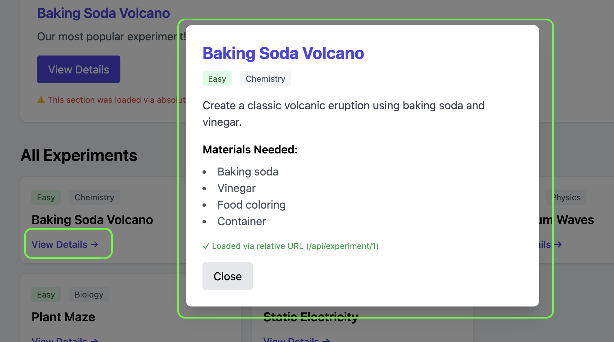

Success!  Other experiments on this page should work as well, as they all have a `<button>` element which was targeted by our `autoclick` behavior.

This is a simplistic example, but it hints at the kind of per-site behaviors you can apply.  A more robust solution would be to use [Custom Behaviors](https://crawler.docs.browsertrix.com/user-guide/behaviors/#loading-custom-behaviors) which allow you to write Javascript code to interact with the website via code.  The way we approached things, that autoclicking of `<button>` applies to _all_ seeds in our crawl.  If we write our own custom behaviors, we could target only specific domains or sites.  One must balance this ability versus the development time, maintenance, and QA.

It would be normal to assume that the URL we captured from this behavior would be in that `extraPages.jsonl` file, but if you look at it from this crawl, it's not there.  What's going on?  

Think back to week 2 when we were looking at WARC files in detail.  The URLs we find in the Browsertrix `pages.jsonl` and `extraPages.jsonl` files might be conceptualized as "websites" we visited, but they do not contain _every_ network request that was performed.  Network requests like this data fetch are stored in the WARCs.

We could pour through the WARC files at `collections/minternet-full-behaviors/archive` and find this request + response.  But the ReplayWeb.page helps us confirm we captured it as well.

If you click on the "Resources" tab of ReplayWeb.page from the last WACZ file we loaded, you can search for the URL `https://minternet-science.exe.xyz/api/experiment/1` and see it's found:

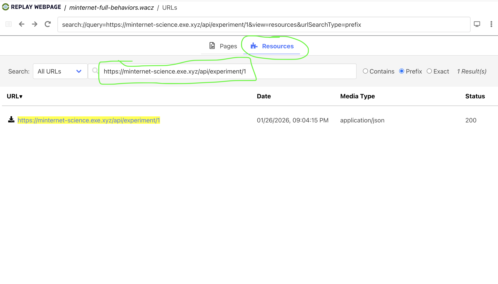

This is confirming why, when we click the button now, it works: we have captured that network request as a resource that is used during replay of the website.  Neat stuff!

If you're feeling adventurous, there is _another_ way we can confirm that we captured this resource.  We haven't talked much about CDX and CDXJ files, but this URL will be in there as well.  These CDX/J files are created _after_ the crawl by parsing and analyzing the WARC files.  URLs are extracted and saved in these files for easy access, which in turn tell us precisely which WARC file (and how many bytes into the file) that URL request + response can be found.

Here is a screenshot of the CDXJ file for this crawl, `collections/minternet-full-behaviors/indexes/index.cdxj`, showing this URL is present:

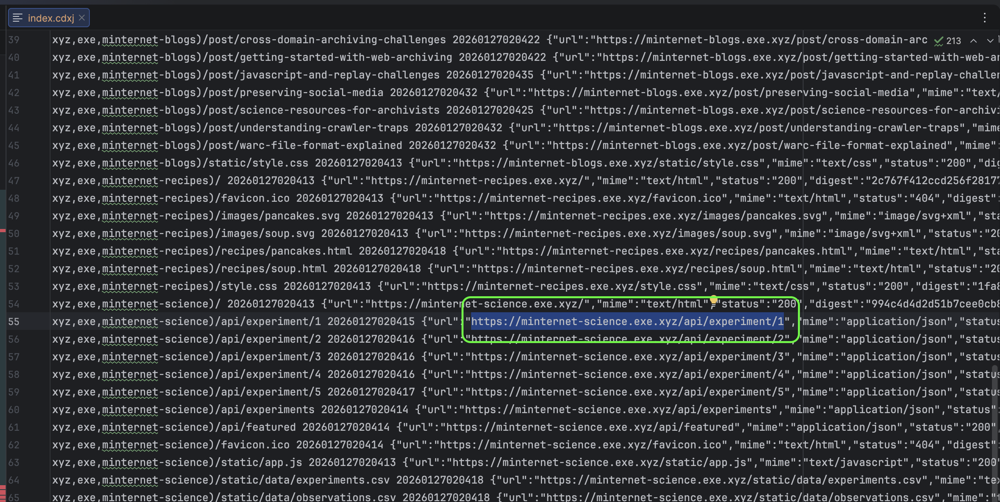

It can seem like a lot of misdirection, and duplicative information, but each format serves a purpose.  Over time, it becomes deeply satisfying to know which parts of the crawl -- WARC files, CDX/J files, pages JSONLines files, WACZ, logs, etc. -- that we might look for information to help us QA a crawl.

### Crawling with a Browser Profile

One unique and powerful feature of Browsertrix is the ability to run the crawl with a [browser profile](https://github.com/ghukill/warcstudio).  From the docs,

> "Browsertrix Crawler can use existing browser profiles when running a crawl. This allows the browser to be pre-configured by logging in to certain sites or changing other settings, before running a crawl. By creating a logged in profile, the actual login credentials are not included in the crawl, only (temporary) session cookies."

Think of this a bit like your own browser where you log into websites that require authentication.  For many sites, once you login, you _stay_ logged in either for a duration of time or until you logout.  In browsertrix the browser profile approach works similarly.

For this lab, we will create a browser profile, login to our UM Google account, save the browser profile, then run a crawl that targets a URL that is only available to logged in users. 

First step is to run a special browsertrix command -- using the Browsertrix Docker image again -- that will allow us to create a browser profile:

```shell
docker run \
-it \
-p 6080:6080 \
-p 9223:9223 \
-v $PWD/profiles:/crawls/profiles/ \
webrecorder/browsertrix-crawler:latest \
create-login-profile \
--url "https://drive.google.com"
```

For those not very experienced with Docker, the `-it` flag tells it to run in an "interactive" mode meaning to stay open until we close it.  Give the container 5-10 seconds to start, and then navigate to the following URL in your own browser:

[http://localhost:9223/](http://localhost:9223/)

What are we looking at here?  Browsertrix has started it's own tiny browser and made it available for us, the human user, to interact with it.  Using this ephemeral browser instance, we can login to sites and otherwise setup our browser profile.

Because we started this process with the flag `--url "https://drive.google.com"` it opened up the page for us.  We can now login with our UM credentials.  

NOTE: This is safe to do!  Browsertrix is running 100% on our own machines; there is no network traffic or credentials shared anywhere.  But it's worth taking precautions if doing this in a web archiving program, where others may have access to the web archiving context and thus the browser profile.

Once you have logged in to your UM Google account, look for the "Create Profile" button near the top of page of the temporary browser this process started:


Once you click this button, you should see the message,

> "Profile Created! You may now close this window."

And the docker container we had started will have closed.  Congratulations, you have successfully created a browser profile that we can use for future crawls.

This should have created a new `profiles/` directory in our current working directory.  Similar to our crawls, in this last Browsertrix Docker command we mounted our folder into the container so anything that happened inside the container would persist after it closed.  Looking at this directory, it's only a single file that is created:

```text
profiles
└── profile.tar.gz
```

This single file contains the state of the browser after we had logged in -- aka a browser profile -- and is all that Browsertrix needs for the crawl.

To test this browser profile effect, let's run two crawls for the same Google doc, one using our browser profile and one without.  

1- Crawl WITH our browser profile:

```shell
docker run -it \
-v $(PWD):/crawls \
webrecorder/browsertrix-crawler:latest \
crawl \
--collection google-doc-with-profile \
--url "https://docs.google.com/document/d/1MsEgxmQatvMcrvjvO01MYOIo9GVzALKTO7mdbL2Xmpg/edit?usp=sharing" \
--scopeType page \
--limit 5 \
--profile /crawls/profiles/profile.tar.gz
```
- note the `--profile` where we pass the browser profile we created 

2- Crawl WITHOUT our browser profile:

```shell
docker run -it \
-v $(PWD):/crawls \
webrecorder/browsertrix-crawler:latest \
crawl \
--collection google-doc-without-profile \
--url "https://docs.google.com/document/d/1MsEgxmQatvMcrvjvO01MYOIo9GVzALKTO7mdbL2Xmpg/edit?usp=sharing" \
--scopeType page \
--limit 5
```
- note the absence of the `--profile` flag

Finally, we can look at these crawls and see how they differ.  We did not use the `--generateWACZ` flag for either crawl, and will instead load the WARC files directly into ReplayWeb.page.

Let's first load our crawl without the profile:

1. Navigate to [https://replayweb.page/](https://replayweb.page/)
2. Click "Choose File" button
3. Navigate to the directory `collections/google-doc-without-profile/archive` and select the only WARC file present
4. Click "Load"

You should see something like this:

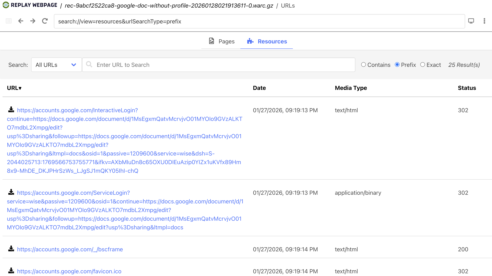

It has taken us straight to the "Resources" tab because it couldn't find any specific pages that look like a seed.  That's okay!  Crawls for a single URL like this can get a little wonky.  We just need to search for the URL we used for the crawl, `https://docs.google.com/document/d/1MsEgxmQatvMcrvjvO01MYOIo9GVzALKTO7mdbL2Xmpg/edit?usp=sharing`:

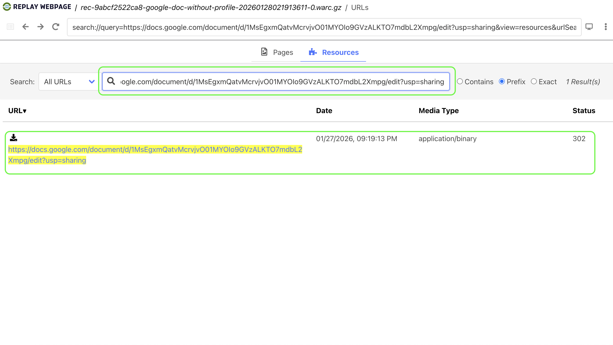

Finally, clicking on that link will bring up the crawl attempt for that URL without a browser profile:

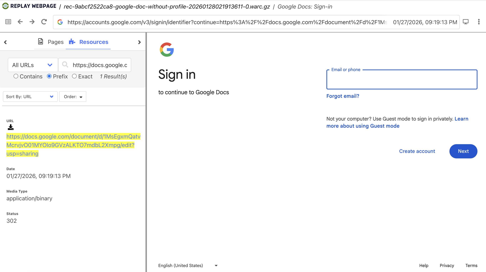

That was a lot of work for some bad news!  Instead of a Google doc here, we see a login redirect because the ULR required a logged in account.  This is _very_ common in web archiving, and can be tricky to workaround.  Lucky for us, we did just that!

Next, perform the same steps except select the WARC file from the local directory `collections/google-doc-with-profile/archive`.  Once loaded, and a search for the URL `https://docs.google.com/document/d/1MsEgxmQatvMcrvjvO01MYOIo9GVzALKTO7mdbL2Xmpg/edit?usp=sharing`, you should see this:

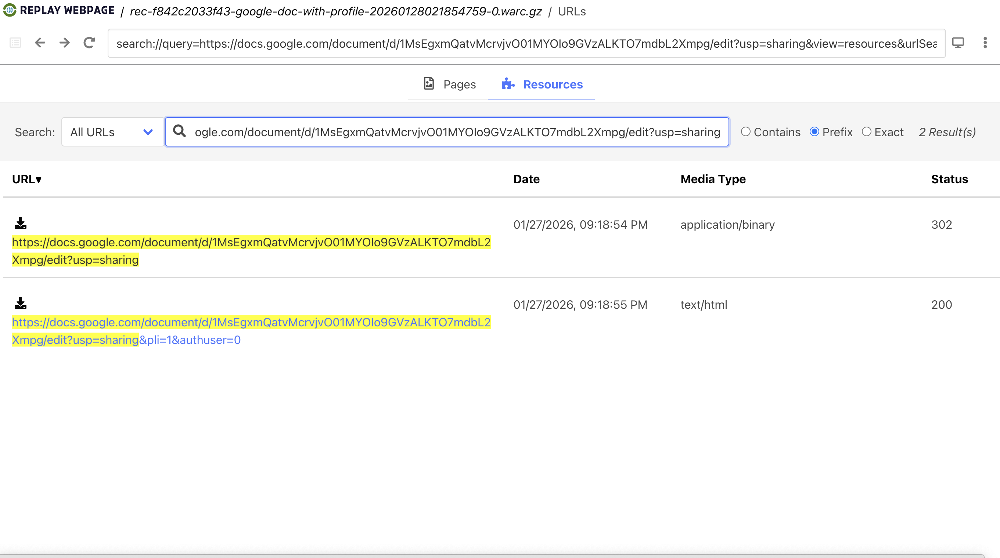

And finally, clicking on either link returned should bring up something similar to this:

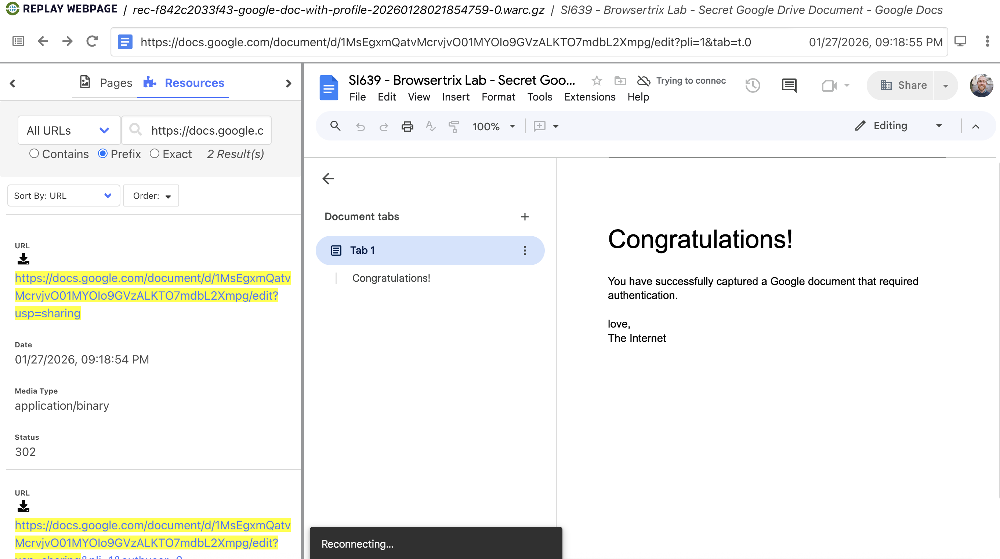

Success!  You have performed a web crawl, using a browser profile with a logged in Google account, to access a Google doc that was restricted.  You'll notice the Google doc interface is a little buggy, e.g. it may keep saying "Reconnecting" or "Trying to connect" at the bottom.  While not ideal, we have still captured the page.  

This exercise was _not_ about archiving Google docs in a reliable and high fidelity way, more about capturing a URL that required a logged in account.  There are likely other, better ways to capture Google docs (e.g PDF exports).  

But since we have done it this way, note that your UM Google account is present in the upper-right of the captured page; it's as if you had accessed the page yourself.  This ability to capture content behind authentication is a powerful feature of Browsertrix.

## Reflection Prompts

1- Is this your first time using a Docker container?  and/or from the command line?  How did you find this dimension of running Browsertrix-Crawler?

2- Do you find it confusing or empowering -- or both! -- that crawl configurations can be set in a configuration YAML file or as command line arguments?

3- Can you think of any situations where Browsertrix might be a good fit, potentially better than `wget` or using the Archive-It service?

4- While this lab was somewhat in depth, i.e. using browser profiles is a pretty advanced technique, what remains confusing or murky about Browsertrix?  if someone asked you on the street to explain what Browertrix is, what parts would feel challenging to explain?