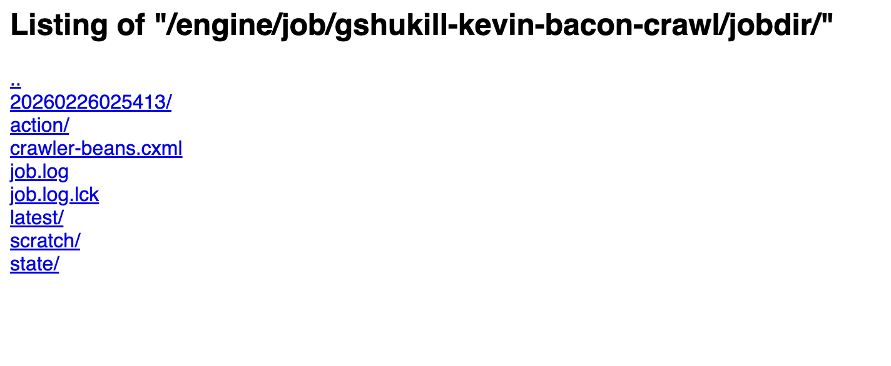
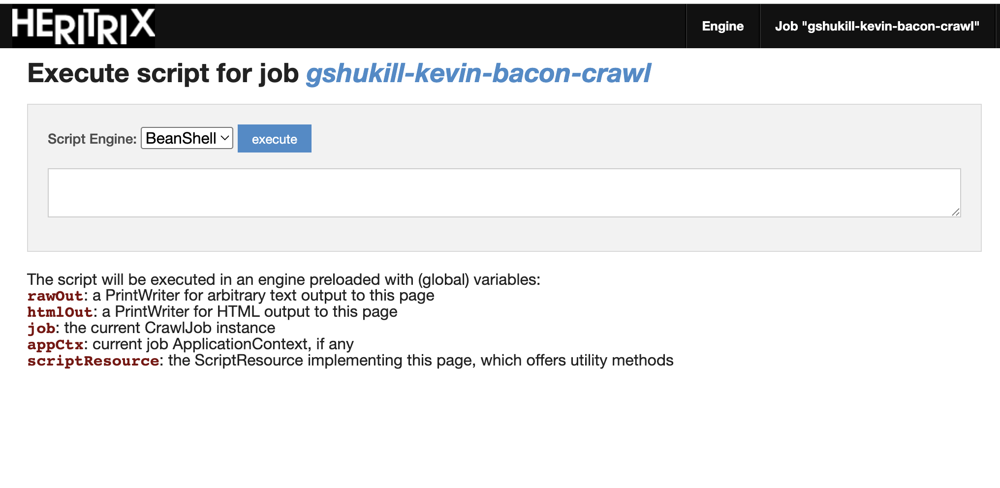
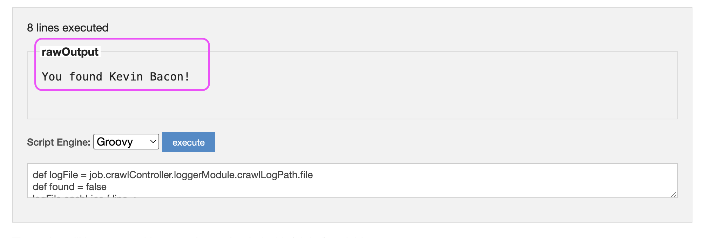

# Lab: Heritrix

## Overview

### Heritrix

This lab is similar to others in that we will be trying out a crawler.  The twist: we're doing a scavenger hunt.

For this lab, we'll be looking at the infamous [Heritrix](https://github.com/internetarchive/heritrix3) web crawler.  From the Github page,

> Heritrix is the Internet Archive's open-source, extensible, web-scale, archival-quality web crawler project. Heritrix (sometimes spelled heretrix, or misspelled or missaid as heratrix/heritix/heretix/heratix) is an archaic word for heiress (woman who inherits). Since our crawler seeks to collect and preserve the digital artifacts of our culture for the benefit of future researchers and generations, this name seemed apt.

From the [Wikipedia page](https://en.wikipedia.org/wiki/Heritrix),

> Heritrix is a web crawler designed for web archiving. It was originally written in collaboration between the Internet Archive, National Library of Norway and National Library of Iceland. Heritrix is available under a free software license and written in Java. The main interface is accessible using a web browser, and there is a command-line tool that can optionally be used to initiate crawls.
> 
> Heritrix was developed jointly by the Internet Archive and the Nordic national libraries on specifications written in early 2003. The first official release was in January 2004, and it has been continually improved by employees of the Internet Archive and other interested parties.
> 
> For many years Heritrix was not the main crawler used to crawl content for the Internet Archive's web collection. The largest contributor to the collection, as of 2011, is Alexa Internet. Alexa crawls the web for its own purposes, using a crawler named ia_archiver. Alexa then donates the material to the Internet Archive. The Internet Archive itself did some of its own crawling using Heritrix, but only on a smaller scale.
> 
> Starting in 2008, the Internet Archive began performance improvements to do its own wide scale crawling, and now does collect most of its content.

Heritrix is a complex and interesting crawler, and we'll only scratch the surface of what it can do.  Some big picture details:

- Heritrix is written in Java
- It's designed to run as server that a user runs "Jobs" on
  - this is opposed to `wget`, `browsertrix`, `pywb`, and other crawlers we've looked at where each invocation of the application is a "crawl" and then it's done
  - this is more similar to Archive-It which is kind of "always on", and can support parallel crawl
- It does _not_ utilize a browser engine for crawls, but is significantly more advanced than something like `wget`
- It is highly, _highly_ extensible and configurable; designed to scale into billions of pages and petabyte sized crawls (with the right hardware and configurations, of course 😎)
- When crawls (Jobs) complete, the data is highly structured and ready to work with, kind of like Browsertrix, but it has no built-in mechanism to replay the captured content.
- It produces WARC files!  It does _not_ produce CDX or WACZ assets.

### The Scavenger Hunt: 6 Degrees of Kevin Bacon


We will be recreating the famous [Six Degrees of Kevin Bacon](https://en.wikipedia.org/wiki/Six_Degrees_of_Kevin_Bacon) game, which rests on the assumption that,

> "...anyone involved in the Hollywood film industry can be linked through their film roles to Bacon within six steps"

We will perform a web crawl of the dataset / knowledge graph [DBPedia](https://www.dbpedia.org/) to see if we can recreate this!

Without going into the -- super interesting!! -- details of exactly what DBPedia is, we can think of each website (called a `Resource` in DBPedia) as sort of a list of facts about the target of the page.  Here is a screenshot from the DBPedia of the 1994 movie [The River Wild](https://dbpedia.org/page/The_River_Wild):


Note the link to the page of [Kevin Bacon](https://dbpedia.org/page/Kevin_Bacon) in there.

Our web crawl scavenger hunt will be simple:
- start with a *single* seed, e.g. `https://dbpedia.org/page/The_River_Wild`
- begin a crawl, limited to 6 hops from this seed
- check to see if we have a link to Kevin Bacon anywhere on that page!

As just an example, I am currently running a crawl for the actor [John Candy](https://dbpedia.org/page/John_Candy).  As of 8,445 captured pages and 94,058 queued, I still have not found Kevin Bacon.  **Advice: don't use John Candy**.

But if you were to start with a page like [Meryl Streep](https://dbpedia.org/page/Meryl_Streep), whom we know was in The River Wild with Kevin Bacon, I can confirm that at around ~600 URLs, **you find Kevin Bacon**!

Disclaimer: This is a wildly inefficient way to do basically all of this.  But we get to experiment with Heritrix, and have a little fun gaining some intuition about crawls that really spider out.

You may wonder _how_, while the crawl is running, that we know we've found Kevin Bacon?  We will use some of Heritrix's built-in affordances to do that: one fairly simple way, and one fairly advanced way.

Game on!

## Instructions


### Logging into Heritrix

For this lab, we will use an instance of Heritrix that is already running for this evening's lab.  You can find the instance here: [https://68.183.144.130:8443/](https://68.183.144.130:8443/).   The username and password will be shared in class.

Note that when accessing this page, your browser may warn you that the `https://` page is not secure.  That's okay, just click through and accept this risk.  This is very temporary instance of Heritrix.  Normally, this would be productionalized with all kinds of infrastructure around it.

### Alternative: Run Heritrix Locally via Docker

Alternatively, you can run Heritrix locally as a Docker container!

Open a terminal and run the following Docker command:

```shell
docker run \
--name si639-heritrix \
-p 8443:8443 \
-e "USERNAME=si639" \
-e "PASSWORD=si639" \
-e "JAVA_OPTS=-Xmx3g" \
iipc/heritrix
```

You should now be able to access Heritrix via the following URL: [https://localhost:8443](https://localhost:8443).

Most all of the instructions will remain the same, just be careful to swap out `localhost:8443` for any URLs that may have the shared class instance of `68.183.144.130:8443`.

### Creating a new Job

In the Heritrix root page, also called "engine", look for a input box and create job button:


Give this a name like `<UMICH_UNIQUE>-kevin-bacon-crawl`, e.g. `gshukill-kevin-bacon-crawl`.  Once you click the button it should create the job, and then you can click into it by finding it below.

Once in the job itself, the very first thing we'll want to do is update the job configuration.  Click the "Configuration" link at the very top of the page.  This will jump you into what is effectively a file editor that looks like this:


Configuration of Heritrix jobs are almost 100% configured via an XML file called `crawler-beans.cxml`.  We've discussed Docker a bit in the past, but it's worth repeating that this file is _inside_ the Docker container.  There are ways to mount this file and edit it that way, but the Heritrix GUI conveniently makes this file editable via this approach.

Next, download or open a **mostly pre-configured crawl XML file** here: [https://ghukill.github.io/umsi-si639-labs/labs/heritrix/kevin-bacon-job.xml](https://ghukill.github.io/umsi-si639-labs/labs/heritrix/kevin-bacon-job.xml).  Our goal is to copy the contents of this file, then replace the entirety of the open file editor in Heritrix with our config XML.

Just to make sure we don't lose it, look for the _teeny tiny_ "Save Changes" button in the lower-left and click it:


Next, we'll make some customizations to the crawl config.  This is your chance to put your personal stamp on this crawl!

#### Update Crawl Metadata

Logical groupings of configurations in the config file are grouped by `<bean>` elements.  Let's not even get into why they are called "bean" for the moment, just that they are.  

Look for a section that looks like this:
```xml
 <bean id="simpleOverrides" class="org.springframework.beans.factory.config.PropertyOverrideConfigurer">
  <property name="properties">
   <value>
# This Properties map is specified in the Java 'property list' text format
# http://java.sun.com/javase/6/docs/api/java/util/Properties.html#load%28java.io.Reader%29

metadata.operatorContactUrl=https://ghukill.github.io/umsi-si639-labs/heritrix/kevin-bacon-crawl
metadata.jobName=YOUR-JOB-NAME-HERE
metadata.description=YOUR-PRETTY-JOB-NAME-HERE

##..more?..##
   </value>
  </property>
 </bean>
```

Update the values `YOUR-JOB-NAME-HERE` and `YOUR-PRETTY-JOB-NAME-HERE` with metadata you'd like to give the crawl.  It doesn't matter much, but worth noting this is Job/Crawl level metadata, something we've touched on quite a bit.

It's worth noting that much more metadata can be entered in this configuration file, something you _would_ want to do for a real crawl.

#### Set your Crawl Seed

For this crawl, we will add only a SINGLE seed.  Remember, our scavenger hunt goal is to start from a single DBPedia page, and within six hops, have a page crawled include a link to [Kevin Bacon](https://dbpedia.org/page/Kevin_Bacon).

Look for the section that looks like this:

```xml
<bean id="longerOverrides" class="org.springframework.beans.factory.config.PropertyOverrideConfigurer">
<property name="properties">
 <props>
  <prop key="seeds.textSource.value">

# URLS HERE
https://dbpedia.org/page/Kevin_Bacon

  </prop>
 </props>
</property>
</bean>
```

By default, we have a single seed of `https://dbpedia.org/page/Kevin_Bacon`; obviously, for our game, that would be cheating!  Here is where you flex your curiosity and creativity!  DBPedia does not have a very handy search or browse GUI, beyond some pretty advanced ones.  One possible way to browse for your starting point would be to _start_ from Kevin Bacon and just click around!  Get a feel for what kind of links there are, how they relate, etc.  Eventually, maybe you'll land on actor pages like:

- [https://dbpedia.org/page/Sam_Richardson_(actor)](https://dbpedia.org/page/Sam_Richardson_(actor))
  - note the `_(actor)` suffix; DBPedia is huge, disambiguation is needed!
- [https://dbpedia.org/page/Julia_Louis-Dreyfus](https://dbpedia.org/page/Julia_Louis-Dreyfus)

These are just a couple of arbitrary examples and may _not_ be good ones to find Kevin Bacon.  But we'll see!  A grand experiment.

With this seed set, click "Save Changes" again and click the back button to return to the Job.

#### Explanations of Configuration Settings

Before we start the crawl, this would be a good time to look at some of the default and non-default settings our crawl configuration.

One of the most important "beans" (sections) in the config is `<bean id="scope" class="org.archive.modules.deciderules.DecideRuleSequence">`:

```xml

<bean id="scope" class="org.archive.modules.deciderules.DecideRuleSequence">
  <!-- <property name="logToFile" value="false" /> -->
  <property name="rules">
   <list>
    <!-- Begin by REJECTing all... -->
    <bean class="org.archive.modules.deciderules.RejectDecideRule" />
    <!-- ...then ACCEPT only DBpedia page URLs... -->
    <bean class="org.archive.modules.deciderules.MatchesListRegexDecideRule">
      <property name="decision" value="ACCEPT" />
      <property name="regexList">
        <list>
            <value>https?://dbpedia.org/page/.*</value>
            <value>https?://dbpedia.org/resource/.*</value>
        </list>
      </property>
    </bean>
    <bean class="org.archive.modules.deciderules.MatchesListRegexDecideRule">
      <property name="decision" value="REJECT" />
      <property name="regexList">
        <list>
            <value>https?://dbpedia.org/resource/(Category|Template)\:.*</value>
        </list>
      </property>
    </bean>
    <!-- ...but REJECT those more than a configured link-hop-count from start... -->
    <bean class="org.archive.modules.deciderules.TooManyHopsDecideRule">
      <property name="maxHops" value="6" />
    </bean>
    <!-- ...and REJECT those with suspicious repeating path-segments... -->
    <bean class="org.archive.modules.deciderules.PathologicalPathDecideRule">
     <!-- <property name="maxRepetitions" value="2" /> -->
    </bean>
    <!-- ...and REJECT those with more than threshold number of path-segments... -->
    <bean class="org.archive.modules.deciderules.TooManyPathSegmentsDecideRule">
     <!-- <property name="maxPathDepth" value="20" /> -->
    </bean>
    <!-- ...but always ACCEPT those marked as prerequisite for another URI... -->
    <bean class="org.archive.modules.deciderules.PrerequisiteAcceptDecideRule">
    </bean>
    <!-- ...but always REJECT those with unsupported URI schemes -->
    <bean class="org.archive.modules.deciderules.SchemeNotInSetDecideRule">
    </bean>
   </list>
  </property>
</bean>
```

This is a glimpse of the complexity of the Heritrix crawler, but also the high degree of configurability it provides.  These are a series of `ALLOW` / `REJECT` rules, looking at different criteria.  This is documented in Heritrix's Crawl Scope documentation.

This clause says that we'll `ACCEPT` and URLs that have the following regular expression patterns (much like we've done for other crawlers!):
```xml
<bean class="org.archive.modules.deciderules.MatchesListRegexDecideRule">
  <property name="decision" value="ACCEPT" />
  <property name="regexList">
    <list>
        <value>https?://dbpedia.org/page/.*</value>
        <value>https?://dbpedia.org/resource/.*</value>
    </list>
  </property>
</bean>
```

This one is near and dear to the heart of this game: it says we will only accept URLs if they no more than 6 hops from our original seed:
```xml
<bean class="org.archive.modules.deciderules.TooManyHopsDecideRule">
  <property name="maxHops" value="6" />
</bean>
```

As we'll see during analysis, this does _not_ mean we're limited to about 6 URLs crawled.  Hops != Total URLs.  But for those who do find Kevin Bacon, you can rest assured that the URL you found is only "6 clicks" away from your seed, despite the fact you may have crawled 10k sites.

The rest of the rules we'll skip for now, most of them defaults.  

One more highly non-default section is this:
```xml
<bean id="disposition" class="org.archive.crawler.postprocessor.DispositionProcessor">
  <property name="delayFactor" value="0" />
  <property name="minDelayMs" value="0" />
  <property name="maxDelayMs" value="0" />
    <property name="respectCrawlDelayUpToSeconds" value="0" />
  <property name="maxPerHostBandwidthUsageKbSec" value="100000" />
</bean>
```

This tells Heritrix to basically not wait _at all_ between URLs.  Other settings in the configuration file apply this logic even when all requests are made to the same domain, `dbpedia.org` for us.  

By default, Heritrix is _exceptionally_ "polite".  It is so "polite" that it has a reputation online as such, and most servers do not block it, knowing it will not bring down their site.  This is a topic a bit out of scope for this lab, but it's a very important quality of Heritrix: it can be configured to respect the wishes and technical load of servers, and thus it remains a viable and long-term option for large crawls.  The complexity in this configuration file, of which we've only seen a glimpse, is how that tuning is performed.

Now, let's get crawling!

### Starting the Crawl

Once back at your Job's main page, look for this row of buttons:


To begin a crawl, you'll want to click them in this order:

1. `Build`: this takes your configuration, validates it, and prepares things for Heritrix
2. `Launch`: this starts actual server / Java processes for your job in memory
3. `Unpause`: this officially starts the crawl, where the a launched job starts in a paused state by default

At this point, start reloading the page every couple of seconds and watch the results roll in!  Here is an example of a crawl that is 20-30 seconds in:


I've highlighted a few key ones to keep an eye on:
- `URLs`: how many URLs have been crawled, and how many are queued
- `Data`: how many bytes have been captured
- `Rates`: how many URIs (pages) per second

**NOTE:** At any point in time, you can click the `Pause` button to pause the crawl.  This can a nice option to catch you breath, have things slow down for a moment to click around.  Though as we'll see, most of the next steps can happen _while_ the crawl is taking place.  

Congratulations, you have started a Heritrix crawl!

### Analyzing Crawl (aka Looking for Kevin Bacon)

Our goal is to capture the URL `https://dbpedia.org/page/Kevin_Bacon`, but how do we know if we've captured it?  We will use two approaches while the crawl is running:

1. Look directly at the crawl log file
2. Use a [Groovy](https://groovy-lang.org/) script that Heritrix can run against a live crawl

#### 1- Look directly at the crawl log file

For our active crawl, each URL request is logged in a file called `crawl.log`.  This lives in our Job directory, which Heritrix conveniently makes available to us via the GUI.

First, from any page, click the "Job Dir" button in the top bar.  This will open a page that looks like this:



Look for the link called `latest/` which will open the directory of the current / latest / active crawl.  For us, it's likely the _only_ crawl, but this can be handy when you have dozens or hundreds of crawls.  This will present links that look like this:

```text
Listing of "/engine/job/gshukill-kevin-bacon-crawl/jobdir/latest"
..
actions-done/
crawler-beans.cxml
job.log
job.log.lck
logs/    <-----------------------
surts.dump
warcs/
```

Next, click `logs/`, which presents:

```text
Listing of "/engine/job/gshukill-kevin-bacon-crawl/jobdir/latest/logs"
..
alerts.log
alerts.log.lck
crawl.log  <-----------------
crawl.log.lck
frontier.recover.gz
nonfatal-errors.log
nonfatal-errors.log.lck
progress-statistics.log
progress-statistics.log.lck
runtime-errors.log
runtime-errors.log.lck
uri-errors.log
uri-errors.log.lck
```

Lastly, clicking on `crawl.log` will show the current logs of the crawl.  The following is a snippet of this, but it can be quite large!

```text
2026-02-26T02:54:17.532Z     1         54 dns:dbpedia.org P https://dbpedia.org/page/The_River_Wild text/dns #006 20260226025417003+14 sha1:6VEY6DBWNYI5QE4JAXHETR7HYE4ANWP6 - -
2026-02-26T02:54:18.147Z   200        300 https://dbpedia.org/robots.txt P https://dbpedia.org/page/The_River_Wild text/plain #006 20260226025417550+590 sha1:5J3WK6ATEAM7QTE3EY5UAXGOWSKCZLO5 - -
2026-02-26T02:54:19.360Z   200     102210 https://dbpedia.org/page/The_River_Wild - - text/html #006 20260226025418151+1039 sha1:BBJ3WZ4RJS3QHT4LN3HDWUCETAKXJKJ5 - 3t
2026-02-26T02:54:19.601Z   303        153 http://dbpedia.org/robots.txt LP http://dbpedia.org/resource/The_River_Wild text/html #005 20260226025419276+319 sha1:KUPT5Q3I7BU7YDY4L6O3LVMY3HQOSF5I - -
2026-02-26T02:54:19.929Z   303        153 http://dbpedia.org/resource/The_River_Wild L https://dbpedia.org/page/The_River_Wild text/html #005 20260226025419603+320 sha1:KUPT5Q3I7BU7YDY4L6O3LVMY3HQOSF5I - 2t
2026-02-26T02:54:20.400Z   303          0 https://dbpedia.org/resource/The_River_Wild LR http://dbpedia.org/resource/The_River_Wild text/html #005 20260226025419931+465 sha1:3I42H3S6NNFQ2MSVX7XZKYAYSCX5QBYJ - -
2026-02-26T02:54:20.873Z   303        153 http://dbpedia.org/page/The_River_Wild LRR https://dbpedia.org/resource/The_River_Wild text/html #010 20260226025420538+329 sha1:KUPT5Q3I7BU7YDY4L6O3LVMY3HQOSF5I - -
2026-02-26T02:54:21.736Z   303        153 http://dbpedia.org/resource/Robert_Elswit L https://dbpedia.org/page/The_River_Wild text/html #005 20260226025420402+1328 sha1:KUPT5Q3I7BU7YDY4L6O3LVMY3HQOSF5I - -
2026-02-26T02:54:22.195Z   303          0 https://dbpedia.org/resource/Robert_Elswit LR http://dbpedia.org/resource/Robert_Elswit text/html #005 20260226025421738+450 sha1:3I42H3S6NNFQ2MSVX7XZKYAYSCX5QBYJ - -
2026-02-26T02:54:22.523Z   303        153 http://dbpedia.org/resource/Curtis_Hanson L https://dbpedia.org/page/The_River_Wild text/html #005 20260226025422198+317 sha1:KUPT5Q3I7BU7YDY4L6O3LVMY3HQOSF5I - -
2026-02-26T02:54:22.626Z   303        153 http://dbpedia.org/page/Robert_Elswit LRR https://dbpedia.org/resource/Robert_Elswit text/html #008 20260226025422306+315 sha1:KUPT5Q3I7BU7YDY4L6O3LVMY3HQOSF5I - -
2026-02-26T02:54:22.933Z   303          0 https://dbpedia.org/resource/Curtis_Hanson LR http://dbpedia.org/resource/Curtis_Hanson text/html #005 20260226025422524+406 sha1:3I42H3S6NNFQ2MSVX7XZKYAYSCX5QBYJ - -
2026-02-26T02:54:23.270Z   303        153 http://dbpedia.org/resource/Universal_Pictures L https://dbpedia.org/page/The_River_Wild text/html #005 20260226025422934+329 sha1:KUPT5Q3I7BU7YDY4L6O3LVMY3HQOSF5I - -
2026-02-26T02:54:23.732Z   303          0 https://dbpedia.org/resource/Universal_Pictures LR http://dbpedia.org/resource/Universal_Pictures text/html #005 20260226025423272+454 sha1:3I42H3S6NNFQ2MSVX7XZKYAYSCX5QBYJ - -
2026-02-26T02:54:24.041Z   303        153 http://dbpedia.org/resource/David_Brenner_(film_editor) L https://dbpedia.org/page/The_River_Wild text/html #005 20260226025423735+304 sha1:KUPT5Q3I7BU7YDY4L6O3LVMY3HQOSF5I - -
2026-02-26T02:54:24.109Z   200     153359 https://dbpedia.org/page/Robert_Elswit LRRR http://dbpedia.org/page/Robert_Elswit text/html #008 20260226025422628+1383 sha1:6ID5WMWZLX3W77MWL3FD3JF2HNTEPRQ7 - -
```

The format is roughly `<TIMESTAMP> <HTTP CODE> <BYTES> <NEW URL> <REASON> <FROM URL> ...`.

For our Six Degrees of Kevin Bacon game, we would consider finding `https://dbpedia.org/page/Kevin_Bacon` _anywhere_ in this log file as success. That would mean the crawl had captued that page.

For a simple approach, this would work: reload the page at your leisure and get updated URLs crawled.

But there is another way...

#### Use a Groovy Script

This is about as deep into the technical weeds as we'll get in this lab.  

For a running or paused crawl, Heritrix allows you to run Groovy language scripts against the crawl assets.  This script has access to the configuration, logs, crawled content, etc.  Imagine you could write python or javascript to analyze a crawl while it's running, with API access to the machinery that's performing the crawl.  That's what this is!

Disclaimer: I am _not_ a Groovy expert, but was able to cobble together a script that would loop through the logs and look for `"Kevin_Bacon"` or `"kevin bacon"` somewhere in the logs.  If found, this means we've done it!  

To run a script, make sure you're back at the Job root page, then look for and click the "Scripting Console" button at the top.

This will open an editor that looks like this:



First, for the script language selector, select "Groovy".

Second, paste the following code into the box:

```text
def logFile = job.crawlController.loggerModule.crawlLogPath.file
def found = false
logFile.eachLine { line ->
    if (line.toLowerCase().contains("kevin_bacon") || line.toLowerCase().contains("kevin%20bacon")) {
        found = true
    }
}
rawOut.println found ? "You found Kevin Bacon!" : "Haven't found Kevin Bacon yet..."
```

Lastly, click "Execute" to see if you've found Kevin Bacon yet.

How does this work?

- the variable `logFile` is created to point at our current `crawl.log` file (the same we were looking at earlier)
- set `found = false`
- loop through lines and look for `"Kevin_Bacon"` or `"kevin bacon"` strings in each row
- if we find it, we win!  if not, we haven't won...yet.

While fun for our game, what other uses of scripting could there be?  Many!  This provides a way to dynamically analyze the crawl, and even modify parameters.  We could add a seed while a crawl is running, analyze the crawl and report out to another system, extract select materials, change "politeness" crawl settings, etc.  In reality, this is one thing tha sets Heritrix apart, is this radical extensibility.  Instead of just a set-it-and-forget-it crawler, Heritrix is like a live programming environment that is conducting a crawl.  This console is an unrealistic way to do this work, where an API interface is more realistic.

But if you chose a good seed -- hint: `https://dbpedia.org/page/Meryl_Streep`, which only takes about ~600 crawled URLs -- you should see a success message like this:



### Wrapping Up

Suppose you've found Kevin Bacon, or maybe you're 12k URLs in starting from [John Candy](https://dbpedia.org/page/John_Candy) and still haven't found him (not that I'd know or anything), and you'd like to stop your crawl.

From the main job page, you can do the following to stop your crawl with the main row of buttons:

1. `Pause`: Pauses the crawl, but still loaded in memory
2. `Terminate`: Stops the crawl, but still loaded in memory
3. `Teardown`: Fully removes the job from memory

If you wanted to try a _different_ seed you could start from the beginning:

1. Modify the configuration XML, changing the seed
2. Click `Build` --> `Launch` --> `Unpause` just like we did in the beginning

A single Job can hold multiple crawls.

#### Accessing WARC Files

Lastly, where are our WARC files?  What if we want to "replay" some of this capturing?  In a somewhat manual, clunky way, we can access them through the GUI:

1. Click `Job Dir` button at the top
2. Click `latest/` folder
3. Click `warcs/` folder
4. Download your WARC

This WARC should work in any platform that will replay them, e.g. [https://replayweb.page/](https://replayweb.page/).

## Reflection Prompts

1- Suppose we use a seed like `https://dbpedia.org/page/Meryl_Streep`, let the crawl get to 600-700 captured URLs, and we conclude that we "found" Kevin Bacon by crawling `https://dbpedia.org/page/Kevin_Bacon`.  If we are confident our crawl configurations setting worked and each page is less than 6 hops from our original seed, how did we collection 600 ~URLs!?

Said another way, what is the relationship of hops to total URLs crawled?

2- Given a lab like this can only scratch the surface of a complex tool like Heritrix, what significant features stand out?  what things remind you of other crawlers we've looked at?  what is different?

3- Archive-It uses Heritrix for crawling (default option, though other options like Brozzler exist).  Do you see parallels between the data model of Heritrix (jobs, seeds, configurations) and Archive-It (collections, crawls, seeds)?  Do you think one influenced the other?  Is this "the only" data model that could work for a web archiving tool or service?
