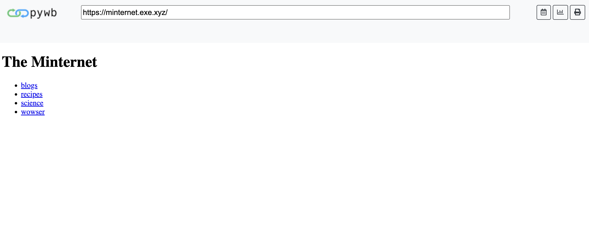
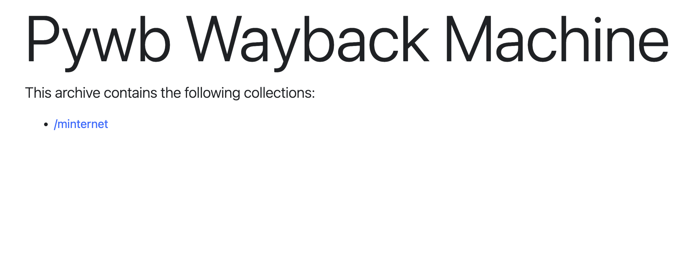
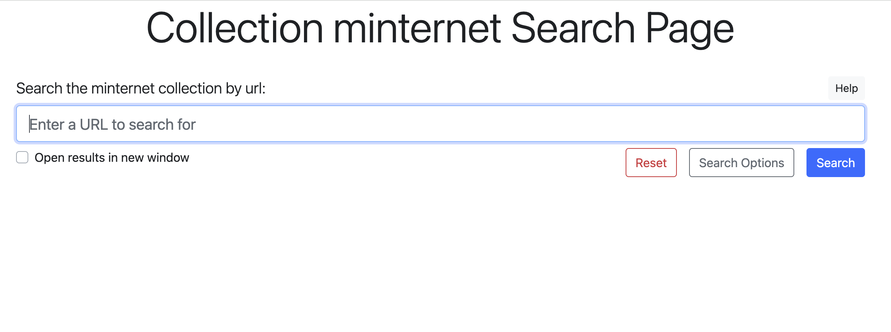
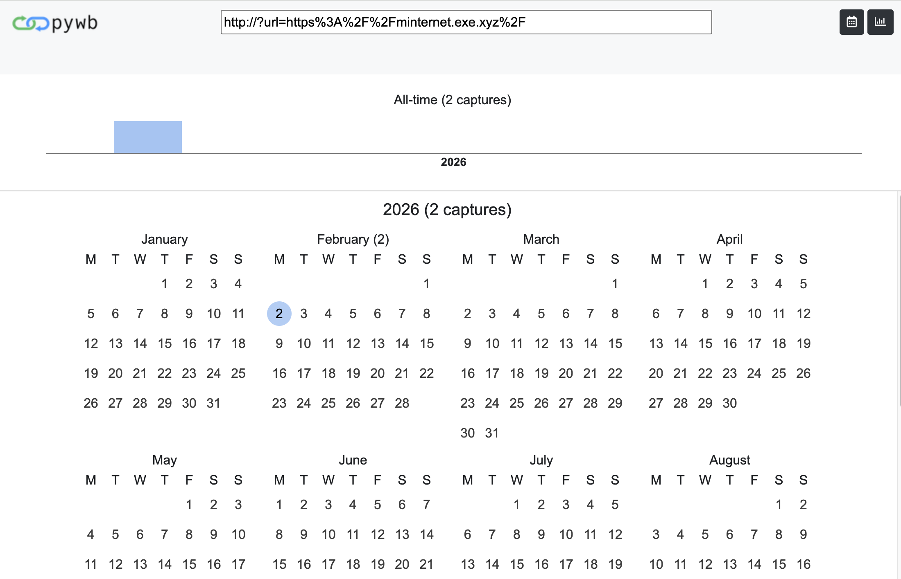
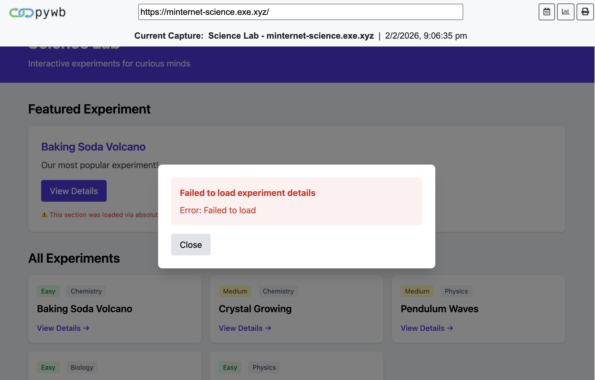
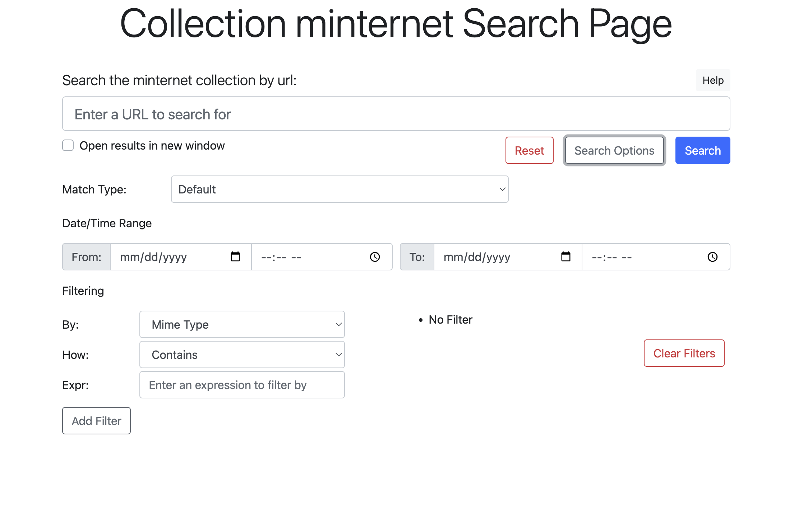
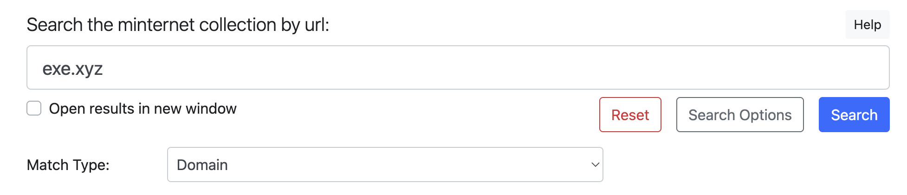
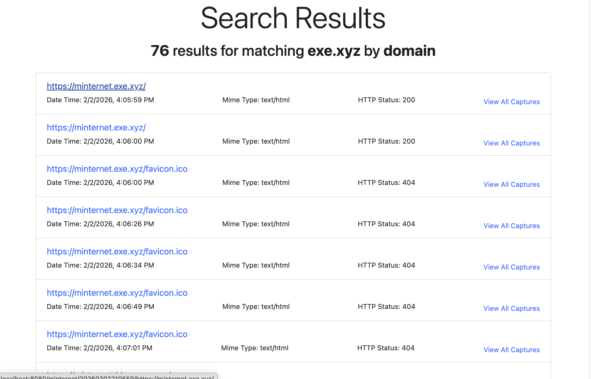
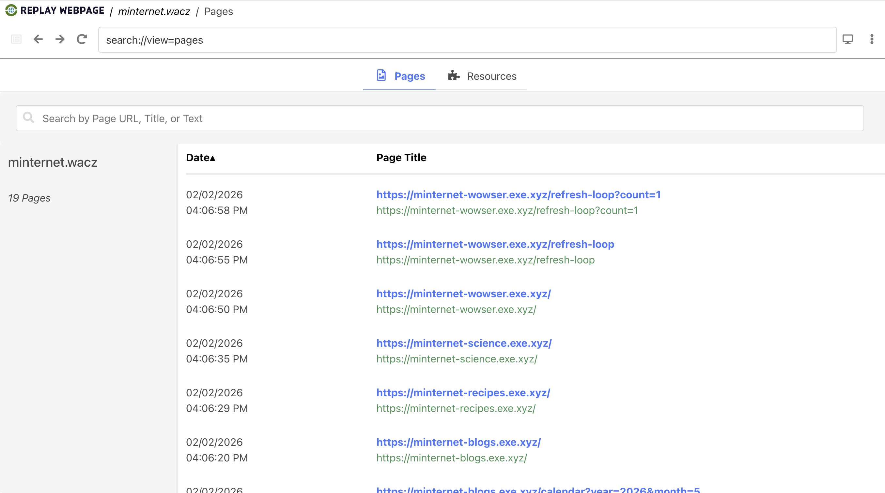

# Lab: pywb (record + replay)

## Overview

This lab looks at the python library `pywb` ([Github](https://github.com/webrecorder/pywb), [documentation](https://pywb.readthedocs.io/en/latest/)),

> **pywb** is a Python 3 web archiving toolkit for replaying web archives large and small as accurately as possible. The toolkit now also includes new features for creating high-fidelity web archives.
> 
> This toolset forms the foundation of Webrecorder project, but also provides a generic web archiving toolkit that is used by other web archives, including the traditional "Wayback Machine" functionality.

The `pywb` python library has kind of a complex past, and potentially future.  Until the [1.0 release of Browsertrix-Crawler](https://github.com/webrecorder/browsertrix-crawler/releases/tag/v1.0.0), `pywb` was used for recording network traffic to WARC files.  Since the 1.0 release, Browsertrix-Crawler uses the Chrome Debug Protocol (CDP) to capture network requests and write WARC files directly. 

But `pywb` has long been a multi-purpose tool, and remains highly relevant.  In addition to "recording" network traffic and writing WARC files, `pywb` can also provide a Wayback instance to replay WARC and WACZ web archives.  As with most things web archiving, the Wayback machine _itself_ relies on another component in the `pywb` library called `warcserver`.  `warcserver` is an API interface all WARC files and CDX indexes in a collection.  This is used to power a Wayback machine for replay, but can also be used to build custom web archiving interfaces.

That's a lot of evolution and interconnectedness from a single library, and we've still not touched on all aspects of `pywb`!

This lab will attempt to show some core architecture choices and core functionality of `pywb`.  With the caveat the approach we use here may not be fully optimized, or represent production grade approaches, they _do_ mirror the patterns in larger services like Archive-It, Webrecorder service, and pre-packed / convenience applications like [ArchiveWeb.page](https://archiveweb.page/) and [ReplayWab.page](https://replayweb.page/) (which we've used extensively!), both of which are also from the Webrecorder ecosystem.

The `pywb` python library includes the following command line interface (CLI) tools when installed:
1. `wayback` - The full Wayback Machine application
2. `warcserver` - Standalone server component
3. `cdx-indexer` - Creates CDX/CDXJ indexes from WARCs
4. `wb-manager` - Collection management utility
5. `live-rewrite-server` - Demo live rewriting server 

Our approach here will be the following:

1. Create a virtual environment and install `pywb`
2. Use `wb-manager` CLI to create a new web archiving collection
3. Use `wayback` CLI with a `--record` flag to perform user-based, transactional capture
4. Replay or web archive via a `wayback` CLI Wayback instance
5. Look at a CDX/J index file to understand how it powers a Wayback instance
6. Create WACZ file that includes all assets from a collection
7. Introduce the ArchiveWeb.page application

## Instructions

###  1. Create a virtual environment and install `pywb`

If you have not already, clone the Github repository [https://github.com/ghukill/umsi-si639-labs](https://github.com/ghukill/umsi-si639-labs):
```shell
git clone https://github.com/ghukill/umsi-si639-labs
```

Move into the repository:
```shell
cd umsi-si639-labs
```

Create a python virtual environment with `uv`:
```shell
uv venv .venv --python 3.12
```

Install all dependencies:
```shell
uv sync
```

Confirm that `pywb` is installed:
```shell
pywb --version
# pywb 2.9.1
```

### 2. Use `wb-manager` CLI to create a new web archiving collection

First, move into the scratch folder:
```shell
cd scratch
```

Let's create a directory for this lab and move into it:
```shell
mkdir pywb-lab
cd pywb-lab
```

Now that we've got a good place to work, let's scaffold a new collection using `wb-manager`:
```shell
wb-manager init minternet
```

This should create a file structure like the following:
```text
.
├── collections
│   └── minternet
│       ├── archive
│       ├── indexes
│       ├── static
│       └── templates
├── static
└── templates

9 directories, 0 files
```

At this point, we've really only created a directory structure that `pywb` understands and expects.  Please note that you _can_ override the defaults locations of all these bits and pieces, but for the sake of this lab we'll just use the defaults.

### 3. Use `wayback` CLI with a `--record` flag to perform user-based, transactional capture

Next, we'll capture some content using a web browser on our own machine in a human-driven, transactional approach.  Unlike crawlers we've looked in previous labs, e.g. `wget` and browsertrix-crawler, this approach to capturing content is not a "crawler" in the traditional sense!  The only content captured will be from a browser that we, as humans, control and navigate.  Only the pages we see and interact with will be included in the web archive.  Only actions we perform, i.e. clicking on buttons, will be recorded.  This style of capture results in very high fidelity captures, but obviously is a lot of manual work.  

Run the following command to `pywb` start a recording session, using our newly created collection:
```shell
wayback --record --live -a --auto-interval 10
```

To begin recording, navigate to the following URL in your browser: [http://localhost:8080/minternet/record/https://minternet.exe.xyz](http://localhost:8080/minternet/record/https://minternet.exe.xyz).  You should see the following in your browser:



While the majority of the browser tab looks normal, our now very familiar Minternet home page -- probably getting sick of it by now! -- displayed, note the pywb header at the top complete with its own URL bar.  This is a visual indication that we are "recording" each page this tab sees in our web archive.

At this point, feel free to click around the Minternet.  Some suggestions for activity to perform so we can see if it replays later:
- click into recipes, look at one recipe but not the other
- click into blogs, click around the calendar and search
- use the forward and back arrows in your browser as you normally would
- click into the science subdomain, click "View details" for _some_ experiments, but not all
- in the science subdomain, click on some of the asset downloads near the bottom like "Experiments Catalog" and "Laboratory Safety Guide"

Once satisfied with clicking around, feel free to close this tab, then go back to the terminal and stop the recording process we started with `ctrl + c` (on Mac, `cmd + c`).

With that done, we can run `tree` again and see the effects of our recording in the collections file structure:

```text
.
├── collections
│   └── minternet
│       ├── archive
│       │   └── rec-20260202012608556474-Grahams-MacBook-Pro.local.warc.gz
│       ├── indexes
│       │   └── autoindex.cdxj
│       ├── static
│       └── templates
├── static
└── templates

9 directories, 2 files
```

Note the new WARC file under the `archive/` folder, and the new index file under `indexes/`.  Success!  We have successfully performed a high fidelity, boutique web crawl, using the `pywb` CLI tool `wayback`!

### 4. Replay or web archive via a `wayback` CLI Wayback instance

Now that we have a web archive collection folder, let's use `pywb` to launch a Wayback instance we can interact with and see our capture.

Run the following from the `scratch/pywb-lab` directory where you started the last command from:
```shell
wayback
```

This starts a Wayback server that we can access at [http://localhost:8080](http://localhost:8080) and should look like this:



The single link for `/minternet` is reflecting the collection we created with the command `wb-manager init minternet` and the folder we can see locally:
```text
.
├── collections
│   └── minternet   <-----------------------
│       ├── archive
│       │   └── rec-20260202210600135574-LIBM-0534313.warc.gz
│       ├── indexes
│       │   └── autoindex.cdxj
│       ├── static
│       └── templates
├── static
└── templates
```

Before we click around and do more, it's a good time to return to this core convention of `pywb`.  While you can override these defaults, it's expecting a `collections/` folder from where it's run from, and under that, each folder represents a "collection".  You can read more about that [here in the documentation](https://pywb.readthedocs.io/en/latest/manual/configuring.html#directory-structure).

But let's get back to our Wayback instance!

If you click on the `minternet/` link, you should get an interface that looks like this:



For many -- myself included at first! -- this can be a bit confusing.  Where are all the helpful links and tabs that sites like ReplayWeb.page give us (more on that later)?  How do I just start browsing around?

The answer is that this interface reveals something somewhat foundational to using `pywb`: it's a core library, and can be extended to do amazing things, and so it's missing some of these nice-to-have, casual features we might expect in some places.   But fear not, we can still browse our archived content.

We know that we started with the URL `https://minternet.exe.xyz/`, so let's pop that into the search box and click "Search".  What we should see is a somewhat familiar Wayback interface, maybe you've seen this in the Internet Archive, showing different capture dates for this URL:



In this screenshot, you can see via the single blue circle that I have a single capture on February 2nd.  Clicking that, and then selecting a capture time from that date, we finally see a replay of our captured content!  From here you can click around.

Try to remember some links you did click on, and actions you took (e.g. [searches in blogs](https://minternet-blogs.exe.xyz/search)).  Does the content look correct?  Are things missing?

One very concrete example is the following from the science site homepage, [https://minternet-science.exe.xyz/](https://minternet-science.exe.xyz/).  During my clicking around capture, I clicked on "View Details" for a couple of experiments, but not all of them.  The following shows a successful display of details for an experiment I had clicked on:


And here is clicking on "View Details" for an experiment I did not during capture:



This should feel similar to the Browsertrix-Crawler lab, where we saw this fail in a similar fashion, but then fixed it with Browsertrix "behaviors" that clicked on all `<button>` elements.  The key difference here, is that only the experiments that I clicked on during my live, transactional capturing are saved in the archive.  This shows both the precision and potential gaps that transactional captures like this can result in.

Let's navigate back to the screen where we had clicked on our collection and were presented with a search box: [http://localhost:8080/minternet/](http://localhost:8080/minternet/).

As you may have noticed, all the websites in the Minternet ecosystem contain `exe.xyz`.  This is the **domain** of the URL.  If we extend that out a bit and look at parts of the URL like `minternet.exe.xyz` or `minternet-blogs.exe.xyz`, `minternet` and `minternet-blogs` are **sub-domains** of that domain.  

Another example is the site where the labs are hosted, `https://ghukill.github.io/umsi-si639-labs/`:
- `github.io` is the **domain**
- `ghukill` is the **sub-domain**
- `ghukill.github.io` is the **host**

It would be tempting to assume that all people and documentation adhere to these rules, or that all URLs follow this pattern... but that's just not the case.  Sometimes "domain" and "host" are used somewhat interchangeably, not all URLs have subdomains, etc.  But it's a decently rough heuristic for the time being.

Why bring all this up?  The search interface that we navigated back to has a "Search Options" button which will reveal the following:



Using some of our sleuthing and knowledge from above, let's try a search where `Match Type = domain` and the value is `exe.xyz`:



Which brings back the results:



What's notable about these results, are that they include virtually _all_ HTTP requests that were made during our browsing.  We see some URLs we recognize in there like `https://minternet.exe.xyz/` (maybe even a few times!  more on that later...), but some unexpected ones like `https://minternet-recipes.exe.xyz/style.css`.  In a real web crawl, the pages you capture may have _lots_ more little things requested and retrieved like CSS, Javascript files, font files, images, etc.  

Under the hood, what is `pywb` doing here?  How did it find these 76 URLs that contained `exe.xyz` as part of the domain?  To the CDX/J indexes with us for the answer!

### 5. Look at a CDX/J index file to understand how it powers a Wayback instance

At the top of this lab we identified some tools that `pywb` comes with when installed.  We can refer to them as "tools" insofar as they are standalone CLI tools we can use, but it's also correct to think of them as "components" of the `pywb` "ecosystem".   One of these tools is called `warcserver`, and it's the _really_ low-level tool/library that is doing work for us during replay in Wayback.

When we perform that search we just did a minute ago for all `exe.xyz` domain URLs in our collection, the `warcserver` component used a CDX/J index file in our collection as its data source.  Looking at our collection file structure again, it's here:

```tree
.
├── collections
│   └── minternet
│       ├── archive
│       │   └── rec-20260202210600135574-LIBM-0534313.warc.gz
│       ├── indexes
│       │   └── autoindex.cdxj       <----------------------------
│       ├── static
│       └── templates
├── static
└── templates
```

This was created automatically as we were clicking around capturing content.  This is related to the `-a --auto-internal 5` flags we set during our recording session: 

```text
-a, --autoindex       Enable auto-indexing
--auto-interval AUTO_INTERVAL
                      Auto-indexing interval (default 30 seconds)
```

This quiet little flag we set, and the invisible work it kicked off during our recording, is super important!  As we wrote all HTTP request + responses to the WARC files, every 5 seconds, it would "index" those additions to the WARC files by adding lines to the `collections/minternet/indexes/autoindex.cdxj` file.  

In very large web archives, e.g. the Internet Archive or Archive-It collections, this "indexing" work is one of the most compute intensive parts.  The CDX/J index files are like a **map** to the WARC files, providing us with a quick and efficient way to lookup specific URLs or other assets and find out where they live in the WARC files.  Remember, a collection might have 1, 10, 100, 1,000, or more WARC files!  If you wanted to replay URL `https://example.com/foo`, where is that request + response in all those WARC files, with millions of URLs captured?  The CDX/J file can tell you quickly and efficiently.

Let's open the file and look at a few of the first lines:

```text
com,tailwindcss,cdn)/ 20260202210635 {"url": "https://cdn.tailwindcss.com/", "mime": "unk", "status": "302", "digest": "3I42H3S6NNFQ2MSVX7XZKYAYSCX5QBYJ", "length": "776", "offset": "101040", "filename": "rec-20260202210600135574-LIBM-0534313.warc.gz"}
com,tailwindcss,cdn)/3.4.17 20260202210635 {"url": "https://cdn.tailwindcss.com/3.4.17", "mime": "text/javascript", "status": "200", "digest": "HUDGL55QDLMNKDCZCTDP53IYBXEBDIZP", "length": "127424", "offset": "102468", "filename": "rec-20260202210600135574-LIBM-0534313.warc.gz"}
xyz,exe,minternet)/ 20260202210559 {"url": "https://minternet.exe.xyz/", "mime": "text/html", "status": "200", "digest": "J33FQDHFNOC4GXETRK34J2UDZBIWCVFU", "length": "647", "offset": "0", "filename": "rec-20260202210600135574-LIBM-0534313.warc.gz"}
xyz,exe,minternet)/ 20260202210600 {"url": "https://minternet.exe.xyz/", "mime": "text/html", "status": "200", "digest": "J33FQDHFNOC4GXETRK34J2UDZBIWCVFU", "length": "645", "offset": "1348", "filename": "rec-20260202210600135574-LIBM-0534313.warc.gz"}
xyz,exe,minternet)/favicon.ico 20260202210600 {"url": "https://minternet.exe.xyz/favicon.ico", "mime": "text/html", "status": "404", "digest": "77LXB6ILN7UYN3EQOI27ZITTGGQNQ3TY", "length": "504", "offset": "2704", "filename": "rec-20260202210600135574-LIBM-0534313.warc.gz"}
xyz,exe,minternet)/favicon.ico 20260202210626 {"url": "https://minternet.exe.xyz/favicon.ico", "mime": "text/html", "status": "404", "digest": "77LXB6ILN7UYN3EQOI27ZITTGGQNQ3TY", "length": "503", "offset": "86114", "filename": "rec-20260202210600135574-LIBM-0534313.warc.gz"}
xyz,exe,minternet)/favicon.ico 20260202210634 {"url": "https://minternet.exe.xyz/favicon.ico", "mime": "text/html", "status": "404", "digest": "77LXB6ILN7UYN3EQOI27ZITTGGQNQ3TY", "length": "504", "offset": "95348", "filename": "rec-20260202210600135574-LIBM-0534313.warc.gz"}
xyz,exe,minternet)/favicon.ico 20260202210649 {"url": "https://minternet.exe.xyz/favicon.ico", "mime": "text/html", "status": "404", "digest": "77LXB6ILN7UYN3EQOI27ZITTGGQNQ3TY", "length": "504", "offset": "247917", "filename": "rec-20260202210600135574-LIBM-0534313.warc.gz"}
xyz,exe,minternet)/favicon.ico 20260202210701 {"url": "https://minternet.exe.xyz/favicon.ico", "mime": "text/html", "status": "404", "digest": "77LXB6ILN7UYN3EQOI27ZITTGGQNQ3TY", "length": "502", "offset": "269406", "filename": "rec-20260202210600135574-LIBM-0534313.warc.gz"}
xyz,exe,minternet-blogs)/ 20260202210602 {"url": "https://minternet-blogs.exe.xyz/", "mime": "text/html", "status": "200", "digest": "4HLOQ5IRMXNZAIIJ6DPVMV4EHBPGG76K", "length": "1494", "offset": "3882", "filename": "rec-20260202210600135574-LIBM-0534313.warc.gz"}
```

These are the first 10 lines from the CDX/J file created from our capture.  To tie these CDX/J lines back to our discussion about domains, sub-domains, and hosts, we have to take a very short detour into SURTs (Sort-friendly URI Reordering Transform).

By inverting a URL Like `https://minternet.exe.xyz/favicon.ico` into the SURT `xyz,exe,minternet)/favicon.ico`, these make the CDX/J files effectively sorted by domain > sub-domain > URL path.  Why does this matter?  Imagine we had 1 million URLs in our web archive, from thousands of different domains.  If we create SURTs in this format, software like `pywb` can very quickly find a particular row in the CDX/J files because the domains are sorted.

This gets into some fairly advanced search and retrieval concepts, probably out of scope for this lab.  But it felt important to touch on, to understand the value that `pywb` provides to the ecosystem. 

When we run `wayback`, an instance of `warcserver` is quietly started as well.  When we interact with that search interface, the `warcserver` instance queries the CDX/J files -- efficiently, as we now now! -- which returns the CDX/J line(s) that match.  

If finding the row for URL `https://minternet.exe.xyz/favicon.ico` in the CDX/J files is the first important step, the second important step is reading that line and understanding a) which WARC file the data is in, and b) the precise location of the data _inside_ that WARC file.  Looking at one of the lines from our file:

```text
xyz,exe,minternet)/ 20260202210600 {"url": "https://minternet.exe.xyz/", "mime": "text/html", "status": "200", "digest": "J33FQDHFNOC4GXETRK34J2UDZBIWCVFU", "length": "645", "offset": "1348", "filename": "rec-20260202210600135574-LIBM-0534313.warc.gz"}
```

This tells us that the request + response is in WARC file `rec-20260202210600135574-LIBM-0534313.warc.gz` (the collection folder is implied), it's `1348` (`offset`) bytes from the start of the file, and it's `645` (`length`) bytes long.  

This has been a lot, but those are the broad strokes of how all this infrastructure works!  

1. the Wayback wants to show url `https://example.com/foo`
2. it makes a request to the `warcserver`
3. it reads the CDX/J files, sorted by SURTs, and goes straight to `com,example)/foo`
4. it reads that row and finds out the data is in file `abc123.warc.gz`
5. it's 1000 bytes from the start, and 200 bytes long

That is a pretty efficient way to perform a "random access" read from a large web archive.  

To finish this little CDX/J side quest, let's recreate the CDX/J file and recreate it with `pywb`.

First, delete the file `collections/minternet/indexes/autoindex.cdxj`.  You can do this in ways you are comfortable with, or in the terminal:
```shell
rm collections/minternet/indexes/autoindex.cdxj
```

We can now recreate them with another `pywb` utility called `cdx-indexer`:

```shell
cdx-indexer --cdxj --sort --output collections/minternet/indexes/index.cdxj collections/minternet/archive/
```

The file created should look _very_ similar, if not identical, to the original index that was created during the capture.  This new CDX/J file was created by analyzing the WARC files for this collection.

### 6. Create WACZ file that includes all assets from a collection

So far, we've:

1. Run `wayback` in record mode, and captured content that was saved to our `minternet/` collection folder
2. Replayed the content using `wayback` using the `minternet/` collection as the root
3. Analyzed, deleted, and recreated CDX/J files associated with this collection

One final action we can take -- still using the `pywb` library -- is to zip up the entire `minternet/` collection as a single WACZ file.

We can do that with a single command:
```shell
wacz create --detect-pages --output minternet.wacz collections/minternet/archive/*.*
```

We should now see a WACZ file in our curent working directory:
```text
.
├── collections
│   └── minternet
│       ├── archive
│       │   └── rec-20260202210600135574-LIBM-0534313.warc.gz
│       ├── indexes
│       │   └── index.cdxj
│       ├── static
│       └── templates
├── minternet.wacz         <-----------------------
├── static
└── templates

9 directories, 3 files
```

To confirm ourselves that the process worked, let's use our trusty [https://replayweb.page/](https://replayweb.page/) and test this WACZ file:

1. Load [https://replayweb.page/](https://replayweb.page/)
2. Click "Choose File" and find the WACZ file

If all goes well, it should look like the following, confirming that our WACZ file is a fully encapsulated web archive:



### 7. Introduce the ArchiveWeb.page application

Now that we've done all that work with `pywb`, seeing what amazing functionality it has, understanding a bit more how it supports an ecosystem of opensource tools... it's time to reveal there is a handy application called [ArchiveWeb.page](https://archiveweb.page/) that basically wraps up all that functionality as a standalone, installable application!

It's outside the scope of this lab to walkthrough ArchiveWeb.page, but please do consider installing it and exploring how it works!  With your `pywb` experience, _much_ of the interface, patterns, and mechanics should be very familiar.

It's worth noting that it -- to my knowledge -- does _not_ use `pywb`, but that's okay.  We also noted that about Browsertrix-Crawler, which has moved away from using `pywb` directly.  These tools the Chrome DevTools Protocol (CDP) to capture HTTP requests and responses, intead of `pywb` as a proxy.  Tools like `brozzler` use tools like `warcprox` (we'll see this in a later lab!) to capture content.  The point here is that there are _lots_ of ways to capture HTTP requests + responses with the goal of creating WARC files.  Despite the evolution in this space, `pywb` continues to be used by many projects and communities, and it's patterns are widely recognizable in web archiving tools of past and future!

## Reflection Prompts

1- What are you initial impressions of performing a "transactional" web crawl with `pywb`, where only sites you visit and actions you take in your browser are captured?  What are the pros and cons compared to a "crawl" like that of Browsertrix or Archive-It?

2- This is our first close look at CDX/J index files.  Conceptually, why are they helpful for web archives?  Do you think they are more aligned with preservation or access of web archives?

Bonus- If you had an opportunity to experiment with the standalone ArchiveWeb.page application, how do you think it compares to `pywb`?
