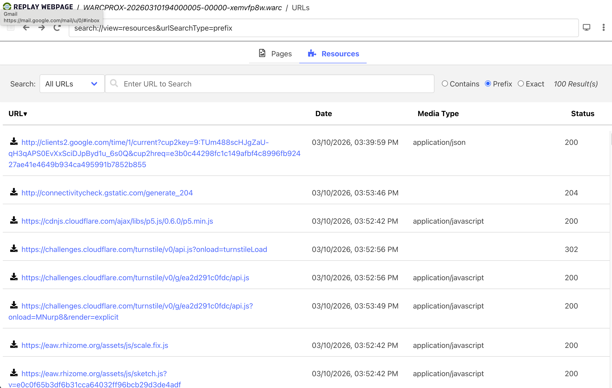
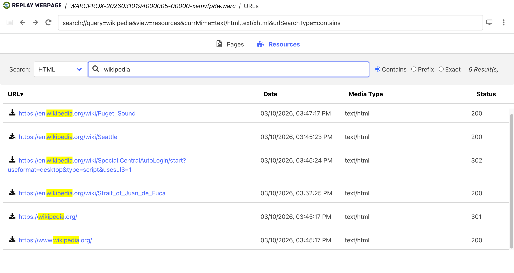
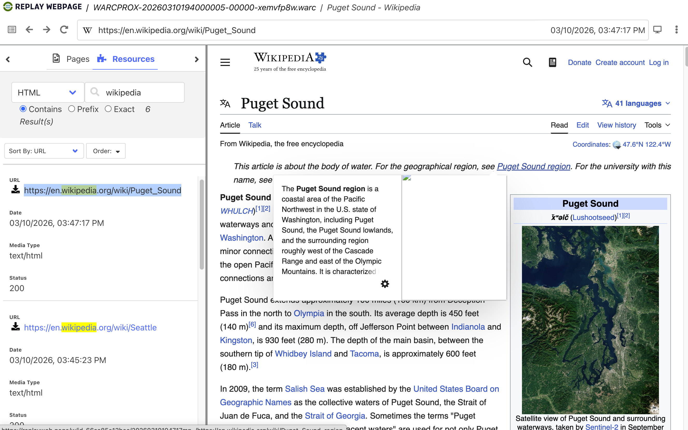

# Lab: warcprox

## Overview

For today's lab, we're going to use the `warcprox` library to perform an _intentional_ Man-In-The-Middle (MITM) attack, in the name of web archiving!

A [Man-in-the-Middle attack](https://en.wikipedia.org/wiki/Man-in-the-middle_attack) is defined by Wikipedia as:

> In cryptography and computer security, a man-in-the-middle[a] (MITM) attack, or on-path attack, is a cyberattack where the attacker secretly relays and possibly alters the communications between two parties who believe that they are directly communicating with each other, where in actuality the attacker has inserted themselves between the two user parties.

Normally, this is a very bad️ thing™.  But the Internet Archive's `warcprox` library utilizes this pattern as a very clever way to build WARC files for a web archive.

Over the last few weeks we have emphasized that WARC files are a file format to capture network traffic.  In theory, by capturing tons of information about HTTP requests and responses, you have enough data that you can "replay" what browsing the Internet was like for that network traffic.

We have looked at a handful of crawlers that created WARC files:
- `wget`
- `pywb`
- `browsertrix`
- `heritrix`

Ignoring some of the finer details about _how_ they did it, they all in one form or another were performing a Man-in-the-Middle "attack" by capturing network traffic and saving it to WARC files.

What's neat about `warcprox` is that it brings this work explicitly to the foreground.

In today's lab we will:

1. start a `warcprox` instance
2. start a special Chromium browser instance that routes all network traffic through our `warcprox` instance
3. browse around the Internet
4. rely on `warcprox` to save all of our browsing to WARC files
5. replay the WARC files and confirm that `warcprox` did its job

While we are going to use a Chromium browser for today's lab that is configured to route traffic through `warcprox`, note that we are not limited by this approach with `warcprox`.

Have you ever used a VPN?  That's another intentional Man-in-the-Middle pattern, routing all your traffic through an intermediate proxy server.

We can route virtually any network traffic through a proxy, and `warcprox` is no different.  Theoretically, you could start `warcprox` in the morning, configure your computer to route _all_ network traffic through the proxy, and by the end of the day you'd have WARC file(s) that capture all internet traffic for the entire day: internet browsers, applications, etc.

This is why we'll use a dedicated, proxied Chromium browser so only _that_ network traffic is routed through `warcprox` for the lab.  We don't need to archive your slack messages, text messages, and email traffic captured as well 😉.

`warcprox` is used by the Internet Archive for its [brozzler crawler](https://github.com/internetarchive/brozzler), and likely other web archiving software and architectures.  It's a pattern that, once understood and internalized, you'll start seeing it everywhere!

## Instructions

### Prepare workspace and install `warcprox` + `playwright` + Chromium browser

As per usual, ensure that you have the SI639 labs github repository cloned and updated:

```shell
git clone https://github.com/ghukill/umsi-si639-labs
cd umsi-si639-labs
git pull origin main
```

Run command to update dependencies:
```shell
uv sync
```

Ensure warcprox is installed:
```shell
uv run warcprox --version
# output like: warcprox 2.12.0
```

Ensure playwright is installed:
```shell
uv run playwright --version
# output like: Version 1.58.0
```

Use playwright to install an instance of the [Chromium browser engine](https://www.chromium.org/Home/) local to this project
```shell
uv run playwright install --with-deps chromium
```

Output should look similar to:
```text
Downloading Chrome for Testing 145.0.7632.6 (playwright chromium v1208) from https://cdn.playwright.dev/chrome-for-testing-public/145.0.7632.6/mac-arm64/chrome-mac-arm64.zip
(node:64841) [DEP0169] DeprecationWarning: `url.parse()` behavior is not standardized and prone to errors that have security implications. Use the WHATWG URL API instead. CVEs are not issued for `url.parse()` vulnerabilities.
(Use `node --trace-deprecation ...` to show where the warning was created)
162.3 MiB [====================] 100% 0.0s
Chrome for Testing 145.0.7632.6 (playwright chromium v1208) downloaded to /Users/commander/Library/Caches/ms-playwright/chromium-1208
Downloading Chrome Headless Shell 145.0.7632.6 (playwright chromium-headless-shell v1208) from https://cdn.playwright.dev/chrome-for-testing-public/145.0.7632.6/mac-arm64/chrome-headless-shell-mac-arm64.zip
(node:64843) [DEP0169] DeprecationWarning: `url.parse()` behavior is not standardized and prone to errors that have security implications. Use the WHATWG URL API instead. CVEs are not issued for `url.parse()` vulnerabilities.
(Use `node --trace-deprecation ...` to show where the warning was created)
91.1 MiB [====================] 100% 0.0s
Chrome Headless Shell 145.0.7632.6 (playwright chromium-headless-shell v1208) downloaded to /Users/commander/Library/Caches/ms-playwright/chromium_headless_shell-1208
```

If no output, but no errors, that's okay too.  Chromium might already be installed from another lab.

Confirm that playwright works with this browser:
```shell
uv run playwright open https://umich.edu
```
- should open a new Chromium browser window for the URL `https://umich.edu`
- close browser
- this confirms playwright is working correctly

Lastly, create a directory for this lab in our `scratch/` folder and move into it:
```shell
mkdir -p scratch/warcprox-lab
cd scratch/warcprox-lab
```

We should be all set!

### Start `warcprox`

From the directory `scratch/warcprox-lab`, start a `warcprox` instance:

```shell
uv run warcprox
```

That's it!  You should see some output like the following:
```text
2026-03-10 15:27:09,144 10128 INFO MainThread warcprox.warcproxy.WarcProxy.__init__(mitmproxy.py:638) 100 proxy threads
2026-03-10 15:27:09,245 10128 NOTICE MainThread warcprox.warcproxy.WarcProxy._logger_notice(__init__.py:260) listening on 127.0.0.1:8000
2026-03-10 15:27:09,246 10128 INFO MimeTypeFilter(tid=n/a) warcprox.mime_type_filter.MimeTypeFilter._run(__init__.py:131) <MimeTypeFilter(MimeTypeFilter(tid=n/a), started 6155677696)> starting up
2026-03-10 15:27:09,246 10128 INFO DedupLoader(tid=n/a) warcprox.BasePostfetchProcessor._run(__init__.py:131) <DedupLoader(DedupLoader(tid=n/a), started 6172504064)> starting up
2026-03-10 15:27:09,246 10128 INFO WarcWriterProcessor(tid=n/a) warcprox.writerthread.WarcWriterProcessor._run(__init__.py:131) <WarcWriterProcessor(WarcWriterProcessor(tid=n/a), started 6189330432)> starting up
2026-03-10 15:27:09,246 10128 INFO MainThread warcprox.dedup.DedupDb.start(dedup.py:102) creating new deduplication database ./warcprox.sqlite
2026-03-10 15:27:09,247 10128 INFO DedupDb(tid=n/a) warcprox.BasePostfetchProcessor._run(__init__.py:131) <ListenerPostfetchProcessor(DedupDb(tid=n/a), started 6206156800)> starting up
2026-03-10 15:27:09,247 10128 INFO StatsProcessor(tid=n/a) warcprox.stats.StatsProcessor._run(__init__.py:131) <StatsProcessor(StatsProcessor(tid=n/a), started 6222983168)> starting up
2026-03-10 15:27:09,247 10128 INFO RunningStats(tid=n/a) warcprox.BasePostfetchProcessor._run(__init__.py:131) <ListenerPostfetchProcessor(RunningStats(tid=n/a), started 6239809536)> starting up
2026-03-10 15:27:09,247 10128 INFO StatsProcessor(tid=n/a) warcprox.stats.StatsProcessor._startup(stats.py:103) opening existing stats database ./warcprox.sqlite
2026-03-10 15:27:09,248 10128 INFO StatsProcessor(tid=n/a) warcprox.stats.StatsProcessor._startup(stats.py:120) created table buckets_of_stats in ./warcprox.sqlite
```

A couple of additional things happened in the folder where it was launched:

```text
.
├── Grahams-MBP-2.localdomain-warcprox-ca
├── Grahams-MBP-2.localdomain-warcprox-ca.pem
└── warcprox.sqlite
```

The two files `Grahams-MBP-2.localdomain-warcprox-ca` and `Grahams-MBP-2.localdomain-warcprox-ca.pem` (name is related to your machine) are self-signed HTTPS certificates.  For advanced and production contexts that use `warcprox`, it's possible to use these certificates to help the browser or crawler allow this Man-in-the-Middle proxy situation.  As we'll see in this lab, browsers are generally clever enough to detect it and make a fuss.  

For this lab we will NOT utilize these certificates, but this is `warcprox` acknowledging that it's quite common to.

Lastly, there is a SQLite database started.  This is used by `warcprox` to remember and deduplicate content it's capturing.  Again, we won't dig into this for the lab, but good to know why it's there.

Before we start sending data to this `warcprox` instance, let's triple check it's working by making a request to a debug endpoint.  Navigate to [http://localhost:8000/status](http://localhost:8000/status) in your browser.  You should see some output like the following:

```json
{
  "role": "warcprox",
  "version": "2.12.0",
  "host": "Grahams-MBP-2.localdomain",
  "address": "127.0.0.1",
  "port": 8000,
  "pid": 11601,
  "threads": 100,
  "active_requests": 2,
  "unaccepted_requests": 0,
  "load": 0.0,
  "queued_urls": 0,
  "queue_max_size": 500,
  "urls_processed": 0,
  "warc_bytes_written": 0,
  "start_time": "2026-03-10T19:33:35.104842+00:00",
  "rates_1min": {
    "actual_elapsed": 63.61693620681763,
    "urls_per_sec": 0.0,
    "warc_bytes_per_sec": 0.0
  },
  "rates_5min": {
    "actual_elapsed": 63.61695909500122,
    "urls_per_sec": 0.0,
    "warc_bytes_per_sec": 0.0
  },
  "rates_15min": {
    "actual_elapsed": 63.616971015930176,
    "urls_per_sec": 0.0,
    "warc_bytes_per_sec": 0.0
  },
  "earliest_still_active_fetch_start": "2026-03-10T19:34:38.784408+00:00",
  "earliest_still_active_socket": {
    "socket": "<socket.socket fd=6, family=2, type=1, proto=0, laddr=('127.0.0.1', 8000), raddr=('127.0.0.1', 59615)>",
    "name": [
      "127.0.0.1",
      8000
    ],
    "peername": [
      "127.0.0.1",
      59615
    ],
    "future_status": "running",
    "exception": null
  },
  "earliest_still_active_postfetch": {
    "url": null,
    "postfetch_plugin": null
  },
  "seconds_behind": 0.001957,
  "postfetch_chain": [
    {
      "processor": "MimeTypeFilter",
      "queued_urls": 0
    },
    {
      "processor": "DedupLoader",
      "queued_urls": 0
    },
    {
      "processor": "WarcWriterProcessor",
      "queued_urls": 0
    },
    {
      "processor": "DedupDb",
      "queued_urls": 0
    },
    {
      "processor": "StatsProcessor",
      "queued_urls": 0
    },
    {
      "processor": "RunningStats",
      "queued_urls": 0
    }
  ]
}
```

Nothing much to comment on here, other than it confirms its working.

### Open and configure a Chromium browser to use `warcprox`

Our next step will be opening a special Chromium browser window that will be configured to proxy traffic through `warcprox`.

**To reiterate: we technically don't need a special browser, you could set proxy settings in Windows / Mac / Linux and have _all_ your computer's traffic get captured by `warcprox`.**  While fun and interesting, it's a) not a super realistic way to perform web archiving, and b) is a bit risky / unsafe given the sensitive data you may capture.  Not to mention the raft of HTTPS errors you see, because _your entire computer_ is detecting a MITM attack.

We should have `playwright` installed, which provides a handy way to install, launch, and configure a browser.  We have already confirmed earlier that it can start a browser.  Now, we'll launch one that:

1. ignore HTTPS certificate errors, which is helpful for testing
2. is configured to send all traffic through our running `warcprox` instance

In a new terminal -- leaving the `warcprox` instance running in the first one -- run the following:

```shell
uv run playwright open \
--ignore-https-errors \
--proxy-server http://localhost:8000/ \
https://minternet.exe.xyz/
```

It's our old friend, Minternet!  The most boring of websites.

Before we get into new browsing activity, jump back to your `warcprox` instance and confirm there is activity.  It's probably a _lot_ of errors that look similar to:

```text
...
2026-03-10 15:40:04,062 11601 WARNING MitmProxyHandler(tid=n/a,started=2026-03-10T19:40:04.052294+00:00,client=127.0.0.1:59821) warcprox.warcprox.WarcProxyHandler.log_error(mitmproxy.py:629) code 500, message [SSL: SSLV3_ALERT_CERTIFICATE_UNKNOWN] sslv3 alert certificate unknown (_ssl.c:1000)
2026-03-10 15:40:04,749 11601 ERROR MitmProxyHandler(tid=n/a,started=2026-03-10T19:40:04.747647+00:00,client=127.0.0.1:59823) warcprox.warcprox.WarcProxyHandler.do_CONNECT(mitmproxy.py:363) problem handling 'CONNECT accounts.google.com:443 HTTP/1.1': SSLError(1, '[SSL: SSLV3_ALERT_CERTIFICATE_UNKNOWN] sslv3 alert certificate unknown (_ssl.c:1000)')
...
```

That's okay!  This is our Chromium instance + `warcprox` both reporting that our Man-in-the-Middle proxy is setting off alarm bells everywhere.  For our purposes, we can ignore these.  Thankfully the `--ignore-https-errors` flag we used when starting Chromium told the browser not to worry as well.

Let's focus back on the Chromium browser.

### Browse the Internet!

Though we instructed to start the Chromium browser at [https://minternet.exe.xyz/](https://minternet.exe.xyz/), you can begin browsing around the Internet to your heart's content with this open Chromium instance.

You may notice quite a few little things as you do:

- it feels a bit slower, sluggish
- the viewport may not change size even though you resize the browser window
- some content looks a bit different or incomplete

This is a fully functioning web browser engine, but it's not quite like your normal daily driver browser.  It's missing plugins, lots of performance enhancements, network traffic is slow given the proxy in the middle, etc.

Now that we're [Chrome DevTool experts](../browser_dev_tools/README.md), a fun thing to do is open the DevTools and inspect network traffic.  For just about any request the browser makes, you should see something similar in the **Response Headers**:

```text
Via: 1.1 warcprox
```

This single, quiet line in the response headers is telling a big tale: this network request (basically all of them) are going through the `warcprox` instance we have running.  It's a nice confirmation that things are working.

Try browsing simple sites you know well, sites with complex content, whatever you think might be interesting to try replaying later.  If you're interested, you could even try logging into a site -- e.g. Github, your email, etc. -- and capture some content that is otherwise not public.  This is relatively safe, as the WARC file capture lives only on your machine.

Once you've browsed around a bit, we can move on to see the results of our capture.

### Stopping and reviewing capture

First, close the Chromium browser that `playwright` started and was used for capture.  

Next, find your terminal window that is running `warcprox` and perform `Ctrl + c` to stop the process.  If stopped cleanly you should see a few logging lines at the very end like this:

```text
^C2026-03-10 15:54:46,390 11601 NOTICE MainThread warcprox.warcproxy.WarcProxy._logger_notice(__init__.py:260) shutting down
2026-03-10 15:54:46,596 11601 INFO MimeTypeFilter(tid=n/a) warcprox.mime_type_filter.MimeTypeFilter._run(__init__.py:141) <MimeTypeFilter(MimeTypeFilter(tid=n/a), started 6203486208)> shutting down
2026-03-10 15:54:47,101 11601 INFO DedupLoader(tid=n/a) warcprox.BasePostfetchProcessor._run(__init__.py:141) <DedupLoader(DedupLoader(tid=n/a), started 6220312576)> shutting down
2026-03-10 15:54:47,109 11601 INFO WarcWriterProcessor(tid=n/a) warcprox.writerthread.WarcWriterProcessor._run(__init__.py:141) <WarcWriterProcessor(WarcWriterProcessor(tid=n/a), started 6237138944)> shutting down
2026-03-10 15:54:47,602 11601 INFO DedupDb(tid=n/a) warcprox.BasePostfetchProcessor._run(__init__.py:141) <ListenerPostfetchProcessor(DedupDb(tid=n/a), started 6253965312)> shutting down
2026-03-10 15:54:47,615 11601 INFO StatsProcessor(tid=n/a) warcprox.stats.StatsProcessor._run(__init__.py:141) <StatsProcessor(StatsProcessor(tid=n/a), started 6270791680)> shutting down
2026-03-10 15:54:48,103 11601 INFO RunningStats(tid=n/a) warcprox.BasePostfetchProcessor._run(__init__.py:141) <ListenerPostfetchProcessor(RunningStats(tid=n/a), started 6287618048)> shutting down
```

Once shutdown, you should see a new `warc/` directory, likely only with 1-2 WARCs given the amount of browsing we performed.  There is also additional certificates (`.pem` files) we acquired during the crawl; again, these can be ignored for now.

```text
.
├── Grahams-MBP-2.localdomain-warcprox-ca
│   ├── clients.google.com.pem
│   ├── cloudflare.com.pem
│   ├── exe.xyz.pem
│   ├── google.com.pem
│   ├── googleapis.com.pem
│   ├── rhizome.org.pem
│   ├── vimeo.com.pem
│   ├── wikimedia.org.pem
│   └── wikipedia.org.pem
├── Grahams-MBP-2.localdomain-warcprox-ca.pem
├── notes.md
├── warcprox.sqlite
└── warcs
    └── WARCPROX-20260310194000005-00000-xemvfp8w.warc
```

A bit of commentary on the WARC(s) files.  That's all there is.  End of commentary.

Unlike other crawlers like `wget`, `browsertrix`, `pywb`, etc., we don't have many other assets that accompany the WARC files.  We have no WACZ files, no CDX/J indexes, nothing!  There is considerable complexity in `warcprox` for capturing network traffic and writing WARC files, but the final product is conceptually simple: WARC files for all request/response network traffic that was routed through it.  This is why you often see `warcprox` paired with other software like `brozzler`, `pywb`, etc., that provide more of the web archiving niceties we are accustomed to like collections, metadata, indexes, etc.

That said, those WARC files are the real treasure!  Let's take a look.

As we've done in the past, [https://replayweb.page/](https://replayweb.page/) is a really handy way to quickly replay a WARC file:

1. Navigate to [https://replayweb.page/](https://replayweb.page/)
2. Consider deleting any previously uploaded WARC files for simplicity's sake (little "X" at the far right)
3. Click the "Choose File" button and find your WARC file from in this `umsi-si639-labs/scratch/warcprox-lab/warcs/` directory
4. Click "Load"

When I do so, my final result looks like the following:



As we've touched on before, discovery in raw WARC files is not great.  I recall that I browsed some Wikipedia pages, so I did the following to find them in this interface:

1. Select `Search --> HTML` in the upper-left
2. typed "wikipedia"
3. the first URL, `https://en.wikipedia.org/wiki/Puget_Sound`, is the one I remember starting from



Clicking on that, I get a replay of the captured content:



Success!  It does (and should) look pretty good.  Thinking back to our various discussions about crawler architectures, the content in the WARC file was the result of a **browser engine** (Chromium) so we get fully rendered pages, with javascript executed, CSS downloaded, etc.  

Unsurprisingly, clicking on any link that you did not visit yourself in the Chromium browser while capturing content with `warcprox` will not work.

Congratulations, you have captured web content using `warcprox` + a Chromium browser engine 🎉.

### Advanced topics (optional)

What was going on with that `warcprox.sqlite` database file?

We can poke around using `sqlite3` and see:

```shell
uv run sqlite3 warcprox.sqlite
```

Should result in a SQLite shell that looks like this:
```text
SQLite version 3.51.2 2026-01-09 17:27:48
Enter ".help" for usage hints.
sqlite> 
```

We can change the output to be a little human friendly:
```sql
.mode table
```

Now, let's list tables:
```sql
.tables
-- buckets_of_stats  dedup
```

Let's look at a few rows from the `dedup` table:
```sql
select * from dedup limit 3;
/*
+------------------------------------------------+--------------------------------------------------------------+
|                      key                       |                            value                             |
+------------------------------------------------+--------------------------------------------------------------+
| sha1:bacd43d03ce47cd9dc548fa82229dbb8ad418cfb| | {"id":"<urn:uuid:d51eb946-e7c1-45c9-9c27-617fba31c161>","url |
|                                                | ":"http://clients2.google.com/time/1/current?cup2key=9:TUm48 |
|                                                | 8scHJgZaU-qH3qAPS0EvXxSciDJpByd1u_6s0Q&cup2hreq=e3b0c44298fc |
|                                                | 1c149afbf4c8996fb92427ae41e4649b934ca495991b7852b855","date" |
|                                                | :"2026-03-10T19:39:59Z"}                                     |
+------------------------------------------------+--------------------------------------------------------------+
| sha1:4ef6580ce56b85c35c938ab7c4ea83c8516154b4| | {"id":"<urn:uuid:93467723-db5e-4c96-ae13-7a99cf090b99>","url |
|                                                | ":"https://minternet.exe.xyz/","date":"2026-03-10T19:40:01Z" |
|                                                | }                                                            |
+------------------------------------------------+--------------------------------------------------------------+
| sha1:ffd770f90b6fe986ec907235fca27331a0d86e78| | {"id":"<urn:uuid:f6b55d0c-bcfb-43e1-af60-ff97c91fb3b6>","url |
|                                                | ":"https://minternet.exe.xyz/favicon.ico","date":"2026-03-10 |
|                                                | T19:40:02Z"}                                                 |
+------------------------------------------------+--------------------------------------------------------------+
*/
```

The `key` column is like a fingerprint, or a hash, of the network request + response.  For our second row, you can see `minternet.exe.xyz` in there.

Every time a response comes in, `warcprox` creates a `sha1` hash of the response, and checks this `dedup` table.  If the `key` does not exist, a new row is added and the response is written to the WARC file.  But if the `key` _exists_, this means we've received this exact content before from this precise URL.  Instead of re-writing the response bytes to the WARC file, `warcprox` can just say, "For this request, see WARC record `abc123`."  This is _very_ common in web archiving capture technology.  For a given crawl, it's possible you may retrieve the same CSS, Javascript, images, or HTML bytes dozens, hundreds, thousands of times.  By deduplicating during capture, you dramatically cut down on the bytes saved.

But think back a few weeks ago when we talked about ["Temporal Incoherence"](https://ws-dl.blogspot.com/2015/12/2015-12-08-evaluating-temporal.html); this is one possible vector from which that is introduced into a web archive.  `warcprox` has decided, "I've seen this content before, let's just reuse a previous capture."  While a pragmatic way to deduplicate data, there are risks here for introducing data from a previous time / crawl that may not match the reality of the page during capture.  It's subtle, but this is an area those kind of mismatches can creep in.

More on `warcprox`'s deduplication here: [https://github.com/internetarchive/warcprox?tab=readme-ov-file#deduplication](https://github.com/internetarchive/warcprox?tab=readme-ov-file#deduplication).

How about that `buckets_of_stats` table?

```sql
select * from buckets_of_stats;
/*
+-----------------+--------------------------------------------------------------+
|     bucket      |                            stats                             |
+-----------------+--------------------------------------------------------------+
| __all__         | {"bucket":"__all__","total":{"urls":441,"wire_bytes":2148917 |
|                 | 8},"new":{"urls":414,"wire_bytes":21182467},"revisit":{"urls |
|                 | ":27,"wire_bytes":306711}}                                   |
+-----------------+--------------------------------------------------------------+
| __unspecified__ | {"bucket":"__unspecified__","total":{"urls":441,"wire_bytes" |
|                 | :21489178},"new":{"urls":414,"wire_bytes":21182467},"revisit |
|                 | ":{"urls":27,"wire_bytes":306711}}                           |
+-----------------+--------------------------------------------------------------+
*/
```

You can exit the SQLite shell with:

```sql
.quit
```

More on the `warcprox` statistics here: [https://github.com/internetarchive/warcprox?tab=readme-ov-file#statistics](https://github.com/internetarchive/warcprox?tab=readme-ov-file#statistics).

Lastly, what's with all this talk about "buckets"?

Our use of `warcprox` has been the simplest case: start it up, capture all content + statistics + deduplication in the same default "bucket".  In more complex arrangements, we might think of "buckets" as collections and/or distinct crawls within a collection.

When routing traffic through `warcprox` we can send a special request header called `Warcprox-Meta` that informs `warcprox` how to handle and bucket our requests.  This opens the door for a single `warcprox` instance to potentially handle multiple users, collections, and crawls.  These buckets will partition the WARC filenames, isolate deduplication, and isolate statistics.

Imagine a scenario like this:

- single `warcprox` instance running at `https://my-archive.org/warcprox`
- crawlers like `wget`, `browsertrix`, boutique human crawls with `Chrome`, etc, all proxying their network traffic through that single `https://my-archive.org/warcprox` instance
- each crawler is sending special headers telling `warcprox` how to organize (bucket) its traffic

The end result are WARC files explicitly named and organized based on the crawler that routed its traffic through `warcprox`.  It's an elegant and powerful way to scale up web archiving activities!

More on the special request header here: [https://github.com/internetarchive/warcprox/blob/master/api.rst#warcprox-meta-http-request-header](https://github.com/internetarchive/warcprox/blob/master/api.rst#warcprox-meta-http-request-header).

## Reflection Prompts

1-

2- 

3- 