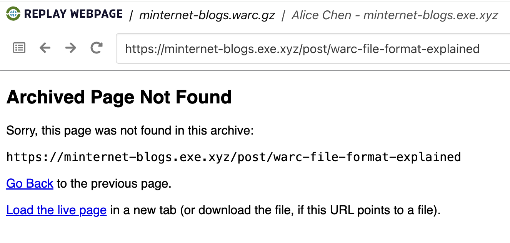

# Lab: `wget`

## Overview

Coming soon...

## Instructions

### Capture a single URL

The following instructions assume you have cloned [https://github.com/ghukill/umsi-si639-labs](https://github.com/ghukill/umsi-si639-labs).

First, let's create a working directory in the `/scratch` folder:
```shell
mkdir scratch/wget-lab
```

Then let's move into it:
```shell
cd scratch/wget-lab
```

Now, we'll run a simple `wget` retrieval of a single URL, and write the results to a WARC file:
```shell
wget "https://minternet.exe.xyz/" --warc-file="minternet"
```

We should end up with two new files:
```shell
 % ls -alh
total 24
drwxr-xr-x  5 commander  staff   160B Jan 10 22:12 .
drwxr-xr-x  7 commander  staff   224B Jan 10 22:07 ..
-rw-r--r--  1 commander  staff   538B Dec 31 19:40 index.html
-rw-r--r--  1 commander  staff   2.8K Jan 10 22:09 minternet.warc.gz
```

It looks as though the WARC file is [gzip-ed](https://www.gzip.org/).  Let's decompress it to look at the WARC file directlty:
```shell
gzip -dk minternet.warc.gz
```

Now, we can look at the WARC file directly with `less` (text viewer):
```shell
less minternet.warc
```

As newly minted WARC experts, a few observations:
- a single `WARC-Type = warcinfo` record
- a `request` record to `WARC-Target-URI: <https://minternet.exe.xyz/>`
  - simple `GET` request
- a `response` record for `WARC-Target-URI: <https://minternet.exe.xyz/>`
  - contains the raw HTML from the page!
- a couple of `WARC-Type = metadata` records at the bottom
  - note the use of `WARC-Target-URI: ...` to indicate what kind of metadata it is; this is similar to linked data URIs
  - metadata about the `wget` request made

How can we view / replay this WARC file?  We have not yet covered other options yet, so let's utilize a neat online option: [https://replayweb.page/](https://replayweb.page/).

ReplayWeb allows us to upload a WARC file -- in this case a `warc.gz` file -- and experience it through a Wayback-lite experience.

1. Find the "Choose File..." button
2. Navigate to `minternet.warc.gz` file
3. Click `Load`
4. After page reloads, find the URL `https://minternet.exe.xyz/` to view!

We have successfully archived a URL using the command line `wget` and replayed the content!

But, `wget` can support much more complex captures.  Let's look at some of those options.

### Recursive crawling to follow links

Let's capture all URLs on `minternet-recipes.exe.xyz`.  Going to use a linux convention for multi-line commands of the `\` backslash.

```shell
wget "https://minternet-recipes.exe.xyz/" \
--warc-file="minternet-recipes" \
--mirror
```

If we run the linux program `tree` we can see not only did we get a new WARC file, but `wget` also produced files somewhat like our "Save As" lab:

```
% tree
.
├── index.html
├── minternet-recipes.exe.xyz  <------ wget output
│   ├── images
│   │   ├── pancakes.svg
│   │   └── soup.svg
│   ├── index.html
│   ├── recipes
│   │   ├── pancakes.html
│   │   └── soup.html
│   └── style.css
├── minternet-recipes.warc.gz  <------- new WARC file
├── minternet.warc
├── minternet.warc.gz
```

If we follow the same steps in [https://replayweb.page/](https://replayweb.page/), uploading our new WARC file, you'll see that we have successfully crawled _multiple_ pages that originated from `https://minternet-recipes.exe.xyz`.

This is a good time to observe that it was "safe" to do so given the known small size of this domain and linked pages.  But this is where a crawl could get away from us!  

To demonstrate this, let's try crawling another site that is known to have a "crawler trap".

But before we do, let's see what kind of command line (CLI) options `wget` has:
```shell
wget --help
```

Output:
```text
% wget --help
GNU Wget 1.21.4, a non-interactive network retriever.
Usage: wget [OPTION]... [URL]...

Mandatory arguments to long options are mandatory for short options too.

Startup:
  -V,  --version                   display the version of Wget and exit
  -h,  --help                      print this help
  -b,  --background                go to background after startup
  -e,  --execute=COMMAND           execute a `.wgetrc'-style command

Logging and input file:
  -o,  --output-file=FILE          log messages to FILE
  -a,  --append-output=FILE        append messages to FILE
  -d,  --debug                     print lots of debugging information
  -q,  --quiet                     quiet (no output)
  -v,  --verbose                   be verbose (this is the default)
  -nv, --no-verbose                turn off verboseness, without being quiet
       --report-speed=TYPE         output bandwidth as TYPE.  TYPE can be bits
  -i,  --input-file=FILE           download URLs found in local or external FILE
  -F,  --force-html                treat input file as HTML
  -B,  --base=URL                  resolves HTML input-file links (-i -F)
                                     relative to URL
       --config=FILE               specify config file to use
       --no-config                 do not read any config file
       --rejected-log=FILE         log reasons for URL rejection to FILE

Download:
  -t,  --tries=NUMBER              set number of retries to NUMBER (0 unlimits)
       --retry-connrefused         retry even if connection is refused
       --retry-on-host-error       consider host errors as non-fatal, transient errors
       --retry-on-http-error=ERRORS    comma-separated list of HTTP errors to retry
  -O,  --output-document=FILE      write documents to FILE
  -nc, --no-clobber                skip downloads that would download to
                                     existing files (overwriting them)
       --no-netrc                  don't try to obtain credentials from .netrc
  -c,  --continue                  resume getting a partially-downloaded file
       --start-pos=OFFSET          start downloading from zero-based position OFFSET
       --progress=TYPE             select progress gauge type
       --show-progress             display the progress bar in any verbosity mode
  -N,  --timestamping              don't re-retrieve files unless newer than
                                     local
       --no-if-modified-since      don't use conditional if-modified-since get
                                     requests in timestamping mode
       --no-use-server-timestamps  don't set the local file's timestamp by
                                     the one on the server
  -S,  --server-response           print server response
       --spider                    don't download anything
  -T,  --timeout=SECONDS           set all timeout values to SECONDS
       --dns-timeout=SECS          set the DNS lookup timeout to SECS
       --connect-timeout=SECS      set the connect timeout to SECS
       --read-timeout=SECS         set the read timeout to SECS
  -w,  --wait=SECONDS              wait SECONDS between retrievals
                                     (applies if more then 1 URL is to be retrieved)
       --waitretry=SECONDS         wait 1..SECONDS between retries of a retrieval
                                     (applies if more then 1 URL is to be retrieved)
       --random-wait               wait from 0.5*WAIT...1.5*WAIT secs between retrievals
                                     (applies if more then 1 URL is to be retrieved)
       --no-proxy                  explicitly turn off proxy
  -Q,  --quota=NUMBER              set retrieval quota to NUMBER
       --bind-address=ADDRESS      bind to ADDRESS (hostname or IP) on local host
       --limit-rate=RATE           limit download rate to RATE
       --no-dns-cache              disable caching DNS lookups
       --restrict-file-names=OS    restrict chars in file names to ones OS allows
       --ignore-case               ignore case when matching files/directories
  -4,  --inet4-only                connect only to IPv4 addresses
  -6,  --inet6-only                connect only to IPv6 addresses
       --prefer-family=FAMILY      connect first to addresses of specified family,
                                     one of IPv6, IPv4, or none
       --user=USER                 set both ftp and http user to USER
       --password=PASS             set both ftp and http password to PASS
       --ask-password              prompt for passwords
       --use-askpass=COMMAND       specify credential handler for requesting 
                                     username and password.  If no COMMAND is 
                                     specified the WGET_ASKPASS or the SSH_ASKPASS 
                                     environment variable is used.
       --no-iri                    turn off IRI support
       --local-encoding=ENC        use ENC as the local encoding for IRIs
       --remote-encoding=ENC       use ENC as the default remote encoding
       --unlink                    remove file before clobber
       --xattr                     turn on storage of metadata in extended file attributes

Directories:
  -nd, --no-directories            don't create directories
  -x,  --force-directories         force creation of directories
  -nH, --no-host-directories       don't create host directories
       --protocol-directories      use protocol name in directories
  -P,  --directory-prefix=PREFIX   save files to PREFIX/..
       --cut-dirs=NUMBER           ignore NUMBER remote directory components

HTTP options:
       --http-user=USER            set http user to USER
       --http-password=PASS        set http password to PASS
       --no-cache                  disallow server-cached data
       --default-page=NAME         change the default page name (normally
                                     this is 'index.html'.)
  -E,  --adjust-extension          save HTML/CSS documents with proper extensions
       --ignore-length             ignore 'Content-Length' header field
       --header=STRING             insert STRING among the headers
       --compression=TYPE          choose compression, one of auto, gzip and none. (default: none)
       --max-redirect              maximum redirections allowed per page
       --proxy-user=USER           set USER as proxy username
       --proxy-password=PASS       set PASS as proxy password
       --referer=URL               include 'Referer: URL' header in HTTP request
       --save-headers              save the HTTP headers to file
  -U,  --user-agent=AGENT          identify as AGENT instead of Wget/VERSION
       --no-http-keep-alive        disable HTTP keep-alive (persistent connections)
       --no-cookies                don't use cookies
       --load-cookies=FILE         load cookies from FILE before session
       --save-cookies=FILE         save cookies to FILE after session
       --keep-session-cookies      load and save session (non-permanent) cookies
       --post-data=STRING          use the POST method; send STRING as the data
       --post-file=FILE            use the POST method; send contents of FILE
       --method=HTTPMethod         use method "HTTPMethod" in the request
       --body-data=STRING          send STRING as data. --method MUST be set
       --body-file=FILE            send contents of FILE. --method MUST be set
       --content-disposition       honor the Content-Disposition header when
                                     choosing local file names (EXPERIMENTAL)
       --content-on-error          output the received content on server errors
       --auth-no-challenge         send Basic HTTP authentication information
                                     without first waiting for the server's
                                     challenge

HTTPS (SSL/TLS) options:
       --secure-protocol=PR        choose secure protocol, one of auto, SSLv2,
                                     SSLv3, TLSv1, TLSv1_1, TLSv1_2, TLSv1_3 and PFS
       --https-only                only follow secure HTTPS links
       --no-check-certificate      don't validate the server's certificate
       --certificate=FILE          client certificate file
       --certificate-type=TYPE     client certificate type, PEM or DER
       --private-key=FILE          private key file
       --private-key-type=TYPE     private key type, PEM or DER
       --ca-certificate=FILE       file with the bundle of CAs
       --ca-directory=DIR          directory where hash list of CAs is stored
       --crl-file=FILE             file with bundle of CRLs
       --pinnedpubkey=FILE/HASHES  Public key (PEM/DER) file, or any number
                                   of base64 encoded sha256 hashes preceded by
                                   'sha256//' and separated by ';', to verify
                                   peer against
       --random-file=FILE          file with random data for seeding the SSL PRNG

       --ciphers=STR           Set the priority string (GnuTLS) or cipher list string (OpenSSL) directly.
                                   Use with care. This option overrides --secure-protocol.
                                   The format and syntax of this string depend on the specific SSL/TLS engine.
HSTS options:
       --no-hsts                   disable HSTS
       --hsts-file                 path of HSTS database (will override default)

FTP options:
       --ftp-user=USER             set ftp user to USER
       --ftp-password=PASS         set ftp password to PASS
       --no-remove-listing         don't remove '.listing' files
       --no-glob                   turn off FTP file name globbing
       --no-passive-ftp            disable the "passive" transfer mode
       --preserve-permissions      preserve remote file permissions
       --retr-symlinks             when recursing, get linked-to files (not dir)

FTPS options:
       --ftps-implicit                 use implicit FTPS (default port is 990)
       --ftps-resume-ssl               resume the SSL/TLS session started in the control connection when
                                         opening a data connection
       --ftps-clear-data-connection    cipher the control channel only; all the data will be in plaintext
       --ftps-fallback-to-ftp          fall back to FTP if FTPS is not supported in the target server
WARC options:
       --warc-file=FILENAME        save request/response data to a .warc.gz file
       --warc-header=STRING        insert STRING into the warcinfo record
       --warc-max-size=NUMBER      set maximum size of WARC files to NUMBER
       --warc-cdx                  write CDX index files
       --warc-dedup=FILENAME       do not store records listed in this CDX file
       --no-warc-compression       do not compress WARC files with GZIP
       --no-warc-digests           do not calculate SHA1 digests
       --no-warc-keep-log          do not store the log file in a WARC record
       --warc-tempdir=DIRECTORY    location for temporary files created by the
                                     WARC writer

Recursive download:
  -r,  --recursive                 specify recursive download
  -l,  --level=NUMBER              maximum recursion depth (inf or 0 for infinite)
       --delete-after              delete files locally after downloading them
  -k,  --convert-links             make links in downloaded HTML or CSS point to
                                     local files
       --convert-file-only         convert the file part of the URLs only (usually known as the basename)
       --backups=N                 before writing file X, rotate up to N backup files
  -K,  --backup-converted          before converting file X, back up as X.orig
  -m,  --mirror                    shortcut for -N -r -l inf --no-remove-listing
  -p,  --page-requisites           get all images, etc. needed to display HTML page
       --strict-comments           turn on strict (SGML) handling of HTML comments

Recursive accept/reject:
  -A,  --accept=LIST               comma-separated list of accepted extensions
  -R,  --reject=LIST               comma-separated list of rejected extensions
       --accept-regex=REGEX        regex matching accepted URLs
       --reject-regex=REGEX        regex matching rejected URLs
       --regex-type=TYPE           regex type (posix)
  -D,  --domains=LIST              comma-separated list of accepted domains
       --exclude-domains=LIST      comma-separated list of rejected domains
       --follow-ftp                follow FTP links from HTML documents
       --follow-tags=LIST          comma-separated list of followed HTML tags
       --ignore-tags=LIST          comma-separated list of ignored HTML tags
  -H,  --span-hosts                go to foreign hosts when recursive
  -L,  --relative                  follow relative links only
  -I,  --include-directories=LIST  list of allowed directories
       --trust-server-names        use the name specified by the redirection
                                     URL's last component
  -X,  --exclude-directories=LIST  list of excluded directories
  -np, --no-parent                 don't ascend to the parent directory

Email bug reports, questions, discussions to <bug-wget@gnu.org>
and/or open issues at https://savannah.gnu.org/bugs/?func=additem&group=wget.
```

Wowser, lot's of options!  Particularly of interest are sections:
- `WARC options`
- `Recursive download`

Note that our use of `--mirror` is actually shorthand for:
```shell
wget -N -r -l inf
```
- `-N` = do not re-retrieve files (de-duplication)
- `-r` = recursively download
- `-l inf` = recursion depth, where "inf" is infinite; this is kind of how many "hops" from our original URL we will allow 

Despite this new-found knowledge, let's YOLO it and see what happens:

```shell
wget "https://minternet-blogs.exe.xyz/" \
--warc-file="minternet-blogs" \
--mirror
```

**You'll probably want to `ctrl + c` or `cmd + c` at this time to stop the crawl!**

We hit a "crawler trap", maybe even a couple, in the blogs website.  We are now firmly in the **QA** and **Scoping** landscape.

Running `tree` again should ilicit a good chuckle for all the URLs we captured via those crawler traps...

Let's try removing the `--mirror` option to be a bit more explicit and granular.  We can set `-l 1` indicating we only want to go "one level deep" past the original URL: 

```shell
wget "https://minternet-blogs.exe.xyz/" \
--warc-file="minternet-blogs" \
-N \
-r \
-l 1
```

That should finish fairly quickly with around 14 URLs captured.

If we pop that into ReplayWeb the same as the others, we can see quite a few pages were captured.  Clicking around a bit, things seem pretty good!
- Blogs posts from the root URL work
- Links like "Calendar" and "Search" render
- Clicking on "Alice" shows posts by Alice

When we click on "Alice", the first couple blogs posts render just fine.  But clicking on "The WARC File Format Explained" gives us an error.  Why is that?



The first two blog posts were linked to from the root page making the "level one" deep.  But the third post was not linked to from the root page, making it "level two" deep.  `wget` faithfull respected the `-l 1` flag and skipped this. 


### Reflection Prompts

Coming soon...